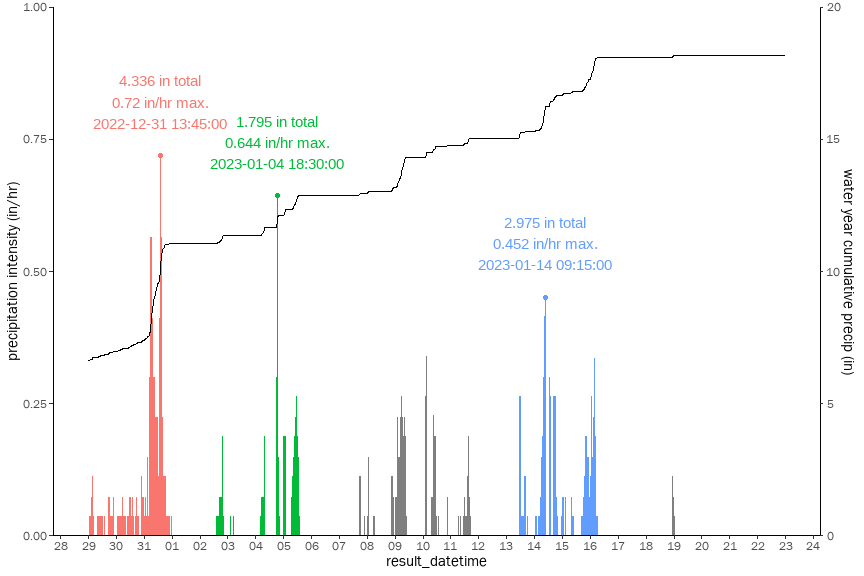
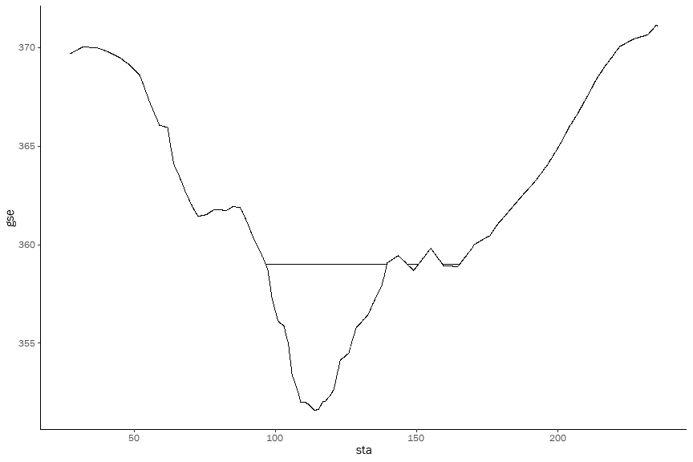

Tassajara Creek H&H Calculations
================

# Hydrologics

``` r
import_streamflow_data <- function(csv) {
  return(read_csv(csv) %>%
    janitor::clean_names() %>%
    mutate(result_datetime = lubridate::mdy(result_date) + lubridate::hms(result_time),
           stage_ft = pmax(gh_probe_ft, 0),
           streamflow_cfs = case_when(streamflow_cfs >=0 ~ streamflow_cfs),
           rain_intensity_in = rain_interval_in * 4
           )
    )
}

new_years_storm <- import_streamflow_data("data/tc-bi580_2022-12-31.csv") 
```

    ## Rows: 3480 Columns: 10
    ## ── Column specification ────────────────────────────────────────────────────────
    ## Delimiter: ","
    ## chr  (1): Result Date
    ## dbl  (8): GHBubbler(ft), GHProbe(ft), WaterTemp(C), RainInterval(in), RainDa...
    ## time (1): Result Time
    ## 
    ## ℹ Use `spec()` to retrieve the full column specification for this data.
    ## ℹ Specify the column types or set `show_col_types = FALSE` to quiet this message.

``` r
new_years_storm %>% 
  ggplot(aes(y = streamflow_cfs, x = stage_ft)) + 
    geom_line(color = "black") + 
    scale_y_continuous(trans = 'log10', limits = c(10, 1e4)) + 
    scale_x_continuous(trans = 'log10', limits = c(1, 5), breaks = 1:4) +
    ggtitle("Rating Curve for TC_BI580 (Tassajara Creek Below I-580") 
```

    ## Warning: Transformation introduced infinite values in continuous y-axis

    ## Warning: Transformation introduced infinite values in continuous x-axis

    ## Warning: Removed 1937 rows containing missing values (`geom_line()`).

<!-- -->

``` r
power_function_fit <- function(data, y, x) {
  df <- data %>% 
    select({{y}}, {{x}}) %>% 
    filter({{y}} > 0 & {{x}} > 0)
  model <- lm(log(df[[deparse(substitute(y))]]) ~ log(df[[deparse(substitute(x))]]))
  coeff <- summary(model)$coeff
  output <- c(alpha = exp(coeff[1,1]), beta = coeff[2,1])
  power_function <- function(x) {
    return(output["alpha"] * x^output["beta"])
  }
  #print(paste0(deparse(substitute(y)), " = ", output["alpha"], " * ", deparse(substitute(x)), "^", output["beta"]))
  #output <- output %>% append(c("function" = power_function))
  #return(output)
  return(power_function)
}

# version 1 of the rating curve using just the stream gauge 
rating_curve <- new_years_storm %>% power_function_fit(y = streamflow_cfs, x = stage_ft)

new_years_storm_pred <- new_years_storm %>%
  #mutate(streamflow_cfs_pred = rating_curve["alpha"] * stage_ft^rating_curve["beta"])
  mutate(streamflow_cfs_pred = rating_curve(stage_ft))

# version 2 of the rating curve using stepwise interpolation based on the I-580 HWM
peak_flow_jan_2023 <- 3657

rating_curve <- new_years_storm %>% 
  select(c(streamflow_cfs, stage_ft)) %>% 
  filter(!is.na(streamflow_cfs)) %>% 
  slice_max(stage_ft) %>%
  bind_rows(tribble(
    ~streamflow_cfs, ~stage_ft,
    peak_flow_jan_2023, max(new_years_storm$stage_ft)
  )) %>%
  power_function_fit(y = streamflow_cfs, x = stage_ft)

new_years_storm_pred <- new_years_storm %>%
  mutate(streamflow_cfs_pred = case_when(is.na(streamflow_cfs) ~ rating_curve(stage_ft), TRUE ~ streamflow_cfs),
         is_predicted = is.na(streamflow_cfs))

new_years_storm_pred %>% ggplot(aes(x = stage_ft)) + 
  geom_line(aes(y = streamflow_cfs_pred), color = "red") + 
  geom_line(aes(y = streamflow_cfs), color="black") +
  scale_y_continuous(trans = 'log10', limits = c(10, 1e4)) + 
  scale_x_continuous(trans = 'log10', limits = c(1, 8), breaks = 1:7) +
  ggtitle("Rating curve extrapolated based on January 2023 HWM")
```

    ## Warning: Transformation introduced infinite values in continuous y-axis

    ## Warning: Transformation introduced infinite values in continuous x-axis

    ## Warning: Transformation introduced infinite values in continuous y-axis

    ## Warning: Transformation introduced infinite values in continuous x-axis

    ## Warning: Removed 1868 rows containing missing values (`geom_line()`).

    ## Warning: Removed 1937 rows containing missing values (`geom_line()`).

<!-- -->

``` r
#new_years_storm_pred %>% ggplot(aes(x = result_datetime)) + 
#  geom_line(aes(y = streamflow_cfs_pred), color = "red") + 
#  geom_line(aes(y = streamflow_cfs), color="black")

maxRange <- 5000
coeff <- 0.0005

new_years_storm_pred %>% 
  filter(result_datetime < ymd("2023-01-23")) %>%
  ggplot(aes(x = result_datetime)) +
  geom_area(aes(y = streamflow_cfs_pred, 
                fill = "q_pred")) + 
  geom_area(aes(y = streamflow_cfs, 
                fill = "q")) +
  geom_tile(aes(y = maxRange - rain_intensity_in/coeff/2, 
                height = rain_intensity_in/coeff, 
                fill = "precip")) +
  scale_y_continuous(name = "streamflow (cfs)",
                     limit = c(0, maxRange),
                     expand = c(0, 0),
                     sec.axis = sec_axis(trans = ~(.-maxRange)*coeff, 
                                         name = "precipitation (in/hr)")) +
  theme(legend.position = 'top') + 
  ggtitle("Dec 2022 - Jan 2023 rainfall and streamflow") +
  scale_fill_manual(values = c("precip" = "blue", "q" = "black", "q_pred" = "red"),
                    labels = c("precip" = "Precipitation", "q" = "Streamflow (gauged)", "q_pred" = "Streamflow (predicted)"),
                    name = NULL) 
```

    ## Warning: Removed 69 rows containing non-finite values (`stat_align()`).

<!-- -->

``` r
# figure out the peak flow from the December storm
peak_flow_dec_2022 <- new_years_storm_pred %>% 
  filter(date(result_datetime) == ymd("2022-12-31")) %>% 
  pull(streamflow_cfs_pred) %>% 
  max()
print(peak_flow_dec_2022)
```

    ## [1] 3464.893

# Flow Frequency

``` r
peak_flows <- tribble(
  ~peak_flow_date, ~discharge_cfs,
  ymd("2019-02-13"), 560,
  ymd("2022-11-11"), 105,
  ymd("2022-12-31"), peak_flow_dec_2022,
  ymd("2023-01-14"), peak_flow_jan_2023
)

flow_freq <- tribble(
  ~name, ~return_interval_y, ~discharge_cfs,
  "Q2 BKF", 2, 650,
  "Q5 BKF", 5, 1200,
  "Q100 Alameda County", 100, 5200
)

flow_freq_curve <- flow_freq %>% 
  power_function_fit(y = discharge_cfs, x = return_interval_y)

flow_freq_curve_inv <- flow_freq %>% 
  power_function_fit(y = return_interval_y, x = discharge_cfs)

peak_flows %>% bind_rows(flow_freq) %>%
  mutate(return_interval_y = flow_freq_curve_inv(discharge_cfs)) %>%
  ggplot(aes(y = discharge_cfs, 
             x = return_interval_y, 
             label = case_when(!is.na(peak_flow_date) ~ as.character(peak_flow_date), TRUE ~ name))) + 
  geom_line() + 
  geom_point() + 
  ggrepel::geom_text_repel() +
  scale_y_continuous(trans='log10') + 
  scale_x_continuous(trans='log10') + 
  ggtitle("Flow frequency for model profiles")
```

<!-- -->

``` r
#peak_flows %>% fasstr::compute_frequency_analysis()
```

# Hydraulics

``` r
cross_sections <- tribble(
  ~cross_section, ~river_sta,
  "B", 7600,
  "D", 8200,
  "E", 8800,
  "F", 9300,
  "G", 10200, 
  "H", 10800
)
```

Constants

``` r
# gravitational constant, cm/s2
g_cgs <- 981
# grain density and water density, g/cm3
rho_s_cgs <- 2.65
rho_cgs <- 1.00
# kinematic viscosity of water, cm2/s
nu_cgs <- 0.01
```

Helper functions for cross sectional geometry calculations

``` r
prep_xs <- function(data, sta, elev, delta_x) {
  data %>%
    arrange({{sta}}) %>%
    mutate(sta = {{sta}}) %>%
    complete(sta = seq(from = min({{sta}}), to = max({{sta}}), by = delta_x)) %>%
    mutate(gse = zoo::na.approx({{elev}}, x = sta)) %>% 
    select(c(sta, gse))
}

calc_xs <- function(data, water_elev) {
  data %>% 
    arrange(sta) %>%
    mutate(wse = case_when(water_elev > gse ~ water_elev),
           delta_x = abs(lag(sta, 1) - sta),
           delta_z = abs(lag(gse, 1) - gse),
           depth = wse - gse, 
           hyp_length = sqrt(delta_x^2 + delta_z^2)
           ) %>%
    filter(!is.na(wse)) %>% 
    summarize(thalweg_elevation = min(gse),
              water_surface_elevation = water_elev,
              max_depth = water_surface_elevation - thalweg_elevation,
              cross_sectional_area = sum(delta_x * depth),
              wetted_perimeter = sum(hyp_length),
              ) %>% 
    as.list() %>% 
    list_flatten()
}

plot_xs <- function(data, water_elev) {
  data %>% 
    arrange(sta) %>%
    mutate(wse = case_when(water_elev > gse ~ water_elev)) %>%
    ggplot(aes(x = sta)) + 
      geom_line(aes(y = gse)) + 
      geom_line(aes(y = wse))
}
```

Import surveyed cross section geometries

``` r
xs_b <- read_csv("data/xs_geom/xs_b.csv") %>%
  prep_xs(sta = station_left_bank_ft, elev = elevation_ngvd29_ft, delta_x = 0.1) 

xs_d <- read_csv("data/xs_geom/xs_d.csv") %>%
  prep_xs(sta = station_left_bank_ft, elev = elevation_ngvd29_ft, delta_x = 0.1) 

xs_e <- read_csv("data/xs_geom/xs_e.csv") %>%
  prep_xs(sta = station_left_bank_ft, elev = elevation_ngvd29_ft, delta_x = 0.1) 

xs_f <- read_csv("data/xs_geom/xs_f.csv") %>%
  prep_xs(sta = station_left_bank_ft, elev = elevation_ngvd29_ft, delta_x = 0.1) 

xs_g <- read_csv("data/xs_geom/xs_g.csv") %>%
  prep_xs(sta = station_left_bank_ft, elev = elevation_ngvd29_ft, delta_x = 0.1) 

xs_h <- read_csv("data/xs_geom/xs_h.csv") %>%
  prep_xs(sta = station_left_bank_ft, elev = elevation_ngvd29_ft, delta_x = 0.1) 

xs_dfs <- tribble(
  ~xs_id, ~xs_df,
  "B", xs_b,
  "D", xs_d,
  "E", xs_e,
  "F", xs_f,
  "G", xs_g,
  "H", xs_h, 
)

xs_dfs %>% 
  unnest() %>% 
  ggplot(aes(y = gse, x = sta)) + 
    facet_wrap(~xs_id) + 
    geom_line() + 
    ggtitle("Cross section geometries")
```

<!-- -->

Example plot with a water surface intersected

``` r
plot_xs(xs_b, 359)
```

    ## Warning: Removed 1421 rows containing missing values (`geom_line()`).

<!-- -->

Calculate hydraulic geometries under HWMs (hydraulic radius, etc)

``` r
hwm_geometries <- read_csv("data/high_water_marks_v2.csv") %>%
  janitor::clean_names() %>%
  left_join(xs_dfs, by = join_by(cross_section == xs_id)) %>%
  mutate(result = map2(xs_df, hwm_elevation, calc_xs)) %>% 
  unnest_wider(result)
```

    ## Rows: 16 Columns: 5
    ## ── Column specification ────────────────────────────────────────────────────────
    ## Delimiter: ","
    ## chr  (2): series, cross section
    ## dbl  (2): hwm_elevation, slope
    ## date (1): peak flow date
    ## 
    ## ℹ Use `spec()` to retrieve the full column specification for this data.
    ## ℹ Specify the column types or set `show_col_types = FALSE` to quiet this message.

``` r
hwm_geometries
```

    ## # A tibble: 16 × 11
    ##    series     cross…¹ peak_flo…² hwm_e…³  slope xs_df    thalw…⁴ water…⁵ max_d…⁶
    ##    <chr>      <chr>   <date>       <dbl>  <dbl> <list>     <dbl>   <dbl>   <dbl>
    ##  1 channel    B       2019-02-13    356. 0.012  <tibble>    352.    356.    4.14
    ##  2 channel    D       2019-02-13    353. 0.005  <tibble>    348.    353.    5.51
    ##  3 channel    E       2019-02-13    352. 0.003  <tibble>    344.    352.    7.44
    ##  4 channel    F       2022-11-11    346. 0.003  <tibble>    343.    346.    3.18
    ##  5 channel    G       2022-11-11    344. 0.003  <tibble>    342.    344.    2.70
    ##  6 channel    H       2019-02-13    343. 0.003  <tibble>    339.    343.    3.81
    ##  7 floodplain B       2022-12-31    365. 0.0076 <tibble>    352.    365.   13.3 
    ##  8 floodplain D       2022-12-31    361. 0.0019 <tibble>    348.    361.   13.3 
    ##  9 floodplain E       2022-12-31    356. 0.0056 <tibble>    344.    356.   11.8 
    ## 10 floodplain E       2023-01-14    357. 0.0063 <tibble>    344.    357.   12.6 
    ## 11 floodplain F       2022-12-31    353. 0.0073 <tibble>    343.    353.   10.3 
    ## 12 floodplain F       2023-01-14    354. 0.0075 <tibble>    343.    354.   10.7 
    ## 13 floodplain G       2022-12-31    350. 0.008  <tibble>    342.    350.    8.45
    ## 14 floodplain G       2023-01-14    351. 0.0077 <tibble>    342.    351.    8.96
    ## 15 floodplain H       2022-12-31    347. 0.0023 <tibble>    339.    347.    7.63
    ## 16 floodplain H       2023-01-14    347. 0.0019 <tibble>    339.    347.    8.00
    ## # … with 2 more variables: cross_sectional_area <dbl>, wetted_perimeter <dbl>,
    ## #   and abbreviated variable names ¹​cross_section, ²​peak_flow_date,
    ## #   ³​hwm_elevation, ⁴​thalweg_elevation, ⁵​water_surface_elevation, ⁶​max_depth

Calculate hydraulics based on hwm geometries and peak flows

``` r
hwm_hydraulics <- hwm_geometries %>% 
  rename(cross_sectional_area_ft2 = cross_sectional_area,
         wetted_perimeter_ft = wetted_perimeter) %>%
  left_join(peak_flows) %>%
  mutate(velocity_ft_s = discharge_cfs / cross_sectional_area_ft2,
         hydraulic_radius_ft = cross_sectional_area_ft2 / wetted_perimeter_ft,
         mannings_n = 1.486 * cross_sectional_area_ft2 * hydraulic_radius_ft^(2/3) 
                      * slope^(1/2) * discharge_cfs^(-1),
         # metric conversions
         velocity_m_s = velocity_ft_s / 0.3048,
         hydraulic_radius_m = hydraulic_radius_ft / 0.3048,
         cross_sectional_area_m2 = cross_sectional_area_ft2 / 0.3048,
         # bed mobilization
         critical_shields_number = 0.15 * slope^(1/4),
         grain_size_mobilized_mm = 10 * rho_cgs * hydraulic_radius_m * slope / 
                         (critical_shields_number * (rho_s_cgs - rho_cgs)),
         grain_size_mobilized_phi = -log2(grain_size_mobilized_mm),
         # suspended transport
         shear_velocity_cm_s = sqrt(g_cgs * (hydraulic_radius_m*100) * slope),
         settling_velocity_ndim = rho_cgs * shear_velocity_cm_s^3 / 
                         ((rho_s_cgs - rho_cgs) * g_cgs * nu_cgs),
         grain_size_suspended_ndim = sqrt(5832 * settling_velocity_ndim),
         grain_size_suspended_mm = 10 * grain_size_suspended_ndim * rho_cgs * nu_cgs^2 /
                         ((rho_s_cgs - rho_cgs) * g_cgs)^(1/3),
         grain_size_suspended_phi = -log2(grain_size_suspended_mm)
  )
```

    ## Joining with `by = join_by(peak_flow_date)`

``` r
hwm_hydraulics
```

    ## # A tibble: 16 × 26
    ##    series     cross…¹ peak_flo…² hwm_e…³  slope xs_df    thalw…⁴ water…⁵ max_d…⁶
    ##    <chr>      <chr>   <date>       <dbl>  <dbl> <list>     <dbl>   <dbl>   <dbl>
    ##  1 channel    B       2019-02-13    356. 0.012  <tibble>    352.    356.    4.14
    ##  2 channel    D       2019-02-13    353. 0.005  <tibble>    348.    353.    5.51
    ##  3 channel    E       2019-02-13    352. 0.003  <tibble>    344.    352.    7.44
    ##  4 channel    F       2022-11-11    346. 0.003  <tibble>    343.    346.    3.18
    ##  5 channel    G       2022-11-11    344. 0.003  <tibble>    342.    344.    2.70
    ##  6 channel    H       2019-02-13    343. 0.003  <tibble>    339.    343.    3.81
    ##  7 floodplain B       2022-12-31    365. 0.0076 <tibble>    352.    365.   13.3 
    ##  8 floodplain D       2022-12-31    361. 0.0019 <tibble>    348.    361.   13.3 
    ##  9 floodplain E       2022-12-31    356. 0.0056 <tibble>    344.    356.   11.8 
    ## 10 floodplain E       2023-01-14    357. 0.0063 <tibble>    344.    357.   12.6 
    ## 11 floodplain F       2022-12-31    353. 0.0073 <tibble>    343.    353.   10.3 
    ## 12 floodplain F       2023-01-14    354. 0.0075 <tibble>    343.    354.   10.7 
    ## 13 floodplain G       2022-12-31    350. 0.008  <tibble>    342.    350.    8.45
    ## 14 floodplain G       2023-01-14    351. 0.0077 <tibble>    342.    351.    8.96
    ## 15 floodplain H       2022-12-31    347. 0.0023 <tibble>    339.    347.    7.63
    ## 16 floodplain H       2023-01-14    347. 0.0019 <tibble>    339.    347.    8.00
    ## # … with 17 more variables: cross_sectional_area_ft2 <dbl>,
    ## #   wetted_perimeter_ft <dbl>, discharge_cfs <dbl>, velocity_ft_s <dbl>,
    ## #   hydraulic_radius_ft <dbl>, mannings_n <dbl>, velocity_m_s <dbl>,
    ## #   hydraulic_radius_m <dbl>, cross_sectional_area_m2 <dbl>,
    ## #   critical_shields_number <dbl>, grain_size_mobilized_mm <dbl>,
    ## #   grain_size_mobilized_phi <dbl>, shear_velocity_cm_s <dbl>,
    ## #   settling_velocity_ndim <dbl>, grain_size_suspended_ndim <dbl>, …

View RAS results

``` r
ras_1d <- read_csv("data/hec_ras_1d_out_v2.csv") %>%
  janitor::clean_names() %>% 
  inner_join(cross_sections)
```

    ## Rows: 80 Columns: 18
    ## ── Column specification ────────────────────────────────────────────────────────
    ## Delimiter: ","
    ## chr  (2): Reach, Profile
    ## dbl (16): River Sta, Q Total (cfs), Q Channel (cfs), Q Left (cfs), Q Right (...
    ## 
    ## ℹ Use `spec()` to retrieve the full column specification for this data.
    ## ℹ Specify the column types or set `show_col_types = FALSE` to quiet this message.
    ## Joining with `by = join_by(river_sta)`

``` r
ras_1d_pivot <- bind_rows(
  ras_1d %>% pivot_longer(starts_with("q_")) %>% mutate(measure = "discharge_cfs", 
                                                        loc = case_when(name == "q_total_cfs" ~ "total",
                                                                        name == "q_channel_cfs" ~ "channel",
                                                                        name == "q_left_cfs" ~ "left",
                                                                        name == "q_right_cfs" ~ "right"
                                                                        )),
  ras_1d %>% pivot_longer(starts_with("area_")) %>% mutate(measure = "cross_sectional_area_ft2",
                                                           loc = case_when(name == "area_sq_ft" ~ "total",
                                                                           name == "area_channel_sq_ft" ~ "channel",
                                                                           name == "area_left_sq_ft" ~ "left",
                                                                           name == "area_right_sq_ft" ~ "right"
                                                                        )),
  ras_1d %>% pivot_longer(starts_with("hydr_")) %>% mutate(measure = "hydraulic_radius_ft", 
                                                           loc = case_when(name == "hydr_radius_ft" ~ "total",
                                                                           name == "hydr_radius_c_ft" ~ "channel",
                                                                           name == "hydr_radius_l_ft" ~ "left",
                                                                           name == "hydr_radius_r_ft" ~ "right"
                                                                        ))) %>% 
  select(reach, river_sta, profile, measure, loc, value) %>% 
  pivot_wider(names_from = measure, values_from = value) %>%
  left_join(ras_1d %>% select(cross_section, river_sta, profile, min_ch_el_ft, w_s_elev_ft, e_g_slope_ft_ft, q_total_cfs), by = c("river_sta", "profile"))   

ras_1d_sed <- ras_1d_pivot %>% 
  drop_na(discharge_cfs) %>%
  mutate(series = case_when((loc == "left" | loc == "right") ~ "floodplain", TRUE ~ loc),
                        velocity_ft_s = discharge_cfs / cross_sectional_area_ft2,
                        slope = e_g_slope_ft_ft, # use this for now
                       # metric conversions
                       velocity_m_s = velocity_ft_s / 0.3048,
                       hydraulic_radius_m = hydraulic_radius_ft / 0.3048,
                       cross_sectional_area_m2 = cross_sectional_area_ft2 / 0.3048,
                       # bed mobilization
                       critical_shields_number = 0.15 * slope^(1/4),
                       grain_size_mobilized_mm = 10 * rho_cgs * hydraulic_radius_m * slope / 
                                       (critical_shields_number * (rho_s_cgs - rho_cgs)),
                       grain_size_mobilized_phi = -log2(grain_size_mobilized_mm),
                       # suspended transport
                       shear_velocity_cm_s = sqrt(g_cgs * (hydraulic_radius_m*100) * slope),
                       settling_velocity_ndim = rho_cgs * shear_velocity_cm_s^3 / 
                                       ((rho_s_cgs - rho_cgs) * g_cgs * nu_cgs),
                       grain_size_suspended_ndim = sqrt(5832 * settling_velocity_ndim),
                       grain_size_suspended_mm = 10 * grain_size_suspended_ndim * rho_cgs * nu_cgs^2 /
                                       ((rho_s_cgs - rho_cgs) * g_cgs)^(1/3),
                       grain_size_suspended_phi = -log2(grain_size_suspended_mm)
              )

ras_1d_sed
```

    ## # A tibble: 181 × 26
    ##    reach   river…¹ profile loc   disch…² cross…³ hydra…⁴ cross…⁵ min_c…⁶ w_s_e…⁷
    ##    <chr>     <dbl> <chr>   <chr>   <dbl>   <dbl>   <dbl> <chr>     <dbl>   <dbl>
    ##  1 Gleaso…   10800 Q2      total  650     107.      2.82 H          352.    357.
    ##  2 Gleaso…   10800 Q2      chan…  650     107.      2.82 H          352.    357.
    ##  3 Gleaso…   10800 Q5      total 1200     179.      3.73 H          352.    359.
    ##  4 Gleaso…   10800 Q5      chan… 1200.    179.      3.9  H          352.    359.
    ##  5 Gleaso…   10800 Q5      right    0.03    0.16    0.08 H          352.    359.
    ##  6 Gleaso…   10800 Q100 F… total 4300     404.      3.83 H          352.    362.
    ##  7 Gleaso…   10800 Q100 F… chan… 4111.    314.      5.64 H          352.    362.
    ##  8 Gleaso…   10800 Q100 F… left     0.43    1.06    0.17 H          352.    362.
    ##  9 Gleaso…   10800 Q100 F… right  188.     89.4     2.04 H          352.    362.
    ## 10 Gleaso…   10800 Q100 AC total 5200     495.      4    H          352.    363.
    ## # … with 171 more rows, 16 more variables: e_g_slope_ft_ft <dbl>,
    ## #   q_total_cfs <dbl>, series <chr>, velocity_ft_s <dbl>, slope <dbl>,
    ## #   velocity_m_s <dbl>, hydraulic_radius_m <dbl>,
    ## #   cross_sectional_area_m2 <dbl>, critical_shields_number <dbl>,
    ## #   grain_size_mobilized_mm <dbl>, grain_size_mobilized_phi <dbl>,
    ## #   shear_velocity_cm_s <dbl>, settling_velocity_ndim <dbl>,
    ## #   grain_size_suspended_ndim <dbl>, grain_size_suspended_mm <dbl>, …

``` r
# hwm_hydraulics %>% 
#   select(c(series, cross_section, peak_flow_date, discharge_cfs, mannings_n, grain_size_mobilized_mm, grain_size_mobilized_phi, grain_size_suspended_mm, # grain_size_suspended_phi)) %>% 
#   DT::datatable() %>% 
#   DT::formatRound(~ mannings_n, 3) %>% 
#   DT::formatRound(~ discharge_cfs + grain_size_mobilized_mm, 0) %>%
#   DT::formatRound(~ grain_size_suspended_mm + grain_size_suspended_phi + grain_size_mobilized_phi, 2)
```

``` r
mannings_n <- hwm_hydraulics %>% 
  group_by(series, cross_section) %>%
  summarize(mannings_n = n() / sum(1 / mannings_n)) # harmonic mean
```

    ## `summarise()` has grouped output by 'series'. You can override using the
    ## `.groups` argument.

``` r
mannings_n %>% 
  ggplot(aes(x = cross_section, y = mannings_n, color = series, label = round(mannings_n,3))) + 
  #geom_point(aes(group = series)) +
  geom_label() +
  scale_color_manual(values = c("channel" = "black", "floodplain" = "red")) + 
  ggtitle("Manning's roughness estimates based on high water marks")
```

<!-- -->

``` r
hwm_hydraulics %>% 
  pivot_longer(cols = c(grain_size_suspended_mm, grain_size_mobilized_mm), names_to = "measure", values_to = "grain_size") %>%
  ggplot(aes(x = cross_section, color = series)) + 
  geom_point(aes(y = grain_size, group = series)) +
  scale_color_manual(values = c("channel" = "black", "floodplain" = "red")) + 
  facet_wrap(~measure, ncol = 1) +
  scale_y_continuous(trans = "log2") + 
  ggtitle("Sediment transport estimates based on high water marks")
```

<!-- -->

``` r
ras_1d_sed %>% 
  filter(loc != "total") %>%
  #group_by(series, cross_section, profile, q_total_cfs) %>% 
  #summarize(velocity_ft_s = mean(velocity_ft_s)) %>%
  ggplot(aes(x = q_total_cfs, y = velocity_ft_s, color = cross_section, label = cross_section, shape = loc)) + 
  geom_point() + scale_shape_manual(values=c(21, 24, 25)) +
  facet_grid(cols = vars(series)) + ggtitle("Velocity (via 1D model)") +
  geom_hline(yintercept=10, linetype='dotted', col = 'red')
```

<!-- -->

``` r
ras_1d_sed %>% 
  filter(loc != "total") %>%
  #group_by(series, cross_section, profile, q_total_cfs) %>% 
  #summarize(grain_size_mobilized_mm = mean(grain_size_mobilized_mm)) %>%
  ggplot(aes(x = q_total_cfs, y = grain_size_mobilized_mm, color = cross_section, label = cross_section, shape = loc)) + 
  geom_point() + scale_shape_manual(values=c(21, 24, 25)) +
  facet_grid(cols = vars(series)) + ggtitle("Bed Mobilization (via 1D model)") +
  scale_y_continuous(limits = c(0,20), breaks = c(2^0, 2^1, 2^2, 2^3, 2^4))
```

<!-- -->

``` r
ras_1d_sed %>% 
  filter(loc != "total") %>%
  #group_by(series, cross_section, profile, q_total_cfs) %>% 
  #summarize(grain_size_suspended_mm = mean(grain_size_suspended_mm)) %>%
  ggplot(aes(x = q_total_cfs, y = grain_size_suspended_mm, color = cross_section, label = cross_section, shape = loc)) + 
  geom_point() + scale_shape_manual(values=c(21, 24, 25)) +
  facet_grid(cols = vars(series)) + ggtitle("Suspended Transport (via 1D model)") +
  scale_y_continuous(limits = c(0,2.25), breaks = c(2^-3, 2^-2, 2^-1, 2^0, 2^1))
```

<!-- -->

``` r
# ras_1d_sed %>% 
#   ggplot(aes(x = discharge_cfs, y = grain_size_mobilized_mm, color = loc)) + 
#   geom_point() + 
#   facet_grid(rows = vars(cross_section), cols = vars(profile))
```

``` r
# ras_1d_sed %>% 
#   filter(profile == "31 Dec 2022") %>%
#   filter(loc != "total") %>%
#   ggplot(aes(x = discharge_cfs, y = grain_size_mobilized_mm, shape = loc, color = cross_section)) + 
#   geom_point() + 
#   facet_grid(cols = vars(profile))
```

``` r
# ras_1d_sed %>% 
#   filter(loc != "total") %>%
#   pivot_longer(cols = c(grain_size_mobilized_mm, grain_size_suspended_mm, velocity_ft_s)) %>%
#   group_by(series, cross_section, profile, q_total_cfs, name) %>% 
#   summarize(value = mean(value)) %>%
#   ggplot(aes(x = q_total_cfs, y = value, color = cross_section, label = cross_section)) + 
#   geom_point() + 
#   facet_grid(cols = vars(series), rows = vars(name), switch = "y") + 
#   theme(strip.text.y.left = element_text(angle = 0))
```
