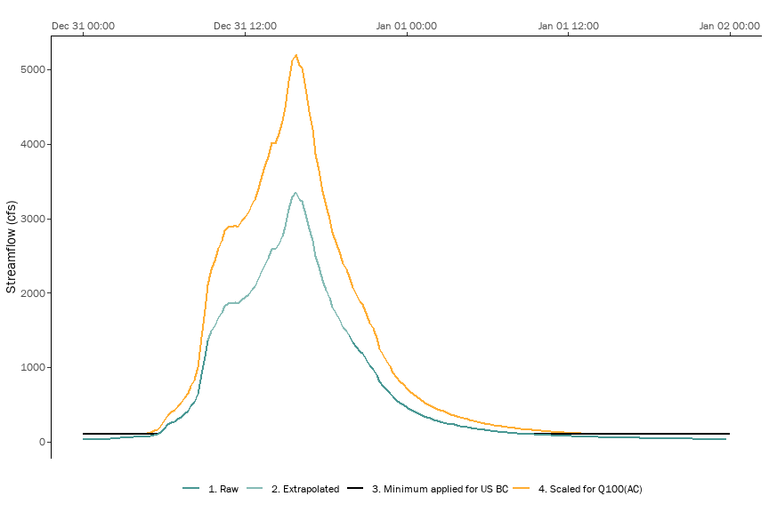

Tassajara Creek H&H Calculations
================

# Hydrologics

``` r
import_streamflow_data <- function(csv) {
  return(read_csv(csv) %>%
    janitor::clean_names() %>%
    mutate(result_datetime = lubridate::mdy(result_date) + lubridate::hms(result_time),
           stage_ft = pmax(gh_probe_ft, 0),
           streamflow_cfs = case_when(streamflow_cfs >=0 ~ streamflow_cfs),
           rain_intensity_in = rain_interval_in * 4
           )
    )
}

new_years_storm <- import_streamflow_data("data/tc-bi580_2022-12-31.csv") 
```

    ## Rows: 3480 Columns: 10
    ## ── Column specification ────────────────────────────────────────────────────────
    ## Delimiter: ","
    ## chr  (1): Result Date
    ## dbl  (8): GHBubbler(ft), GHProbe(ft), WaterTemp(C), RainInterval(in), RainDa...
    ## time (1): Result Time
    ## 
    ## ℹ Use `spec()` to retrieve the full column specification for this data.
    ## ℹ Specify the column types or set `show_col_types = FALSE` to quiet this message.

``` r
new_years_storm %>% ggplot(aes(y = streamflow_cfs, x = stage_ft)) + 
  #geom_line() + 
  geom_smooth()
```

    ## `geom_smooth()` using method = 'gam' and formula = 'y ~ s(x, bs = "cs")'

    ## Warning: Removed 69 rows containing non-finite values (`stat_smooth()`).

<!-- -->

``` r
power_function_fit <- function(data, y, x) {
  df <- data %>% 
    select({{y}}, {{x}}) %>% 
    filter({{y}} > 0 & {{x}} > 0)
  model <- lm(log(df[[deparse(substitute(y))]]) ~ log(df[[deparse(substitute(x))]]))
  coeff <- summary(model)$coeff
  output <- c(alpha = exp(coeff[1,1]), beta = coeff[2,1])
  power_function <- function(x) {
    return(output["alpha"] * x^output["beta"])
  }
  #print(paste0(deparse(substitute(y)), " = ", output["alpha"], " * ", deparse(substitute(x)), "^", output["beta"]))
  #output <- output %>% append(c("function" = power_function))
  #return(output)
  return(power_function)
}

# version 1 of the rating curve using just the stream gauge 
rating_curve <- new_years_storm %>% power_function_fit(y = streamflow_cfs, x = stage_ft)

new_years_storm_pred <- new_years_storm %>%
  #mutate(streamflow_cfs_pred = rating_curve["alpha"] * stage_ft^rating_curve["beta"])
  mutate(streamflow_cfs_pred = rating_curve(stage_ft))

# version 2 of the rating curve using stepwise interpolation based on the I-580 HWM
peak_flow_jan_2023 <- 3657

rating_curve <- new_years_storm %>% 
  select(c(streamflow_cfs, stage_ft)) %>% 
  filter(!is.na(streamflow_cfs)) %>% 
  slice_max(stage_ft) %>%
  bind_rows(tribble(
    ~streamflow_cfs, ~stage_ft,
    peak_flow_jan_2023, max(new_years_storm$stage_ft)
  )) %>%
  power_function_fit(y = streamflow_cfs, x = stage_ft)

new_years_storm_pred <- new_years_storm %>%
  mutate(streamflow_cfs_pred = case_when(is.na(streamflow_cfs) ~ rating_curve(stage_ft), TRUE ~ streamflow_cfs),
         is_predicted = is.na(streamflow_cfs))

new_years_storm_pred %>% ggplot(aes(x = stage_ft)) + 
  geom_line(aes(y = streamflow_cfs_pred), color = "red") + 
  geom_line(aes(y = streamflow_cfs), color="black") +
  scale_y_continuous(trans = 'log10', limits = c(10, 1e4)) + 
  scale_x_continuous(trans = 'log10', limits = c(1, 8), breaks = 1:8)
```

    ## Warning: Transformation introduced infinite values in continuous y-axis

    ## Warning: Transformation introduced infinite values in continuous x-axis

    ## Warning: Transformation introduced infinite values in continuous y-axis

    ## Warning: Transformation introduced infinite values in continuous x-axis

    ## Warning: Removed 1868 rows containing missing values (`geom_line()`).

    ## Warning: Removed 1937 rows containing missing values (`geom_line()`).

<!-- -->

``` r
#new_years_storm_pred %>% ggplot(aes(x = result_datetime)) + 
#  geom_line(aes(y = streamflow_cfs_pred), color = "red") + 
#  geom_line(aes(y = streamflow_cfs), color="black")

maxRange <- 5000
coeff <- 0.0005

new_years_storm_pred %>% 
  filter(result_datetime < ymd("2023-01-23")) %>%
  ggplot(aes(x = result_datetime)) +
  geom_tile(aes(y = maxRange - rain_intensity_in/coeff/2, 
                height = rain_intensity_in/coeff, 
                fill = 'PColor')
            ) +
  geom_area(aes(y = streamflow_cfs_pred), fill = "red", color = "red") + 
  geom_area(aes(y = streamflow_cfs), fill = "black", color="black") +
  scale_y_continuous(name = "streamflow (cfs)",
                     limit = c(0, maxRange),
                     expand = c(0, 0),
                     sec.axis = sec_axis(trans = ~(.-maxRange)*coeff, 
                                         name = "precipitation (in/hr)")) +
  scale_fill_manual(values = c('PColor' = "blue"),
                    labels = c('PColor' = 'Precipitation'),
                    name = NULL) +
  scale_color_manual(values = c('black', '#e41a1c'), 
                     name = NULL) +
  guides(color = guide_legend(nrow = 1)) +
  theme(legend.position = 'top')
```

    ## Warning: Removed 69 rows containing non-finite values (`stat_align()`).

<!-- -->

``` r
# figure out the peak flow from the December storm
peak_flow_dec_2022 <- new_years_storm_pred %>% 
  filter(date(result_datetime) == ymd("2022-12-31")) %>% 
  pull(streamflow_cfs_pred) %>% 
  max()
```

# Flow Frequency

``` r
peak_flows <- tribble(
  ~peak_flow_date, ~discharge_cfs,
  ymd("2019-02-13"), 560,
  ymd("2022-11-11"), 105,
  ymd("2022-12-31"), peak_flow_dec_2022,
  ymd("2023-01-14"), peak_flow_jan_2023
)

flow_freq <- tribble(
  ~name, ~return_interval_y, ~discharge_cfs,
  "Q2 BKF", 2, 650,
  "Q5 BKF", 5, 1200,
  "Q100 Alameda County", 100, 5200
)

flow_freq_curve <- flow_freq %>% 
  power_function_fit(y = discharge_cfs, x = return_interval_y)

flow_freq_curve_inv <- flow_freq %>% 
  power_function_fit(y = return_interval_y, x = discharge_cfs)

peak_flows %>% bind_rows(flow_freq) %>%
  mutate(return_interval_y = flow_freq_curve_inv(discharge_cfs)) %>%
  ggplot(aes(y = discharge_cfs, x = return_interval_y, label = case_when(!is.na(peak_flow_date) ~ as.character(peak_flow_date), TRUE ~ name))) + 
  geom_line() + geom_point() + ggrepel::geom_text_repel() +
  scale_y_continuous(trans='log10') + scale_x_continuous(trans='log10')
```

<!-- -->

``` r
#peak_flows %>% fasstr::compute_frequency_analysis()
```

# Hydraulics

``` r
# gravitational constant, cm/s2
g_cgs <- 981
# grain density and water density, g/cm3
rho_s_cgs <- 2.65
rho_cgs <- 1.00
# kinematic viscosity of water, cm2/s
nu_cgs <- 0.01

hwm_hydraulics <- read_csv("data/high_water_marks.csv") %>% 
  janitor::clean_names() %>%
  left_join(peak_flows) %>%
  mutate(velocity_ft_s = discharge_cfs / cross_sectional_area_ft,
         hydraulic_radius_ft = cross_sectional_area_ft / wetted_perimeter_ft,
         mannings_n = 1.486 * cross_sectional_area_ft * hydraulic_radius_ft^(2/3) 
                      * slope^(1/2) * discharge_cfs^(-1),
         # metric conversions
         velocity_m_s = velocity_ft_s / 0.3048,
         hydraulic_radius_m = hydraulic_radius_ft / 0.3048,
         cross_sectional_area_m = cross_sectional_area_ft / 0.3048,
         # bed mobilization
         critical_shields_number = 0.15 * slope^(1/4),
         grain_size_mobilized_mm = 10 * rho_cgs * hydraulic_radius_m * slope / 
                         (critical_shields_number * (rho_s_cgs - rho_cgs)),
         grain_size_mobilized_phi = -log2(grain_size_mobilized_mm),
         # suspended transport
         shear_velocity_cm_s = sqrt(g_cgs * (hydraulic_radius_m*100) * slope),
         settling_velocity_ndim = rho_cgs * shear_velocity_cm_s^3 / 
                         ((rho_s_cgs - rho_cgs) * g_cgs * nu_cgs),
         grain_size_suspended_ndim = sqrt(5832 * settling_velocity_ndim),
         grain_size_suspended_mm = 10 * grain_size_suspended_ndim * rho_cgs * nu_cgs^2 /
                         ((rho_s_cgs - rho_cgs) * g_cgs)^(1/3),
         grain_size_suspended_phi = -log2(grain_size_suspended_mm)
  )
```

    ## Rows: 16 Columns: 6
    ## ── Column specification ────────────────────────────────────────────────────────
    ## Delimiter: ","
    ## chr  (2): series, cross section
    ## dbl  (3): wetted perimeter ft, cross sectional area ft, slope
    ## date (1): peak flow date
    ## 
    ## ℹ Use `spec()` to retrieve the full column specification for this data.
    ## ℹ Specify the column types or set `show_col_types = FALSE` to quiet this message.
    ## Joining with `by = join_by(peak_flow_date)`

``` r
hwm_hydraulics
```

    ## # A tibble: 16 × 21
    ##    series     cross_…¹ peak_flo…² wette…³ cross…⁴  slope disch…⁵ veloc…⁶ hydra…⁷
    ##    <chr>      <chr>    <date>       <dbl>   <dbl>  <dbl>   <dbl>   <dbl>   <dbl>
    ##  1 channel    B        2019-02-13    26.7    60.3 0.012     560     9.28    2.26
    ##  2 channel    D        2019-02-13    21.8    59.8 0.005     560     9.36    2.74
    ##  3 channel    E        2019-02-13    27.3    87.0 0.003     560     6.44    3.18
    ##  4 channel    F        2022-11-11    19.4    39.0 0.003     105     2.70    2.01
    ##  5 channel    G        2022-11-11    30.2    36.6 0.003     105     2.87    1.21
    ##  6 channel    H        2019-02-13    54.0   113.  0.003     560     4.94    2.10
    ##  7 floodplain B        2022-12-31   141.    791.  0.0076   3465.    4.38    5.62
    ##  8 floodplain D        2022-12-31   187.    860.  0.0019   3465.    4.03    4.59
    ##  9 floodplain E        2022-12-31   105.    393.  0.0056   3465.    8.82    3.73
    ## 10 floodplain E        2023-01-14   111.    476.  0.0063   3657     7.68    4.29
    ## 11 floodplain F        2022-12-31   165.    608.  0.0073   3465.    5.70    3.68
    ## 12 floodplain F        2023-01-14   168.    672.  0.0075   3657     5.45    4.00
    ## 13 floodplain G        2022-12-31   153.    610.  0.008    3465.    5.68    3.98
    ## 14 floodplain G        2023-01-14   156.    686.  0.0077   3657     5.33    4.40
    ## 15 floodplain H        2022-12-31    54.0   592.  0.0023   3465.    5.85   11.0 
    ## 16 floodplain H        2023-01-14    54.0   647.  0.0019   3657     5.65   12.0 
    ## # … with 12 more variables: mannings_n <dbl>, velocity_m_s <dbl>,
    ## #   hydraulic_radius_m <dbl>, cross_sectional_area_m <dbl>,
    ## #   critical_shields_number <dbl>, grain_size_mobilized_mm <dbl>,
    ## #   grain_size_mobilized_phi <dbl>, shear_velocity_cm_s <dbl>,
    ## #   settling_velocity_ndim <dbl>, grain_size_suspended_ndim <dbl>,
    ## #   grain_size_suspended_mm <dbl>, grain_size_suspended_phi <dbl>, and
    ## #   abbreviated variable names ¹​cross_section, ²​peak_flow_date, …

``` r
# hwm_hydraulics %>% 
#   select(c(series, cross_section, peak_flow_date, discharge_cfs, mannings_n, grain_size_mobilized_mm, grain_size_mobilized_phi, grain_size_suspended_mm, # grain_size_suspended_phi)) %>% 
#   DT::datatable() %>% 
#   DT::formatRound(~ mannings_n, 3) %>% 
#   DT::formatRound(~ discharge_cfs + grain_size_mobilized_mm, 0) %>%
#   DT::formatRound(~ grain_size_suspended_mm + grain_size_suspended_phi + grain_size_mobilized_phi, 2)
```

``` r
hwm_hydraulics %>% 
  pivot_longer(cols = c(grain_size_suspended_mm, grain_size_mobilized_mm), names_to = "measure", values_to = "grain_size") %>%
  ggplot(aes(x = cross_section, color = series)) + 
  geom_point(aes(y = grain_size, group = series)) +
  scale_color_manual(values = c("channel" = "black", "floodplain" = "red")) + 
  facet_wrap(~measure, ncol = 1) +
  scale_y_continuous(trans = "log2")
```

<!-- -->

``` r
mannings_n <- hwm_hydraulics %>% 
  group_by(series, cross_section) %>%
  summarize(mannings_n = n() / sum(1 / mannings_n)) # harmonic mean
```

    ## `summarise()` has grouped output by 'series'. You can override using the
    ## `.groups` argument.

``` r
mannings_n %>% 
  ggplot(aes(x = cross_section, y = mannings_n, color = series, label = round(mannings_n,3))) + 
  #geom_point(aes(group = series)) +
  geom_label() +
  scale_color_manual(values = c("channel" = "black", "floodplain" = "red")) 
```

<!-- -->
