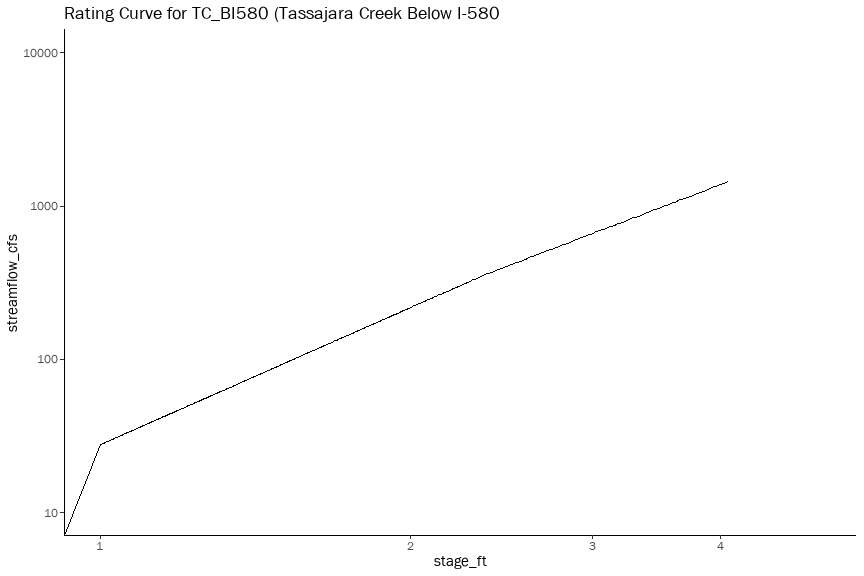
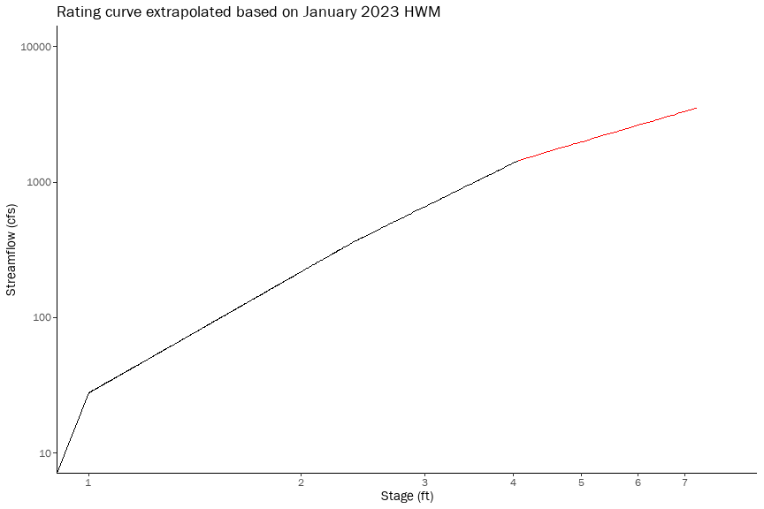
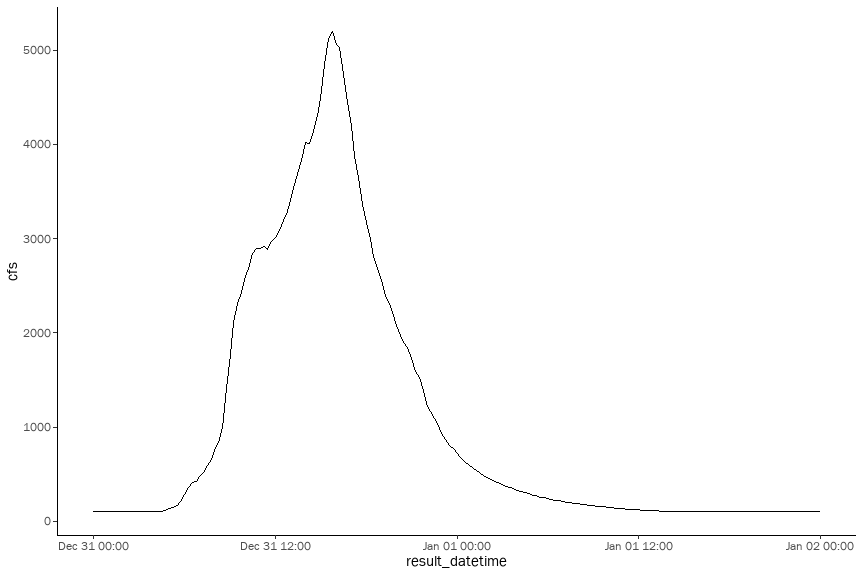
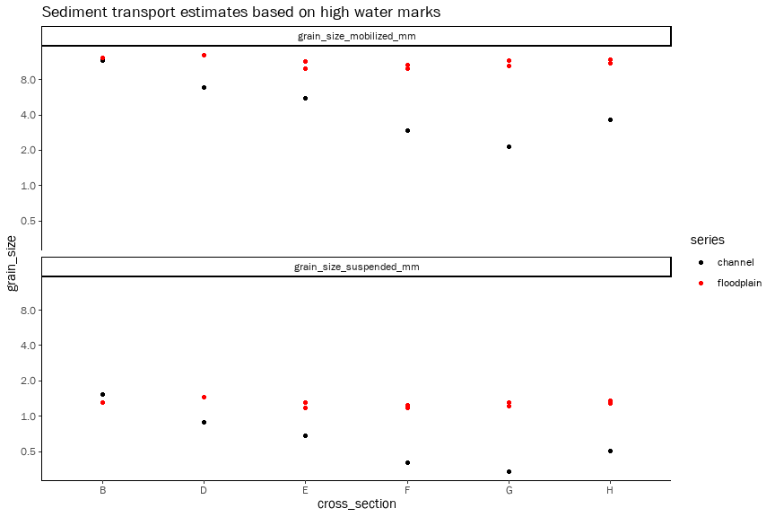
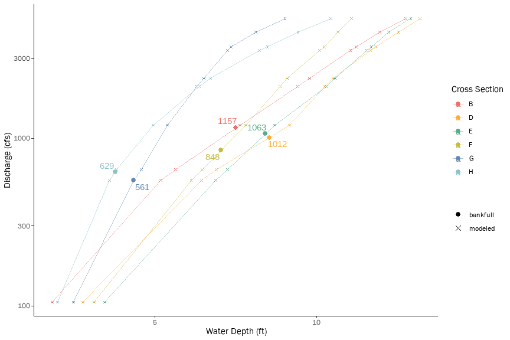
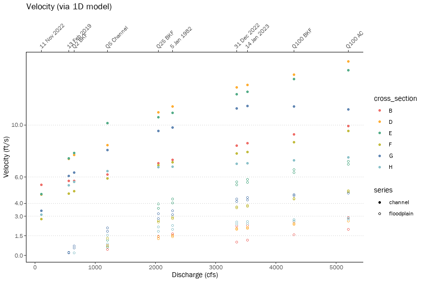
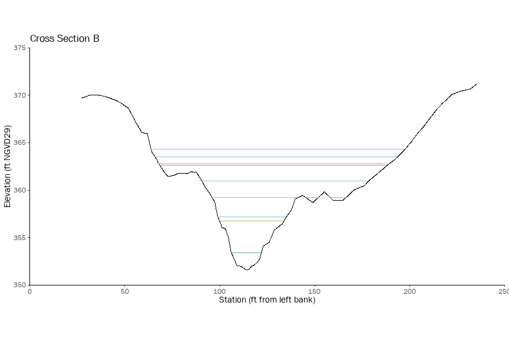
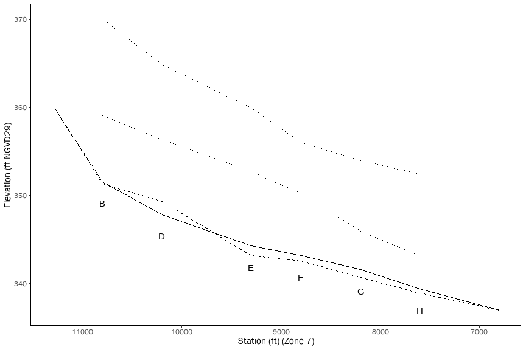

Tassajara Creek H&H Calculations
================

# Hydrologics

``` r
import_streamflow_data <- function(csv) {
  return(read_csv(csv) %>%
    janitor::clean_names() %>%
    mutate(result_datetime = lubridate::mdy(result_date) + lubridate::hms(result_time),
           stage_ft = pmax(gh_probe_ft, 0),
           streamflow_cfs = case_when(streamflow_cfs >=0 ~ streamflow_cfs),
           rain_intensity_in = rain_interval_in * 4
           )
    )
}

new_years_storm <- import_streamflow_data("data/tc-bi580_2022-12-31.csv") 
```

    ## Rows: 3480 Columns: 10
    ## ── Column specification ────────────────────────────────────────────────────────
    ## Delimiter: ","
    ## chr  (1): Result Date
    ## dbl  (8): GHBubbler(ft), GHProbe(ft), WaterTemp(C), RainInterval(in), RainDa...
    ## time (1): Result Time
    ## 
    ## ℹ Use `spec()` to retrieve the full column specification for this data.
    ## ℹ Specify the column types or set `show_col_types = FALSE` to quiet this message.

``` r
new_years_storm %>% 
  ggplot(aes(y = streamflow_cfs, x = stage_ft)) + 
    geom_line(color = "black") + 
    scale_y_continuous(trans = 'log10', limits = c(10, 1e4)) + 
    scale_x_continuous(trans = 'log10', limits = c(1, 5), breaks = 1:4) +
    ggtitle("Rating Curve for TC_BI580 (Tassajara Creek Below I-580") 
```

    ## Warning: Transformation introduced infinite values in continuous y-axis

    ## Warning: Transformation introduced infinite values in continuous x-axis

    ## Warning: Removed 1937 rows containing missing values (`geom_line()`).

<!-- -->

``` r
power_function_fit <- function(data, y, x) {
  df <- data %>% 
    select({{y}}, {{x}}) %>% 
    filter({{y}} > 0 & {{x}} > 0)
  model <- lm(log(df[[deparse(substitute(y))]]) ~ log(df[[deparse(substitute(x))]]))
  coeff <- summary(model)$coeff
  output <- c(alpha = exp(coeff[1,1]), beta = coeff[2,1])
  power_function <- function(x) {
    return(output["alpha"] * x^output["beta"])
  }
  #print(paste0(deparse(substitute(y)), " = ", output["alpha"], " * ", deparse(substitute(x)), "^", output["beta"]))
  #output <- output %>% append(c("function" = power_function))
  #return(output)
  return(power_function)
}

# version 1 of the rating curve using just the stream gauge 
rating_curve <- new_years_storm %>% power_function_fit(y = streamflow_cfs, x = stage_ft)

new_years_storm_pred <- new_years_storm %>%
  #mutate(streamflow_cfs_pred = rating_curve["alpha"] * stage_ft^rating_curve["beta"])
  mutate(streamflow_cfs_pred = rating_curve(stage_ft))

# version 3 of the rating curve using stepwise interpolation based on the I-580 HWM
peak_flow_jan_2023 <- 3524.8

rating_curve <- new_years_storm %>% 
  select(c(streamflow_cfs, stage_ft)) %>% 
  filter(!is.na(streamflow_cfs)) %>% 
  slice_max(stage_ft) %>%
  bind_rows(tribble(
    ~streamflow_cfs, ~stage_ft,
    peak_flow_jan_2023, max(new_years_storm$stage_ft)
  )) %>%
  power_function_fit(y = streamflow_cfs, x = stage_ft)

new_years_storm_pred <- new_years_storm %>%
  mutate(streamflow_cfs_pred = case_when(is.na(streamflow_cfs) ~ rating_curve(stage_ft), TRUE ~ streamflow_cfs),
         is_predicted = is.na(streamflow_cfs))

new_years_storm_pred %>% ggplot(aes(x = stage_ft)) + 
  geom_line(aes(y = streamflow_cfs_pred), color = "red") + 
  geom_line(aes(y = streamflow_cfs), color="black") +
  scale_y_continuous(trans = 'log10', limits = c(10, 1e4)) + 
  scale_x_continuous(trans = 'log10', limits = c(1, 8), breaks = 1:7) +
  ggtitle("Rating curve extrapolated based on January 2023 HWM") + xlab("Stage (ft)") + ylab("Streamflow (cfs)")
```

    ## Warning: Transformation introduced infinite values in continuous y-axis

    ## Warning: Transformation introduced infinite values in continuous x-axis

    ## Warning: Transformation introduced infinite values in continuous y-axis

    ## Warning: Transformation introduced infinite values in continuous x-axis

    ## Warning: Removed 1868 rows containing missing values (`geom_line()`).

    ## Warning: Removed 1937 rows containing missing values (`geom_line()`).

<!-- -->

``` r
ggsave(file="out/gage_rc.svg", plot=last_plot(), width=9, height=6)
```

    ## Warning: Transformation introduced infinite values in continuous y-axis

    ## Warning: Transformation introduced infinite values in continuous x-axis

    ## Warning: Transformation introduced infinite values in continuous y-axis

    ## Warning: Transformation introduced infinite values in continuous x-axis

    ## Warning: Removed 1868 rows containing missing values (`geom_line()`).

    ## Warning: Removed 1937 rows containing missing values (`geom_line()`).

``` r
#new_years_storm_pred %>% ggplot(aes(x = result_datetime)) + 
#  geom_line(aes(y = streamflow_cfs_pred), color = "red") + 
#  geom_line(aes(y = streamflow_cfs), color="black")

maxRange <- 5000
coeff <- 0.0005

new_years_storm_pred %>% 
  filter(result_datetime < ymd("2023-01-23")) %>% #23")) %>%
  ggplot(aes(x = result_datetime)) +
  geom_area(aes(y = streamflow_cfs_pred, 
                fill = "q_pred")) + 
  geom_area(aes(y = streamflow_cfs, 
                fill = "q")) +
  geom_tile(aes(y = maxRange - rain_intensity_in/coeff/2, 
                height = rain_intensity_in/coeff, 
                color = "precip", fill = "precip")) +
  scale_y_continuous(name = "Streamflow (cfs)",
                     limit = c(0, maxRange),
                     expand = c(0, 0),
                     sec.axis = sec_axis(trans = ~(.-maxRange)*coeff, 
                                         name = "Precipitation (in/hr)")) +
  theme(legend.position = 'none') + 
  #ggtitle("Dec 2022 - Jan 2023 rainfall and streamflow") +
  geom_hline(yintercept = 650 , linetype = "dashed") + annotate("text", x=as.POSIXct(ymd("2023-01-21")), y=100+650 , label="Q2 = 650 cfs") +
  geom_hline(yintercept = 1200, linetype = "dashed") + annotate("text", x=as.POSIXct(ymd("2023-01-21")), y=100+1200, label="Q5 = 1200 cfs") +
  scale_fill_manual(values = c("precip" = "black", "q" = "#499894", "q_pred" = "#86bcb6"),
                    labels = c("precip" = "Precipitation", "q" = "Streamflow (gauged)", "q_pred" = "Streamflow (predicted)"),
                    name = NULL) +
  scale_color_manual(values = c("precip" = "black", "q" = "#499894", "q_pred" = "#86bcb6"),
                    labels = c("precip" = "Precipitation", "q" = "Streamflow (gauged)", "q_pred" = "Streamflow (predicted)"),
                    name = NULL) +
  scale_x_datetime(date_breaks = "days" , date_labels = "%d") + 
  xlab("Date (December 2022 - January 2023)") #\n%b") + 
```

    ## Warning: Removed 69 rows containing non-finite values (`stat_align()`).

<!-- -->

``` r
ggsave(file="out/hyeto_hydro.svg", plot=last_plot(), width=9, height=6)
```

    ## Warning: Removed 69 rows containing non-finite values (`stat_align()`).

``` r
# figure out the peak flow from the December storm
peak_flow_dec_2022 <- new_years_storm_pred %>% 
  filter(date(result_datetime) == ymd("2022-12-31")) %>% 
  pull(streamflow_cfs_pred) %>% 
  max()
print(peak_flow_dec_2022)
```

    ## [1] 3346.775

``` r
# export the hydrograph for RAS 2D
min_flow <- 100

hydro_dec <- new_years_storm_pred %>% 
  filter(between(result_datetime, ymd("2022-12-31"), ymd("2023-01-02"))) 
ras_hydro_dec <- hydro_dec %>%
  mutate(cfs = case_when(streamflow_cfs_pred > min_flow ~ streamflow_cfs_pred, TRUE ~ min_flow)) %>%
  select(result_datetime, cfs) 

ras_hydro_dec %>% write_csv("data/ras_hydro_2022-12-31.csv")
ggplot() + geom_line(data = ras_hydro_dec, aes(x = result_datetime, y = cfs))
```

<!-- -->

``` r
hydro_jan <- new_years_storm_pred %>% 
  filter(between(result_datetime, ymd("2023-01-14"), ymd("2023-01-18")))
ras_hydro_jan <- hydro_jan %>%
  mutate(cfs = case_when(streamflow_cfs_pred > min_flow ~ streamflow_cfs_pred, TRUE ~ min_flow)) %>%
  select(result_datetime, cfs) 

ras_hydro_jan %>% write_csv("data/ras_hydro_2023-01-14.csv")
ggplot() + geom_line(data = ras_hydro_jan, aes(x = result_datetime, y = cfs)) 
```

<!-- -->

``` r
# scale December hydrograph to 5200 cfs 100-year flow, 
# as a simple approximation of the 100-year storm

multiplier <- 5200 / max(ras_hydro_dec$cfs)

ras_hydro_q100 <- hydro_dec %>% 
  mutate(cfs = (cfs = case_when(streamflow_cfs_pred * multiplier > min_flow ~ streamflow_cfs_pred * multiplier, TRUE ~ min_flow))) %>%
  select(result_datetime, cfs)

ras_hydro_q100 %>% write_csv("data/ras_hydro_q100.csv")
ggplot() + geom_line(data = ras_hydro_q100, aes(x = result_datetime, y = cfs))
```

<!-- -->

``` r
ggplot() + 
  geom_line(data = ras_hydro_q100, aes(x = result_datetime, y = cfs ,color = "4. Scaled for Q100(AC)"), linewidth=1) +
  geom_line(data = ras_hydro_dec, aes(x = result_datetime, y = cfs, color = "3. Minimum applied for US BC"), linewidth=1) + 
  geom_line(data = new_years_storm_pred %>% filter(result_datetime >= ymd("2022-12-31") & result_datetime < ymd("2023-01-02")), 
            aes(x = result_datetime, y = streamflow_cfs_pred, color = "2. Extrapolated"), linewidth=1) +
  geom_line(data = new_years_storm_pred %>% filter(result_datetime >= ymd("2022-12-31") & result_datetime < ymd("2023-01-02")), 
            aes(x = result_datetime, y = streamflow_cfs, color = "1. Raw"), linewidth=1) + 
  scale_color_manual(values = c("#499894", "#86bcb6", "black", "#ffae34"), name="") + 
  scale_size_manual(values = c(2, 1, 2, 1)) + 
  #scale_linetype_manual(values = c("solid", "dashed", "dashed", "dashed")) +
  theme(legend.position = "bottom")+
  xlab("") + ylab("Streamflow (cfs)") + scale_x_datetime(position = "top") 
```

<!-- -->

``` r
ggsave(file="out/ras_hydro.svg", plot=last_plot(), width=9, height=6)
ggsave(file="out/ras_hydro_short.svg", plot=last_plot(), width=9, height=4) 
```

Examine specific storms

``` r
max_range_left <- 1
max_range_right <- 20
coeff <- max_range_right/max_range_left

new_years_storm_class <- new_years_storm_pred %>%
  filter(result_datetime < ymd("2023-01-23")) %>%
  mutate(storm = as.factor(case_when(
                           result_datetime < ymd_hms("2023-01-02 00:00:00") ~ "1",
                           result_datetime < ymd_hms("2023-01-07 00:00:00") ~ "2",
                           result_datetime < ymd_hms("2023-01-09 18:00:00") ~ NA,
                           result_datetime < ymd_hms("2023-01-13 00:00:00") ~ NA,
                           result_datetime < ymd_hms("2023-01-17 00:00:00") ~ "5",
                             TRUE ~ NA
  )))

new_years_storm_class_summary <- new_years_storm_class %>% group_by(storm) %>% summarize(max_intensity = max(rain_intensity_in),
                                                        total_precip = sum(rain_interval_in),
                                                        max_stage = max(stage_ft),
                                                        max_streamflow = max(streamflow_cfs_pred),
                                                        peak_rainfall_dt = result_datetime[which.max(rain_interval_in)],
                                                        peak_runoff_dt = result_datetime[which.max(stage_ft)],
                                                        #lag_time = as.duration(peak_runoff_dt - peak_rainfall_dt)
                                                        ) %>%
  mutate(storm_label = paste0(
                              total_precip, " in total", "\n", 
                              max_intensity, " in/hr max.", "\n",
                              peak_rainfall_dt
                              ))

new_years_storm_class %>% ggplot(aes(x = result_datetime)) + 
  geom_col(aes(y = rain_intensity_in, color = storm, fill = storm)) +
  geom_line(aes(y = rain_wy_in/coeff)) +
  scale_x_datetime(date_breaks = "days" , date_labels = "%d") + #\n%b") + 
  scale_y_continuous(name = "precipitation intensity (in/hr)",
                   limit = c(0, max_range_left),
                   expand = c(0, 0),
                   sec.axis = sec_axis(trans = ~.*coeff, 
                                       name = "water year cumulative precip (in)")) + 
  geom_point(data = new_years_storm_class_summary %>% filter(storm %in% c(1, 2, 5)), 
             aes(y = max_intensity, x = peak_rainfall_dt, color = storm)) + 
  geom_text(data = new_years_storm_class_summary %>% filter(storm %in% c(1, 2, 5)), 
             aes(y = max_intensity + 0.1, x = peak_rainfall_dt, color = storm, label = storm_label)) +
  theme(legend.position = "none")
```

<!-- -->

``` r
print(sum(new_years_storm_pred$rain_interval_in))
```

    ## [1] 11.327

``` r
print(new_years_storm_class_summary)
```

    ## # A tibble: 4 × 8
    ##   storm max_in…¹ total…² max_s…³ max_s…⁴ peak_rainfall_dt    peak_runoff_dt     
    ##   <fct>    <dbl>   <dbl>   <dbl>   <dbl> <dttm>              <dttm>             
    ## 1 1        0.72     4.34    7.04   3347. 2022-12-31 13:45:00 2022-12-31 15:45:00
    ## 2 2        0.644    1.80    3.45    946. 2023-01-04 18:30:00 2023-01-05 15:00:00
    ## 3 5        0.452    2.98    7.28   3525. 2023-01-14 09:15:00 2023-01-16 06:00:00
    ## 4 <NA>     0.34     2.22    4.16   1491. 2023-01-10 02:45:00 2023-01-09 10:30:00
    ## # … with 1 more variable: storm_label <chr>, and abbreviated variable names
    ## #   ¹​max_intensity, ²​total_precip, ³​max_stage, ⁴​max_streamflow

``` r
print(new_years_storm_pred %>% filter(result_datetime == ymd_hms("2023-01-05 15:30:00")))
```

    ## # A tibble: 1 × 15
    ##   result_date result_t…¹ gh_bu…² gh_pr…³ water…⁴ rain_…⁵ rain_…⁶ rain_…⁷ battery
    ##   <chr>       <time>       <dbl>   <dbl>   <dbl>   <dbl>   <dbl>   <dbl>   <dbl>
    ## 1 01/05/2023  15:30         3.33    3.23      11       0   0.755    12.9    13.0
    ## # … with 6 more variables: streamflow_cfs <dbl>, result_datetime <dttm>,
    ## #   stage_ft <dbl>, rain_intensity_in <dbl>, streamflow_cfs_pred <dbl>,
    ## #   is_predicted <lgl>, and abbreviated variable names ¹​result_time,
    ## #   ²​gh_bubbler_ft, ³​gh_probe_ft, ⁴​water_temp_c, ⁵​rain_interval_in,
    ## #   ⁶​rain_day_pst_in, ⁷​rain_wy_in

``` r
print(new_years_storm_pred %>% filter(result_datetime == ymd_hms("2023-01-06 14:30:00")))
```

    ## # A tibble: 1 × 15
    ##   result_date result_t…¹ gh_bu…² gh_pr…³ water…⁴ rain_…⁵ rain_…⁶ rain_…⁷ battery
    ##   <chr>       <time>       <dbl>   <dbl>   <dbl>   <dbl>   <dbl>   <dbl>   <dbl>
    ## 1 01/06/2023  14:30         1.23    1.11    10.6       0       0    12.9    13.3
    ## # … with 6 more variables: streamflow_cfs <dbl>, result_datetime <dttm>,
    ## #   stage_ft <dbl>, rain_intensity_in <dbl>, streamflow_cfs_pred <dbl>,
    ## #   is_predicted <lgl>, and abbreviated variable names ¹​result_time,
    ## #   ²​gh_bubbler_ft, ³​gh_probe_ft, ⁴​water_temp_c, ⁵​rain_interval_in,
    ## #   ⁶​rain_day_pst_in, ⁷​rain_wy_in

# Flow Frequency

``` r
peak_flows <- tribble(
  ~peak_flow_date, ~discharge_cfs,
  ymd("2019-02-13"), 561,
  ymd("2022-11-11"), 105,
  ymd("2022-12-31"), peak_flow_dec_2022,
  ymd("2023-01-14"), peak_flow_jan_2023
)

flow_freq <- tribble(
  ~use, ~name, ~return_interval_y, ~discharge_cfs,
  T, "Q2 BKF",     2,  650, # 18.4 m3/s per MacWilliams et al 2008
  T, "Q25 BKF",   25, 2048, #  58 m3/s per MacWilliams et al 2008
  T, "Q100 BKF", 100, 4300, # 121.8 m3/s per MacWilliams et al 2008
  F, "Q5 Channel Capacity BKF",     5, 1200, #  34 m3/s per MacWilliams et al 2008
  F, "Q100 Alameda County", 100, 5200, # AlCo estimate from Chan and Heard
)

flow_freq_curve <- flow_freq %>% filter(use) %>% 
  power_function_fit(y = discharge_cfs, x = return_interval_y)

flow_freq_curve_inv <- flow_freq %>% filter(use) %>% 
  power_function_fit(y = return_interval_y, x = discharge_cfs)

flow_freq_pred <- flow_freq %>%
  mutate(return_interval_y_pred = flow_freq_curve_inv(discharge_cfs))

peak_flows_pred <- peak_flows %>%
  mutate(return_interval_y_pred = flow_freq_curve_inv(discharge_cfs))

ggplot() + 
  geom_point(data = flow_freq, aes(y = discharge_cfs, x = return_interval_y)) + 
  geom_point(data = peak_flows_pred, aes(y = discharge_cfs, x = return_interval_y_pred), color = "red") + 
  geom_line(data = flow_freq_pred, aes(y = discharge_cfs, x = return_interval_y_pred)) + 
  scale_y_continuous(trans='log10') + 
  scale_x_continuous(trans='log10') + 
  ggtitle("Flow frequency for model profiles") +
  #ggrepel::geom_text_repel(data = flow_freq, aes(y = discharge_cfs, x = return_interval_y, label = name)) + 
  #ggrepel::geom_text_repel(data = peak_flows_pred, aes(y = discharge_cfs, x = return_interval_y_pred, label = as.character(peak_flow_date)), color = "red")  +
  ggrepel::geom_text_repel(data = peak_flows_pred %>% 
                                    rename(return_interval_y = return_interval_y_pred) %>% 
                                    bind_rows(flow_freq) %>% 
                                    mutate(label = case_when(!is.na(peak_flow_date) ~ as.character(peak_flow_date), TRUE ~ name))
                             , aes(y = discharge_cfs, x = return_interval_y, label = label, color = is.na(peak_flow_date)))  +
  scale_color_manual(values=c("TRUE" = "black", "FALSE" = "red"), name="") +
  ylab("Streamflow (cfs)") + xlab("Return Interval (years)") + theme(legend.position = "none")
```

<!-- -->

``` r
ggsave(file="out/flowfreq.svg", plot=last_plot(), width=9, height=6) 
```

``` r
#peak_flows %>% fasstr::compute_frequency_analysis()
```

# Hydraulics

``` r
stations <- tribble(
  ~cross_section, ~station_1d, ~station_2d, ~culvert,
   NA,    NA,    0, NA, # US boundary
   NA, 11300,   26, "Gleason",# gleason apron toe
  "B", 10800,  490, NA,    
   NA, 10400,   NA, NA, # pedestrian path
  "D", 10200, 1210, NA,     
  "E",  9300, 2061, NA,     
  "F",  8800, 2568, NA,    
  "G",  8200, 3157, NA,    
  "H",  7600, 3828, NA,  
   NA,  6900,   NA, NA, # 580 frontage apron head
   NA,  6800,   NA, "I-580",# 580 underpass
   NA,    NA, 4507, NA,  # DS boundary
)

cross_sections <- stations %>% drop_na(cross_section)
```

Constants

``` r
# gravitational constant, cm/s2
g_cgs <- 981
# grain density and water density, g/cm3
rho_s_cgs <- 2.65
rho_cgs <- 1.00
# kinematic viscosity of water, cm2/s
nu_cgs <- 0.01
```

Helper functions for cross sectional geometry calculations

``` r
prep_xs <- function(data, sta, elev, delta_x) {
  data %>%
    arrange({{sta}}) %>%
    mutate(sta = {{sta}}) %>%
    complete(sta = seq(from = min({{sta}}), to = max({{sta}}), by = delta_x)) %>%
    mutate(gse = zoo::na.approx({{elev}}, x = sta)) %>% 
    select(c(sta, gse))
}

calc_xs <- function(data, water_elev) {
  data %>% 
    arrange(sta) %>%
    mutate(wse = case_when(water_elev > gse ~ water_elev),
           delta_x = abs(lag(sta, 1) - sta),
           delta_z = abs(lag(gse, 1) - gse),
           depth = wse - gse, 
           hyp_length = sqrt(delta_x^2 + delta_z^2)
           ) %>%
    filter(!is.na(wse)) %>% 
    summarize(thalweg_elevation = min(gse),
              water_surface_elevation = water_elev,
              max_depth = water_surface_elevation - thalweg_elevation,
              cross_sectional_area = sum(delta_x * depth),
              wetted_perimeter = sum(hyp_length),
              ) %>% 
    as.list() %>% 
    list_flatten()
}

plot_xs <- function(data, water_elev) {
  data %>% 
    arrange(sta) %>%
    mutate(wse = case_when(water_elev > gse ~ water_elev)) %>%
    ggplot(aes(x = sta)) + 
      geom_line(aes(y = gse)) + 
      geom_line(aes(y = wse))
}
```

Import surveyed cross section geometries

``` r
xs_b <- read_csv("data/xs_geom/xs_b.csv") %>%
  prep_xs(sta = station_left_bank_ft, elev = elevation_ngvd29_ft, delta_x = 0.1) 

xs_d <- read_csv("data/xs_geom/xs_d.csv") %>%
  prep_xs(sta = station_left_bank_ft, elev = elevation_ngvd29_ft, delta_x = 0.1) 

xs_e <- read_csv("data/xs_geom/xs_e.csv") %>%
  prep_xs(sta = station_left_bank_ft, elev = elevation_ngvd29_ft, delta_x = 0.1) 

xs_f <- read_csv("data/xs_geom/xs_f.csv") %>%
  prep_xs(sta = station_left_bank_ft, elev = elevation_ngvd29_ft, delta_x = 0.1) 

xs_g <- read_csv("data/xs_geom/xs_g.csv") %>%
  prep_xs(sta = station_left_bank_ft, elev = elevation_ngvd29_ft, delta_x = 0.1) 

xs_h <- read_csv("data/xs_geom/xs_h.csv") %>%
  prep_xs(sta = station_left_bank_ft, elev = elevation_ngvd29_ft, delta_x = 0.1) 

culvert_gleason <- read_csv("data/xs_geom/culvert_gleason.csv") %>%
  prep_xs(sta = station_left_bank_ft, elev = elevation_ngvd29_ft, delta_x = 0.1) 

culvert_i580 <- read_csv("data/xs_geom/culvert_i580.csv") %>%
  prep_xs(sta = station_left_bank_ft, elev = elevation_ngvd29_ft, delta_x = 0.1) 


xs_dfs <- tribble(
  ~xs_id, ~xs_df,
  "B", xs_b,
  "D", xs_d,
  "E", xs_e,
  "F", xs_f,
  "G", xs_g,
  "H", xs_h, 
)

xs_dfs %>% 
  unnest() %>% 
  ggplot(aes(y = gse, x = sta)) + 
    facet_wrap(~xs_id) + 
    geom_line() + 
    ggtitle("Cross section geometries")
```

<!-- -->

Example plot with a water surface intersected

``` r
plot_xs(xs_b, 359)
```

    ## Warning: Removed 1421 rows containing missing values (`geom_line()`).

<!-- -->

Calculate hydraulic geometries under HWMs (hydraulic radius, etc)

``` r
hwm_geometries <- read_csv("data/high_water_marks_v2.csv") %>%
  janitor::clean_names() %>%
  left_join(xs_dfs, by = join_by(cross_section == xs_id)) %>%
  mutate(result = map2(xs_df, hwm_elevation, calc_xs)) %>% 
  unnest_wider(result)
```

    ## Rows: 16 Columns: 5
    ## ── Column specification ────────────────────────────────────────────────────────
    ## Delimiter: ","
    ## chr  (2): series, cross section
    ## dbl  (2): hwm_elevation, slope
    ## date (1): peak flow date
    ## 
    ## ℹ Use `spec()` to retrieve the full column specification for this data.
    ## ℹ Specify the column types or set `show_col_types = FALSE` to quiet this message.

``` r
hwm_geometries
```

    ## # A tibble: 16 × 11
    ##    series     cross…¹ peak_flo…² hwm_e…³  slope xs_df    thalw…⁴ water…⁵ max_d…⁶
    ##    <chr>      <chr>   <date>       <dbl>  <dbl> <list>     <dbl>   <dbl>   <dbl>
    ##  1 channel    B       2019-02-13    356. 0.012  <tibble>    352.    356.    4.14
    ##  2 channel    D       2019-02-13    353. 0.005  <tibble>    348.    353.    5.51
    ##  3 channel    E       2019-02-13    352. 0.003  <tibble>    344.    352.    7.44
    ##  4 channel    F       2022-11-11    346. 0.003  <tibble>    343.    346.    3.18
    ##  5 channel    G       2022-11-11    344. 0.003  <tibble>    342.    344.    2.70
    ##  6 channel    H       2019-02-13    343. 0.003  <tibble>    339.    343.    3.81
    ##  7 floodplain B       2022-12-31    365. 0.0076 <tibble>    352.    365.   13.3 
    ##  8 floodplain D       2022-12-31    361. 0.0019 <tibble>    348.    361.   13.3 
    ##  9 floodplain E       2022-12-31    356. 0.0056 <tibble>    344.    356.   11.8 
    ## 10 floodplain E       2023-01-14    357. 0.0063 <tibble>    344.    357.   12.6 
    ## 11 floodplain F       2022-12-31    353. 0.0073 <tibble>    343.    353.   10.3 
    ## 12 floodplain F       2023-01-14    354. 0.0075 <tibble>    343.    354.   10.7 
    ## 13 floodplain G       2022-12-31    350. 0.008  <tibble>    342.    350.    8.45
    ## 14 floodplain G       2023-01-14    351. 0.0077 <tibble>    342.    351.    8.96
    ## 15 floodplain H       2022-12-31    347. 0.0023 <tibble>    339.    347.    7.63
    ## 16 floodplain H       2023-01-14    347. 0.0019 <tibble>    339.    347.    8.00
    ## # … with 2 more variables: cross_sectional_area <dbl>, wetted_perimeter <dbl>,
    ## #   and abbreviated variable names ¹​cross_section, ²​peak_flow_date,
    ## #   ³​hwm_elevation, ⁴​thalweg_elevation, ⁵​water_surface_elevation, ⁶​max_depth

``` r
calc_thalweg_elevation <- function(data) {
  min(data$gse)
}
thalweg_elevations <- xs_dfs %>% 
  mutate(thalweg_elevation = map(xs_df, calc_thalweg_elevation)) %>% 
  unnest(thalweg_elevation) %>%
  select(xs_id, thalweg_elevation)
```

Estimate slopes to use in 1d hydraulics. For channels, use normal depth
assumption and calc avg ground slope. For floodplain, use the Dec 2022
HWMs.

``` r
hwm_geometries %>% filter(peak_flow_date == ymd("2022-12-31"))
```

    ## # A tibble: 6 × 11
    ##   series     cross_…¹ peak_flo…² hwm_e…³  slope xs_df    thalw…⁴ water…⁵ max_d…⁶
    ##   <chr>      <chr>    <date>       <dbl>  <dbl> <list>     <dbl>   <dbl>   <dbl>
    ## 1 floodplain B        2022-12-31    365. 0.0076 <tibble>    352.    365.   13.3 
    ## 2 floodplain D        2022-12-31    361. 0.0019 <tibble>    348.    361.   13.3 
    ## 3 floodplain E        2022-12-31    356. 0.0056 <tibble>    344.    356.   11.8 
    ## 4 floodplain F        2022-12-31    353. 0.0073 <tibble>    343.    353.   10.3 
    ## 5 floodplain G        2022-12-31    350. 0.008  <tibble>    342.    350.    8.45
    ## 6 floodplain H        2022-12-31    347. 0.0023 <tibble>    339.    347.    7.63
    ## # … with 2 more variables: cross_sectional_area <dbl>, wetted_perimeter <dbl>,
    ## #   and abbreviated variable names ¹​cross_section, ²​peak_flow_date,
    ## #   ³​hwm_elevation, ⁴​thalweg_elevation, ⁵​water_surface_elevation, ⁶​max_depth

``` r
gleason_wse <- seq(from=min(culvert_gleason$gse)+0.1, to=max(culvert_gleason$gse), by=0.1) %>% 
  as_tibble() %>%
  mutate(result = map(value, function(x){calc_xs(data = culvert_gleason, water_elev=x)})) %>% 
  unnest_wider(col = result) %>%
  drop_na() %>%
  mutate(slope = 0.010,
         mannings_n = 0.016,
         hydraulic_radius = cross_sectional_area / wetted_perimeter, 
         discharge_cfs = 1.486 * cross_sectional_area * hydraulic_radius^(2/3) * slope^(1/2) * mannings_n^(-1)) %>%
  bind_rows(tribble(~highwater, ~discharge_cfs, TRUE, peak_flow_dec_2022)) %>%
  arrange(discharge_cfs) %>%
  mutate(culvert_wse = zoo::na.approx(water_surface_elevation)) %>%
  filter(highwater) %>% 
  pull(culvert_wse)

i580_wse <- seq(from=min(culvert_i580$gse)+0.1, to=max(culvert_i580$gse), by=0.1) %>% 
  as_tibble() %>%
  mutate(result = map(value, function(x){calc_xs(data = culvert_i580, water_elev=x)})) %>% 
  unnest_wider(col = result) %>%
  drop_na() %>%
  mutate(slope = 0.010,
         mannings_n = 0.016,
         hydraulic_radius = cross_sectional_area / wetted_perimeter, 
         discharge_cfs = 1.486 * cross_sectional_area * hydraulic_radius^(2/3) * slope^(1/2) * mannings_n^(-1)) %>%
  bind_rows(tribble(~highwater, ~discharge_cfs, TRUE, peak_flow_dec_2022)) %>%
  arrange(discharge_cfs) %>%
  mutate(culvert_wse = zoo::na.approx(water_surface_elevation)) %>%
  filter(highwater) %>% 
  pull(culvert_wse)

slopes_calc <- stations %>%
  filter(!is.na(cross_section) | !is.na(culvert)) %>%
  left_join(hwm_geometries %>% filter(peak_flow_date == ymd("2022-12-31"))) %>%
  select(cross_section, culvert, station_1d, hwm_elevation, thalweg_elevation) %>%
  left_join(tribble(~culvert, ~culvert_wse, ~culvert_gse,
                    "Gleason", gleason_wse, min(culvert_gleason$gse),
                    "I-580", i580_wse, min(culvert_i580$gse),
                    )) %>%
  mutate(hwm_elevation = case_when(is.na(hwm_elevation) ~ culvert_wse, TRUE ~ hwm_elevation),
         thalweg_elevation = case_when(is.na(thalweg_elevation) ~ culvert_gse, TRUE ~ thalweg_elevation)) %>%
  arrange(station_1d) %>%
  mutate(wse_slope_from_ds = (hwm_elevation - lag(hwm_elevation, 1)) / (station_1d - lag(station_1d, 1)),
         gse_slope_from_ds = (thalweg_elevation - lag(thalweg_elevation, 1)) / (station_1d - lag(station_1d, 1))) %>%
  arrange(-station_1d) %>%
  mutate(wse_slope_from_us = (hwm_elevation - lag(hwm_elevation, 1)) / (station_1d - lag(station_1d, 1)),
         gse_slope_from_us = (thalweg_elevation - lag(thalweg_elevation, 1)) / (station_1d - lag(station_1d, 1))) %>%
  mutate(wse_slope_from_ds = case_when(is.na(wse_slope_from_ds) ~ 0.010, TRUE ~ wse_slope_from_ds),
         wse_slope_from_us = case_when(is.na(wse_slope_from_us) ~ 0.010, TRUE ~ wse_slope_from_us),
         gse_slope_from_ds = case_when(is.na(gse_slope_from_ds) ~ 0.010, TRUE ~ gse_slope_from_ds),
         gse_slope_from_us = case_when(is.na(gse_slope_from_us) ~ 0.010, TRUE ~ gse_slope_from_us),
         floodplain = (wse_slope_from_ds + wse_slope_from_us) / 2,
         channel = (gse_slope_from_ds + gse_slope_from_us) / 2
         #floodplain = wse_slope_from_ds,
         #channel = gse_slope_from_ds
         ) %>%
  # keep just the relevant features
  select(cross_section, channel, floodplain) %>%
  pivot_longer(cols = c(channel, floodplain), names_to = "series", values_to = "slope_calc") %>% drop_na()
```

    ## Joining with `by = join_by(cross_section)`
    ## Joining with `by = join_by(culvert)`

``` r
slopes_calc
```

    ## # A tibble: 12 × 3
    ##    cross_section series     slope_calc
    ##    <chr>         <chr>           <dbl>
    ##  1 B             channel       0.0117 
    ##  2 B             floodplain    0.00423
    ##  3 D             channel       0.00507
    ##  4 D             floodplain    0.00587
    ##  5 E             channel       0.00309
    ##  6 E             floodplain    0.00549
    ##  7 F             channel       0.00245
    ##  8 F             floodplain    0.00551
    ##  9 G             channel       0.00317
    ## 10 G             floodplain    0.00536
    ## 11 H             channel       0.00334
    ## 12 H             floodplain    0.00583

Calculate hydraulics based on hwm geometries and peak flows

``` r
hwm_hydraulics <- hwm_geometries %>% 
  rename(cross_sectional_area_ft2 = cross_sectional_area,
         wetted_perimeter_ft = wetted_perimeter) %>%
  left_join(peak_flows) %>%
  # TEST 8 MARCH 2023
  left_join(slopes_calc) %>%
  mutate(slope = slope_calc) %>%
  # END TEST 8 MARCH 2023
  mutate(velocity_ft_s = discharge_cfs / cross_sectional_area_ft2,
         hydraulic_radius_ft = cross_sectional_area_ft2 / wetted_perimeter_ft,
         mannings_n = 1.486 * cross_sectional_area_ft2 * hydraulic_radius_ft^(2/3) 
                      * slope^(1/2) * discharge_cfs^(-1),
         # metric conversions
         velocity_m_s = velocity_ft_s / 0.3048,
         hydraulic_radius_m = hydraulic_radius_ft / 0.3048,
         cross_sectional_area_m2 = cross_sectional_area_ft2 / 0.3048^2,
         # bed mobilization
         critical_shields_number = 0.15 * slope^(1/4),
         grain_size_mobilized_mm = 10 * rho_cgs * hydraulic_radius_m * slope / 
                         (critical_shields_number * (rho_s_cgs - rho_cgs)),
         grain_size_mobilized_phi = -log2(grain_size_mobilized_mm),
         # suspended transport
         shear_velocity_cm_s = sqrt(g_cgs * (hydraulic_radius_m*100) * slope),
         settling_velocity_ndim = rho_cgs * shear_velocity_cm_s^3 / 
                         ((rho_s_cgs - rho_cgs) * g_cgs * nu_cgs),
         grain_size_suspended_ndim = sqrt(5832 * settling_velocity_ndim),
         grain_size_suspended_mm = 10 * grain_size_suspended_ndim * rho_cgs * nu_cgs^2 /
                         ((rho_s_cgs - rho_cgs) * g_cgs)^(1/3),
         grain_size_suspended_phi = -log2(grain_size_suspended_mm)
  )
```

    ## Joining with `by = join_by(peak_flow_date)`
    ## Joining with `by = join_by(series, cross_section)`

``` r
hwm_hydraulics
```

    ## # A tibble: 16 × 27
    ##    series    cross…¹ peak_flo…² hwm_e…³   slope xs_df    thalw…⁴ water…⁵ max_d…⁶
    ##    <chr>     <chr>   <date>       <dbl>   <dbl> <list>     <dbl>   <dbl>   <dbl>
    ##  1 channel   B       2019-02-13    356. 0.0117  <tibble>    352.    356.    4.14
    ##  2 channel   D       2019-02-13    353. 0.00507 <tibble>    348.    353.    5.51
    ##  3 channel   E       2019-02-13    352. 0.00309 <tibble>    344.    352.    7.44
    ##  4 channel   F       2022-11-11    346. 0.00245 <tibble>    343.    346.    3.18
    ##  5 channel   G       2022-11-11    344. 0.00317 <tibble>    342.    344.    2.70
    ##  6 channel   H       2019-02-13    343. 0.00334 <tibble>    339.    343.    3.81
    ##  7 floodpla… B       2022-12-31    365. 0.00423 <tibble>    352.    365.   13.3 
    ##  8 floodpla… D       2022-12-31    361. 0.00587 <tibble>    348.    361.   13.3 
    ##  9 floodpla… E       2022-12-31    356. 0.00549 <tibble>    344.    356.   11.8 
    ## 10 floodpla… E       2023-01-14    357. 0.00549 <tibble>    344.    357.   12.6 
    ## 11 floodpla… F       2022-12-31    353. 0.00551 <tibble>    343.    353.   10.3 
    ## 12 floodpla… F       2023-01-14    354. 0.00551 <tibble>    343.    354.   10.7 
    ## 13 floodpla… G       2022-12-31    350. 0.00536 <tibble>    342.    350.    8.45
    ## 14 floodpla… G       2023-01-14    351. 0.00536 <tibble>    342.    351.    8.96
    ## 15 floodpla… H       2022-12-31    347. 0.00583 <tibble>    339.    347.    7.63
    ## 16 floodpla… H       2023-01-14    347. 0.00583 <tibble>    339.    347.    8.00
    ## # … with 18 more variables: cross_sectional_area_ft2 <dbl>,
    ## #   wetted_perimeter_ft <dbl>, discharge_cfs <dbl>, slope_calc <dbl>,
    ## #   velocity_ft_s <dbl>, hydraulic_radius_ft <dbl>, mannings_n <dbl>,
    ## #   velocity_m_s <dbl>, hydraulic_radius_m <dbl>,
    ## #   cross_sectional_area_m2 <dbl>, critical_shields_number <dbl>,
    ## #   grain_size_mobilized_mm <dbl>, grain_size_mobilized_phi <dbl>,
    ## #   shear_velocity_cm_s <dbl>, settling_velocity_ndim <dbl>, …

Bankfull estimates (need to fix flow freq calc though)

``` r
#bankfull <- tribble(
#    ~cross_section, ~bankfull_wse, 
#    "B", 359.08,
#    "D", 357.44,
#    "E", 352.73,
#    "F", 350.28,
#    "G", 346.27,
#    "H", 343.16  ) %>%
#  left_join(xs_dfs, by = join_by(cross_section == xs_id)) %>%
#  mutate(result = map2(xs_df, bankfull_wse, calc_xs)) %>% 
#  unnest_wider(result)
#
#bankfull %>% 
#  rename(cross_sectional_area_ft2 = cross_sectional_area,
#         wetted_perimeter_ft = wetted_perimeter) %>%
#  left_join(cross_sections) %>%
#  left_join(hwm_hydraulics %>% 
#              filter(series== "channel") %>% 
#              select(cross_section, slope, mannings_n)) %>%
#  mutate(hydraulic_radius_ft = cross_sectional_area_ft2 / wetted_perimeter_ft,
#         bankfull_discharge = 1.486 * cross_sectional_area_ft2 * hydraulic_radius_ft^(2/3) * slope^(1/2) * mannings_n^(-1),
#         bankfull_return_interval = flow_freq_curve_inv(bankfull_discharge))
```

View RAS 1D results

``` r
ras_1d <- read_csv("data/hec_ras_1d_out_v3.csv") %>%
  janitor::clean_names() %>% 
  left_join(cross_sections, by = join_by(river_sta == station_1d)) %>%
  mutate(peak_flow_date = dmy(profile)) %>%
  drop_na(reach)
```

    ## Rows: 88 Columns: 18
    ## ── Column specification ────────────────────────────────────────────────────────
    ## Delimiter: ","
    ## chr  (2): Reach, Profile
    ## dbl (16): River Sta, Q Total (cfs), Q Channel (cfs), Q Left (cfs), Q Right (...
    ## 
    ## ℹ Use `spec()` to retrieve the full column specification for this data.
    ## ℹ Specify the column types or set `show_col_types = FALSE` to quiet this message.

    ## Warning: There was 1 warning in `mutate()`.
    ## ℹ In argument: `peak_flow_date = dmy(profile)`.
    ## Caused by warning:
    ## !  40 failed to parse.

``` r
# edit: bring in ras result from after storm geometries
ras_1d_afterstorm <- read_csv("data/hec_ras_1d_out_v4_afterstorm.csv") %>%
  janitor::clean_names() %>% 
  left_join(cross_sections, by = join_by(river_sta == station_1d)) %>%
  mutate(peak_flow_date = dmy(profile)) %>%
  drop_na(reach)
```

    ## Rows: 88 Columns: 18
    ## ── Column specification ────────────────────────────────────────────────────────
    ## Delimiter: ","
    ## chr  (2): Reach, Profile
    ## dbl (16): River Sta, Q Total (cfs), Q Channel (cfs), Q Left (cfs), Q Right (...
    ## 
    ## ℹ Use `spec()` to retrieve the full column specification for this data.
    ## ℹ Specify the column types or set `show_col_types = FALSE` to quiet this message.

    ## Warning: There was 1 warning in `mutate()`.
    ## ℹ In argument: `peak_flow_date = dmy(profile)`.
    ## Caused by warning:
    ## !  40 failed to parse.

``` r
ras_1d_afterstorm_summary <- ras_1d_afterstorm %>% 
  rename(w_s_elev_ft_afterstorm = w_s_elev_ft, 
                             min_ch_el_ft_afterstorm = min_ch_el_ft,
                             ) %>%
  select(river_sta, profile, w_s_elev_ft_afterstorm, min_ch_el_ft_afterstorm)
#ras_1d <- ras_1d %>% left_join(ras_1d_afterstorm_summary)


# pull RAS 1D results for Dec 2022
hwm_dec_2022 <- hwm_geometries %>% 
  filter(peak_flow_date == "2022-12-31") %>% 
  left_join(cross_sections)
```

    ## Joining with `by = join_by(cross_section)`

``` r
ras_1d_xs <- ras_1d %>% 
  drop_na(cross_section) #%>% 
  #left_join(capacity) %>%
  #mutate(freeboard = capacity_wse - w_s_elev_ft)

ras_1d_pivot <- bind_rows(
  ras_1d_xs %>% pivot_longer(starts_with("q_")) %>% mutate(measure = "discharge_cfs", 
                                                        loc = case_when(name == "q_total_cfs" ~ "total",
                                                                        name == "q_channel_cfs" ~ "channel",
                                                                        name == "q_left_cfs" ~ "left",
                                                                        name == "q_right_cfs" ~ "right"
                                                                        )),
  ras_1d_xs %>% pivot_longer(starts_with("area_")) %>% mutate(measure = "cross_sectional_area_ft2",
                                                           loc = case_when(name == "area_sq_ft" ~ "total",
                                                                           name == "area_channel_sq_ft" ~ "channel",
                                                                           name == "area_left_sq_ft" ~ "left",
                                                                           name == "area_right_sq_ft" ~ "right"
                                                                        )),
  ras_1d_xs %>% pivot_longer(starts_with("hydr_")) %>% mutate(measure = "hydraulic_radius_ft", 
                                                           loc = case_when(name == "hydr_radius_ft" ~ "total",
                                                                           name == "hydr_radius_c_ft" ~ "channel",
                                                                           name == "hydr_radius_l_ft" ~ "left",
                                                                           name == "hydr_radius_r_ft" ~ "right"
                                                                        ))) %>% 
  select(reach, river_sta, profile, measure, loc, value) %>% 
  pivot_wider(names_from = measure, values_from = value) %>%
  left_join(ras_1d %>% select(cross_section, river_sta, profile, min_ch_el_ft, w_s_elev_ft, e_g_slope_ft_ft, q_total_cfs), by = c("river_sta", "profile"))   

ras_1d_sed <- ras_1d_pivot %>% 
  drop_na(discharge_cfs) %>%
  mutate(series = case_when((loc == "left" | loc == "right") ~ "floodplain", TRUE ~ loc),
                        velocity_ft_s = discharge_cfs / cross_sectional_area_ft2,
                        slope = e_g_slope_ft_ft, # use this for now
                       # metric conversions
                       velocity_m_s = velocity_ft_s / 0.3048,
                       hydraulic_radius_m = hydraulic_radius_ft / 0.3048,
                       cross_sectional_area_m2 = cross_sectional_area_ft2 / 0.3048^2,
                       # bed mobilization
                       critical_shields_number = 0.15 * slope^(1/4),
                       grain_size_mobilized_mm = 10 * rho_cgs * hydraulic_radius_m * slope / 
                                       (critical_shields_number * (rho_s_cgs - rho_cgs)),
                       grain_size_mobilized_phi = -log2(grain_size_mobilized_mm),
                       # suspended transport
                       shear_velocity_cm_s = sqrt(g_cgs * (hydraulic_radius_m*100) * slope),
                       settling_velocity_ndim = rho_cgs * shear_velocity_cm_s^3 / 
                                       ((rho_s_cgs - rho_cgs) * g_cgs * nu_cgs),
                       grain_size_suspended_ndim = sqrt(5832 * settling_velocity_ndim),
                       grain_size_suspended_mm = 10 * grain_size_suspended_ndim * rho_cgs * nu_cgs^2 /
                                       ((rho_s_cgs - rho_cgs) * g_cgs)^(1/3),
                       grain_size_suspended_phi = -log2(grain_size_suspended_mm)
              )

ras_1d_sed
```

    ## # A tibble: 206 × 26
    ##    reach   river…¹ profile loc   disch…² cross…³ hydra…⁴ cross…⁵ min_c…⁶ w_s_e…⁷
    ##    <chr>     <dbl> <chr>   <chr>   <dbl>   <dbl>   <dbl> <chr>     <dbl>   <dbl>
    ##  1 Gleaso…   10800 Q2 BKF  total  650     114.      2.92 B          352.    357.
    ##  2 Gleaso…   10800 Q2 BKF  chan…  650     114.      2.92 B          352.    357.
    ##  3 Gleaso…   10800 Q5 Cha… total 1200     197.      3.12 B          352.    359.
    ##  4 Gleaso…   10800 Q5 Cha… chan… 1198.    194.      4.09 B          352.    359.
    ##  5 Gleaso…   10800 Q5 Cha… right    1.56    3.53    0.22 B          352.    359.
    ##  6 Gleaso…   10800 Q100 B… total 4300     619.      4.66 B          352.    364.
    ##  7 Gleaso…   10800 Q100 B… chan… 3784.    408.      7.24 B          352.    364.
    ##  8 Gleaso…   10800 Q100 B… left    55.1    34.4     1.56 B          352.    364.
    ##  9 Gleaso…   10800 Q100 B… right  461.    177.      3.24 B          352.    364.
    ## 10 Gleaso…   10800 Q100 AC total 5200     724.      5.2  B          352.    364.
    ## # … with 196 more rows, 16 more variables: e_g_slope_ft_ft <dbl>,
    ## #   q_total_cfs <dbl>, series <chr>, velocity_ft_s <dbl>, slope <dbl>,
    ## #   velocity_m_s <dbl>, hydraulic_radius_m <dbl>,
    ## #   cross_sectional_area_m2 <dbl>, critical_shields_number <dbl>,
    ## #   grain_size_mobilized_mm <dbl>, grain_size_mobilized_phi <dbl>,
    ## #   shear_velocity_cm_s <dbl>, settling_velocity_ndim <dbl>,
    ## #   grain_size_suspended_ndim <dbl>, grain_size_suspended_mm <dbl>, …

Manning’s N esitmates

``` r
chan_heard_2006_n = tribble(
  ~cross_section, ~mannings_n,
  "B", 0.0865,
  "D", 0.0368,
  "E", 0.0687,
  "F", 0.0705,
  "G", 0.0520,
  "H", 0.0380
) %>% mutate(series = "floodplain (2006)")

mannings_n <- hwm_hydraulics %>% 
  group_by(series, cross_section) %>%
  summarize(mannings_n = n() / sum(1 / mannings_n)) %>% # harmonic mean
  bind_rows(chan_heard_2006_n)
```

    ## `summarise()` has grouped output by 'series'. You can override using the
    ## `.groups` argument.

``` r
mannings_n %>% 
  ggplot(aes(x = cross_section, y = mannings_n, color = series, label = round(mannings_n,3))) + 
  #geom_point(aes(group = series)) +
  geom_point() +
  ggrepel::geom_text_repel() +
  scale_y_continuous(breaks = c(0, 0.01, 0.02, 0.03, 0.04, 0.05, 0.06, 0.09, 0.12), limits = c(0, 0.13), expand=c(0,0)) +
  scale_color_manual(values = c("channel" = "black", "floodplain" = "red", "floodplain (2006)" = "pink"), name="") + 
  ggtitle("Manning's roughness estimates based on high water marks") + 
  geom_hline(yintercept = 0.04, color = "black", linetype = "dashed") +
  geom_hline(yintercept = 0.06, color = "red", linetype = "dashed") +
  geom_hline(yintercept = 0.12, color = "red", linetype = "dashed")   + 
  ylab("Manning's roughness coefficient (n)") + xlab("Cross Section") + 
  theme(legend.position = "top")
```

<!-- -->

``` r
ggsave(file="out/mannings.svg", plot=last_plot(), width=9, height=6)

# add chan and heard estimates
# add comparison with design estimates
```

Bankfull discharge estimates

``` r
# bankfull <- tribble(
#     ~cross_section, ~bankfull_wse, #~w_s_elev_ft, 
#     "B", 359.08,
#     "D", 357.44,
#     "E", 352.73,
#     "F", 350.28,
#     "G", 346.27,
#     "H", 343.16  
#     ) #%>% mutate(profile = "bankfull")
# 
# xs_depth_vs_discharge <- ras_1d_xs %>%
#   left_join(thalweg_elevations, by = join_by(cross_section == xs_id)) %>%
#   mutate(depth = w_s_elev_ft - thalweg_elevation) %>%
#   select(cross_section, profile, q_total_cfs, depth) 
# 
# bf_model <- xs_depth_vs_discharge %>%
#   group_by(cross_section) %>%
#   do(model = lm(data = ., formula = log(q_total_cfs) ~ log(depth))) %>%
#   mutate(model_coeff = list(model$coefficients)) %>%
#   unnest_wider(col = model_coeff) %>%
#   janitor::clean_names()  %>%
#   mutate(bf_alpha = exp(intercept), bf_beta = log_depth) %>%
#   select(cross_section, bf_alpha, bf_beta)
# 
# bankfull_q <- bankfull %>% 
#   left_join(thalweg_elevations, by = join_by(cross_section == xs_id)) %>% 
#   mutate(bankfull_depth = bankfull_wse - thalweg_elevation) %>%
#   left_join(bf_model) %>%
#   mutate(bankfull_discharge = bf_alpha * bankfull_depth^bf_beta) %>%
#   mutate(bankfull_discharge_ri = flow_freq_curve_inv(bankfull_discharge))
# 
# ggplot() + 
#   geom_point(data = bankfull_q, aes(x = bankfull_depth, y = bankfull_discharge, color = cross_section, shape = "bankfull")) +
#   ggrepel::geom_text_repel(data = bankfull_q, aes(x = bankfull_depth, y = bankfull_discharge, color = cross_section, label = round(bankfull_discharge))) +
#   geom_point(data = xs_depth_vs_discharge, aes(x = depth, y = q_total_cfs, color = cross_section, shape = "modeled")) + 
#   #geom_line(data = xs_depth_vs_discharge, aes(x = depth, y = q_total_cfs, color = cross_section, shape = "modeled")) +
#   geom_smooth(data = xs_depth_vs_discharge, aes(x = depth, y = q_total_cfs, color = cross_section), method = "lm", se = F, linewidth=0.5) +
#   scale_x_log10() + scale_y_log10() +
#   scale_color_manual(values = c("B" = "#ef6f6a",
#                                 "D" = "#ffae34",
#                                 "E" = "#55ad89",
#                                 "F" = "#c3bc3f",
#                                 "G" = "#6388b4",
#                                 "H" = "#8cc2ca"
#                                  )) 
# 
# print(bankfull_q)
```

``` r
bankfull <- tribble(
    ~cross_section, ~bankfull_wse, #~w_s_elev_ft, 
    "B", 359.08,
    "D", 356.38,
    "E", 352.73,
    "F", 350.23,
    "G", 345.95,
    "H", 343.16  
    ) %>% 
  left_join(thalweg_elevations, by = join_by(cross_section == xs_id)) %>% 
  mutate(depth = bankfull_wse - thalweg_elevation, bankfull = TRUE) %>%
  rename(min_ch_el_ft = thalweg_elevation, w_s_elev_ft = bankfull_wse)

xs_depth_vs_discharge <- ras_1d %>% drop_na(cross_section) %>%
  left_join(thalweg_elevations, by = join_by(cross_section == xs_id)) %>%
  mutate(depth = w_s_elev_ft - thalweg_elevation) %>%
  select(cross_section, profile, q_total_cfs, depth, min_ch_el_ft, w_s_elev_ft) 

delta_y <- 0.001
elev_levels <- xs_depth_vs_discharge %>% 
  group_by(cross_section) %>% 
  summarize(thalweg_elevation = min(min_ch_el_ft), min_wse = min(w_s_elev_ft), max_wse = max(w_s_elev_ft)) %>%
  mutate(w_s_elev_ft = map2(min_wse, max_wse, function(x, y) seq(from=x+delta_y, to=y-delta_y, by=delta_y))) %>% 
  unnest() %>%
  mutate(depth = w_s_elev_ft - thalweg_elevation)
```

    ## Warning: `cols` is now required when using `unnest()`.
    ## ℹ Please use `cols = c(w_s_elev_ft)`.

``` r
#bankfull_q <- bankfull %>%
#  bind_rows(xs_depth_vs_discharge) %>%
#  group_by(cross_section) %>% 
#  bind_rows(elev_levels) %>%
#  arrange(cross_section, depth) %>%
#  mutate(q_total_cfs = zoo::na.approx(q_total_cfs)) %>%
#  filter(bankfull)

bankfull_q <-xs_depth_vs_discharge %>%
  bind_rows(elev_levels) %>%
  arrange(cross_section, depth) %>%
  mutate(ln_q_total_cfs = log(q_total_cfs)) %>%
  mutate(ln_q_total_cfs = zoo::na.approx(ln_q_total_cfs)) %>%
  bind_rows(bankfull) %>%
  arrange(cross_section, depth) %>%
  mutate(ln_q_total_cfs = zoo::na.approx(ln_q_total_cfs)) %>%
  mutate(q_total_cfs = exp(ln_q_total_cfs)) %>%
  filter(bankfull) %>%
  mutate(return_interval = flow_freq_curve_inv(q_total_cfs))

ggplot() + 
  geom_point(data = bankfull_q, aes(x = depth, y = q_total_cfs, color = cross_section, shape = "bankfull"), size=2.5) +
  ggrepel::geom_text_repel(data = bankfull_q, aes(x = depth, y = q_total_cfs, color = cross_section, label = round(q_total_cfs))) +
  geom_point(data = xs_depth_vs_discharge, aes(x = depth, y = q_total_cfs, color = cross_section, shape = "modeled"), size=1) + 
  geom_line(data = xs_depth_vs_discharge, aes(x = depth, y = q_total_cfs, color = cross_section), alpha=0.5) + 
  #geom_line(data = xs_depth_vs_discharge, aes(x = depth, y = q_total_cfs, color = cross_section, shape = "modeled")) +
  scale_y_log10() + 
  ylab("Discharge (cfs)") + xlab("Water Depth (ft)") +
  scale_color_manual(values = c("B" = "#ef6f6a", 
                                "D" = "#ffae34",
                                "E" = "#55ad89",
                                "F" = "#c3bc3f",
                                "G" = "#6388b4",
                                "H" = "#8cc2ca"
                                 ), name="Cross Section") +
  scale_shape_manual(values = c("bankfull" = 19, "modeled" = 4), name="")
```

<!-- -->

``` r
ggsave(file="out/bankfull.svg", plot=last_plot(), width=9, height=6)

bankfull_q#
```

    ## # A tibble: 6 × 12
    ##   cross_…¹ profile q_tot…² depth min_c…³ w_s_e…⁴ thalw…⁵ min_wse max_wse ln_q_…⁶
    ##   <chr>    <chr>     <dbl> <dbl>   <dbl>   <dbl>   <dbl>   <dbl>   <dbl>   <dbl>
    ## 1 B        <NA>      1157.  7.5     352.    359.      NA      NA      NA    7.05
    ## 2 D        <NA>      1012.  8.53    348.    356.      NA      NA      NA    6.92
    ## 3 E        <NA>      1063.  8.41    344.    353.      NA      NA      NA    6.97
    ## 4 F        <NA>       848.  7.04    343.    350.      NA      NA      NA    6.74
    ## 5 G        <NA>       561.  4.34    342.    346.      NA      NA      NA    6.33
    ## 6 H        <NA>       629.  3.77    339.    343.      NA      NA      NA    6.44
    ## # … with 2 more variables: bankfull <lgl>, return_interval <dbl>, and
    ## #   abbreviated variable names ¹​cross_section, ²​q_total_cfs, ³​min_ch_el_ft,
    ## #   ⁴​w_s_elev_ft, ⁵​thalweg_elevation, ⁶​ln_q_total_cfs

``` r
if (FALSE) {
  
bankfull <- tribble(
    ~cross_section, ~bankfull_wse, ~thalweg_elevation, #~w_s_elev_ft, 
    "B", 359.08,351.36,
    "D", 356.38,349.37,
    "E", 352.73,343.2,
    "F", 350.23, 342.6,
    "G", 345.95, 340.73,
    "H", 343.16 , 338.93,
    ) %>% 
  mutate(bankfull = TRUE) 

xs_depth_vs_discharge <- ras_1d_afterstorm %>% 
  drop_na(cross_section) %>%
  mutate(depth = w_s_elev_ft - min_ch_el_ft) %>%
  select(cross_section, profile, q_total_cfs, depth, min_ch_el_ft, w_s_elev_ft) 

delta_y <- 0.001
elev_levels <- xs_depth_vs_discharge %>% 
  group_by(cross_section) %>% 
  summarize(thalweg_elevation = min(min_ch_el_ft), min_wse = min(w_s_elev_ft), max_wse = max(w_s_elev_ft)) %>%
  mutate(w_s_elev_ft = map2(min_wse, max_wse, function(x, y) seq(from=x+delta_y, to=y-delta_y, by=delta_y))) %>% 
  unnest(cols = c(w_s_elev_ft)) %>%
  mutate(depth = w_s_elev_ft - thalweg_elevation)

#bankfull_q <- bankfull %>%
#  bind_rows(xs_depth_vs_discharge) %>%
#  group_by(cross_section) %>% 
#  bind_rows(elev_levels) %>%
#  arrange(cross_section, depth) %>%
#  mutate(q_total_cfs = zoo::na.approx(q_total_cfs)) %>%
#  filter(bankfull)

bankfull_q <-xs_depth_vs_discharge %>%
  bind_rows(elev_levels) %>%
  arrange(cross_section, depth) %>%
  mutate(ln_q_total_cfs = log(q_total_cfs)) %>%
  mutate(ln_q_total_cfs = zoo::na.approx(ln_q_total_cfs)) %>%
  bind_rows(bankfull) %>%
  arrange(cross_section, depth) %>%
  mutate(ln_q_total_cfs = zoo::na.approx(ln_q_total_cfs)) %>%
  mutate(q_total_cfs = exp(ln_q_total_cfs)) %>%
  filter(bankfull) %>%
  mutate(return_interval = flow_freq_curve_inv(q_total_cfs))

ggplot() + 
  geom_point(data = bankfull_q, aes(x = depth, y = q_total_cfs, color = cross_section, shape = "bankfull"), size=2.5) +
  ggrepel::geom_text_repel(data = bankfull_q, aes(x = depth, y = q_total_cfs, color = cross_section, label = round(q_total_cfs))) +
  geom_point(data = xs_depth_vs_discharge, aes(x = depth, y = q_total_cfs, color = cross_section, shape = "modeled"), size=1) + 
  geom_line(data = xs_depth_vs_discharge, aes(x = depth, y = q_total_cfs, color = cross_section), alpha=0.5) + 
  #geom_line(data = xs_depth_vs_discharge, aes(x = depth, y = q_total_cfs, color = cross_section, shape = "modeled")) +
  scale_y_log10() + 
  ylab("Discharge (cfs)") + xlab("Water Depth (ft)") +
  scale_color_manual(values = c("B" = "#ef6f6a", 
                                "D" = "#ffae34",
                                "E" = "#55ad89",
                                "F" = "#c3bc3f",
                                "G" = "#6388b4",
                                "H" = "#8cc2ca"
                                 ), name="Cross Section") +
  scale_shape_manual(values = c("bankfull" = 19, "modeled" = 4), name="")
ggsave(file="out/bankfull.svg", plot=last_plot(), width=9, height=6)

bankfull_q#

}
```

Freeboard

``` r
capacity <- tribble(
    ~cross_section, ~capacity_wse, 
    "B", 370.05,                    
    "D", 364.88,
    "E", 359.95,
    "F", 356.01,
    "G", 353.96,
    "H", 352.44) 

ras_1d_xs %>%
  left_join(capacity) %>%
  filter(stringr::str_detect(profile, "Q100")) %>% 
  mutate(freeboard = capacity_wse - w_s_elev_ft) %>%
  select(cross_section, profile, freeboard) %>%
  pivot_wider(names_from = profile, values_from = freeboard)
```

    ## Joining with `by = join_by(cross_section)`

    ## # A tibble: 6 × 3
    ##   cross_section `Q100 BKF` `Q100 AC`
    ##   <chr>              <dbl>     <dbl>
    ## 1 B                   6.53      5.72
    ## 2 D                   4.51      3.84
    ## 3 E                   3.41      2.73
    ## 4 F                   2.17      1.75
    ## 5 G                   4.24      3.33
    ## 6 H                   3.63      2.62

Sediment transport plots

``` r
hwm_hydraulics %>% 
  pivot_longer(cols = c(grain_size_suspended_mm, grain_size_mobilized_mm), names_to = "measure", values_to = "grain_size") %>%
  ggplot(aes(x = cross_section, color = series)) + 
  geom_point(aes(y = grain_size, group = series)) +
  scale_color_manual(values = c("channel" = "black", "floodplain" = "red")) + 
  facet_wrap(~measure, ncol = 1) +
  scale_y_continuous(trans = "log2") + 
  ggtitle("Sediment transport estimates based on high water marks")
```

<!-- -->

``` r
breaks <- ras_1d_sed %>% group_by(profile, q_total_cfs) %>% summarize() %>% as.list()
```

    ## `summarise()` has grouped output by 'profile'. You can override using the
    ## `.groups` argument.

``` r
ras_1d_sed %>% 
  filter(loc != "total") %>%
  #group_by(series, cross_section, profile, q_total_cfs) %>% 
  #summarize(velocity_ft_s = mean(velocity_ft_s)) %>%
  ggplot(aes(x = q_total_cfs, y = velocity_ft_s, color = cross_section, label = cross_section, shape = loc)) + 
  geom_point() + scale_shape_manual(values=c(19, 24, 25)) +
  facet_grid(cols = vars(series)) + ggtitle("Velocity (via 1D model)") +
  geom_hline(yintercept=10, linetype='dotted', col = 'red') + 
  scale_x_continuous(breaks = breaks$q_total_cfs, labels = breaks$profile, position = "top", name = "", 
                     sec.axis = sec_axis(trans = ~ ., name = "Discharge (cfs)")) + 
  theme(axis.text.x.top = element_text(angle = 45, vjust = 0, hjust=0)) +
  scale_color_manual(values = c("B" = "#ef6f6a",
                                "D" = "#ffae34",
                                "E" = "#55ad89",
                                "F" = "#c3bc3f",
                                "G" = "#6388b4",
                                "H" = "#8cc2ca"
                                 )) + ylab("Velocity (ft/s)")
```

<!-- -->

``` r
ggsave(file="out/q_velocity.svg", plot=last_plot(), width=9, height=6)

ras_1d_sed %>% 
  filter(loc != "total") %>%
  #group_by(series, cross_section, profile, q_total_cfs) %>% 
  #summarize(grain_size_mobilized_mm = mean(grain_size_mobilized_mm)) %>%
  ggplot(aes(x = q_total_cfs, y = grain_size_mobilized_mm, color = cross_section, label = cross_section, shape = loc)) + 
  geom_point() + scale_shape_manual(values=c(19, 24, 25)) +
  facet_grid(cols = vars(series)) + ggtitle("Bed Mobilization (via 1D model)") +
  scale_y_continuous(limits = c(0,20), breaks = c(2^0, 2^1, 2^2, 2^3, 2^4)) + 
    scale_x_continuous(breaks = breaks$q_total_cfs, labels = breaks$profile, position = "top", name = "", 
                     sec.axis = sec_axis(trans = ~ ., name = "Discharge (cfs)")) + 
  geom_hline(yintercept=2^0, col = "gray", linetype = "dotted") +
  geom_hline(yintercept=2^1,   col = "gray", linetype = "dotted") +
  geom_hline(yintercept=2^2,   col = "gray", linetype = "dotted") +
  geom_hline(yintercept=2^3,   col = "gray", linetype = "dotted") +
  geom_hline(yintercept=2^4 ,  col = "gray", linetype = "dotted") +
  theme(axis.text.x.top = element_text(angle = 45, vjust = 0, hjust=0)) +
  scale_color_manual(values = c("B" = "#ef6f6a",
                                "D" = "#ffae34",
                                "E" = "#55ad89",
                                "F" = "#c3bc3f",
                                "G" = "#6388b4",
                                "H" = "#8cc2ca"
                                 )) + ylab("Grain Size (mm)")
```

<!-- -->

``` r
ggsave(file="out/q_sed_bedmobiliz.svg", plot=last_plot(), width=9, height=6)

ras_1d_sed %>% 
  filter(loc != "total") %>%
  #group_by(series, cross_section, profile, q_total_cfs) %>% 
  #summarize(grain_size_suspended_mm = mean(grain_size_suspended_mm)) %>%
  ggplot(aes(x = q_total_cfs, y = grain_size_suspended_mm, color = cross_section, label = cross_section, shape = loc)) + 
  geom_point() + scale_shape_manual(values=c(19, 24, 25)) +
  facet_grid(cols = vars(series)) + ggtitle("Suspended Transport (via 1D model)") +
  scale_y_continuous(limits = c(0,2.25), breaks = c(2^-4, 2^-3, 2^-2, 2^-1, 2^0, 2^1)) +
    scale_x_continuous(breaks = breaks$q_total_cfs, labels = breaks$profile, position = "top", name = "", 
                     sec.axis = sec_axis(trans = ~ ., name = "Discharge (cfs)")) + 
  geom_hline(yintercept=2^-4, col = "gray", linetype = "dotted") +
  geom_hline(yintercept=2^-3,   col = "gray", linetype = "dotted") +
  geom_hline(yintercept=2^-2,   col = "gray", linetype = "dotted") +
  geom_hline(yintercept=2^-1,   col = "gray", linetype = "dotted") +
  geom_hline(yintercept=2^0 ,  col = "gray", linetype = "dotted") +
  geom_hline(yintercept=2^1 ,  col = "gray", linetype = "dotted") +
  theme(axis.text.x.top = element_text(angle = 45, vjust = 0, hjust=0)) +
  scale_color_manual(values = c("B" = "#ef6f6a",
                                "D" = "#ffae34",
                                "E" = "#55ad89",
                                "F" = "#c3bc3f",
                                "G" = "#6388b4",
                                "H" = "#8cc2ca"
                                 )) + ylab("Grain Size (mm)")
```

<!-- -->

``` r
ggsave(file="out/q_sed_suspended.svg", plot=last_plot(), width=9, height=6)
```

``` r
ras_1d_sed %>% 
  filter(loc != "total") %>%
  #group_by(series, cross_section, profile, q_total_cfs) %>% 
  #summarize(velocity_ft_s = mean(velocity_ft_s)) %>%
  ggplot(aes(x = q_total_cfs, y = velocity_ft_s)) + 
  geom_point(aes(color = cross_section, shape = series)) + scale_shape_manual(values=c(19, 21)) +
  #geom_smooth(aes(color = cross_section, shape = series)) + scale_shape_manual(values=c(19, 21)) +
  #facet_grid(cols = vars(series)) + 
  ggtitle("Velocity (via 1D model)") +
  scale_x_continuous(breaks = breaks$q_total_cfs, labels = breaks$profile, position = "top", name = "", 
                     sec.axis = sec_axis(trans = ~ ., name = "Discharge (cfs)")) + 
  theme(axis.text.x.top = element_text(angle = 45, vjust = 0, hjust=0), panel.grid.major.y = element_blank()) + 
  geom_hline(yintercept=1.5, col = "gray", linetype = "dotted") +
  geom_hline(yintercept=3,   col = "gray", linetype = "dotted") +
  geom_hline(yintercept=4,   col = "gray", linetype = "dotted") +
  geom_hline(yintercept=6,   col = "gray", linetype = "dotted") +
  geom_hline(yintercept=10,  col = "gray", linetype = "dotted") +
  scale_y_continuous(breaks = c(0, 1.5, 3, 4, 6, 10)) +
  scale_color_manual(values = c("B" = "#ef6f6a",
                                "D" = "#ffae34",
                                "E" = "#55ad89",
                                "F" = "#c3bc3f",
                                "G" = "#6388b4",
                                "H" = "#8cc2ca"
                                 )) + ylab("Velocity (ft/s)")
```

<!-- -->

``` r
ggsave(file="out/q_velocity_stacked.svg", plot=last_plot(), width=9, height=6)
```

``` r
profile_colors <- c("Q100 AC" = "#8cc2ca",
                                "Q100 BKF" = "#8cc2ca",
                                "Q25 BKF" = "#8cc2ca",
                                "Q5 Channel" = "#8cc2ca",
                                "Q2 BKF" = "#8cc2ca",
                                "14 Jan 2023" = "#ffae34",
                                "31 Dec 2022" = "#bb7693",
                                "13 Feb 2019" = "#c3bc3f",
                                "11 Nov 2022" = "#55ad89"
                                 )

ras_1d %>% 
  left_join(hwm_geometries) %>% 
  filter(profile != "5 Jan 1982") %>%
  left_join(bankfull %>% rename(bankfull_wse = w_s_elev_ft) %>% select(cross_section, bankfull_wse)) %>%
  arrange(water_surface_elevation) %>%
  mutate(profile_fct = forcats::fct_reorder(profile, -w_s_elev_ft)) %>%
  ggplot(aes(x = river_sta)) + 
    geom_line(aes(y = w_s_elev_ft, color = profile_fct) ) + 
    geom_line(aes(y = min_ch_el_ft), color = "black") +
    scale_x_reverse() + theme(legend.title=element_blank()) + 
    geom_point(aes(y = water_surface_elevation, color = profile_fct), shape = 9, size = 4) + 
    geom_text(aes(y = bankfull_wse, label = "- -"), color = "black", size = 4) +
    geom_text(data = left_join(hwm_dec_2022, capacity), aes(x = station_1d, y = capacity_wse, label = "—"), color = "black", size = 4) +
  scale_color_manual(values = profile_colors) +
    #ggtitle("2D model result") + 
  xlab("Station (ft) (Zone 7)") + 
  ylab("Elevation (ft NGVD29)") +
  geom_text(data = hwm_dec_2022, aes(x = station_1d, 
                                     y = thalweg_elevation - 1, 
                                     label = cross_section ))
```

    ## Joining with `by = join_by(cross_section, peak_flow_date)`
    ## Joining with `by = join_by(cross_section)`
    ## Joining with `by = join_by(cross_section)`

    ## Warning: Removed 56 rows containing missing values (`geom_point()`).

    ## Warning: Removed 18 rows containing missing values (`geom_text()`).

<!-- -->

``` r
#
ggsave(file="out/lp_1d_wse.svg", plot=last_plot(), width=9, height=6)
```

    ## Warning: Removed 56 rows containing missing values (`geom_point()`).
    ## Removed 18 rows containing missing values (`geom_text()`).

``` r
  #+ 
    #scale_linetype_manual(values = c("Q100 AC" = "dashed",
    #                            "Q100 BKF" = "solid",
    #                            "Q25 BKF" = "solid",
    #                            "Q5 Channel" = "dashed",
    #                            "Q2 BKF" = "solid",
    #                            "14 Jan 2023" = "dashed",
    #                            "31 Dec 2022" = "solid",
    #                            "13 Feb 2019" = "dashed",
    #                            "11 Nov 2022" = "solid"
    #                             )) + 
  #labs(color = "profile", linetype = "profile")
```

``` r
# COMPARING AGAINST 2023 AFTER STORM SURVEY 
#ras_1d %>% left_join(ras_1d_afterstorm, by = join_by(reach, river_sta, profile, cross_section, station_2d, culvert, peak_flow_date), suffix=c("_2022", "_2023"))
ras_1d %>% 
  bind_rows(ras_1d_afterstorm, .id="geometry") %>%
  mutate(depth = w_s_elev_ft - min_ch_el_ft) %>%
  select(geometry, river_sta, cross_section, profile, w_s_elev_ft, min_ch_el_ft, depth) %>%
  mutate(profile_fct = forcats::fct_reorder(profile, -w_s_elev_ft)) %>%
  pivot_wider(names_from = geometry, values_from = c(min_ch_el_ft, w_s_elev_ft, depth)) %>%
  ggplot(aes(x = river_sta)) + 
  geom_line(aes(y = w_s_elev_ft_1, color = profile_fct)) + 
  geom_line(aes(y = w_s_elev_ft_2, color = profile_fct), linetype="dashed") +
  geom_line(aes(y = min_ch_el_ft_1)) + 
  geom_line(aes(y = min_ch_el_ft_2), linetype="dashed") + scale_color_manual(values = profile_colors) + 
      scale_x_reverse() + theme(legend.title=element_blank()) +
  xlab("Station (ft) (Zone 7)") + 
  ylab("Elevation (ft NGVD29)") + 
  geom_text(data = left_join(hwm_dec_2022, capacity), aes(x = station_1d, y = capacity_wse, label = "—"), color = "black", size = 4) +
  geom_text(data = hwm_dec_2022, aes(x = station_1d, y = thalweg_elevation - 2.5, label = cross_section )) 
```

    ## Joining with `by = join_by(cross_section)`

<!-- -->

``` r
ggsave(file="out/lp_1d_wse_afterstorm.svg", plot=last_plot(), width=9, height=6)
```

``` r
# COMPARING AGAINST 2023 AFTER STORM SURVEY 
#ras_1d %>% left_join(ras_1d_afterstorm, by = join_by(reach, river_sta, profile, cross_section, station_2d, culvert, peak_flow_date), suffix=c("_2022", "_2023"))
ras_1d %>% 
  bind_rows(ras_1d_afterstorm, .id="geometry") %>%
  mutate(depth = w_s_elev_ft - min_ch_el_ft) %>%
  select(geometry, river_sta, cross_section, profile, w_s_elev_ft, min_ch_el_ft, depth) %>%
  mutate(profile_fct = forcats::fct_reorder(profile, -w_s_elev_ft)) %>%
  pivot_wider(names_from = geometry, values_from = c(min_ch_el_ft, w_s_elev_ft, depth)) %>%
  ggplot(aes(x = river_sta)) + 
  geom_line(aes(y = min_ch_el_ft_1)) + 
  geom_line(aes(y = min_ch_el_ft_2), linetype="dashed") + scale_color_manual(values = profile_colors) + 
      scale_x_reverse() + theme(legend.title=element_blank()) +
  xlab("Station (ft) (Zone 7)") + 
  ylab("Elevation (ft NGVD29)") + 
  geom_text(data = hwm_dec_2022, aes(x = station_1d, y = thalweg_elevation - 2.5, label = cross_section )) + 
  geom_line(data = left_join(hwm_dec_2022, capacity), aes(x = station_1d, y = capacity_wse), color = "black", linetype="dotted") +
  geom_line(data = left_join(hwm_dec_2022, bankfull), aes(x = station_1d, y = w_s_elev_ft ), color = "black", linetype="dotted") 
```

    ## Joining with `by = join_by(cross_section)`
    ## Joining with `by = join_by(cross_section)`

<!-- -->

``` r
ggsave(file="out/lp_1d_thalweg.svg", plot=last_plot(), width=9, height=6)
```

``` r
ras_1d %>% 
  bind_rows(ras_1d_afterstorm, .id="geometry") %>%
  select(geometry, cross_section, profile, w_s_elev_ft, min_ch_el_ft) %>%
  pivot_wider(names_from = geometry, values_from = c(min_ch_el_ft, w_s_elev_ft)) %>%
  unnest() %>%
  drop_na(cross_section) %>%
  mutate(w_s_elev_ft_delta = w_s_elev_ft_2 - w_s_elev_ft_1,
         min_ch_el_ft_delta = min_ch_el_ft_2 - min_ch_el_ft_1
         ) %>%
  filter(profile %in% c("Q2 BKF", "Q100 AC")) %>% write_csv("out/ras_1d_comparison.csv")
```

    ## Warning: Values from `min_ch_el_ft` and `w_s_elev_ft` are not uniquely identified;
    ## output will contain list-cols.
    ## • Use `values_fn = list` to suppress this warning.
    ## • Use `values_fn = {summary_fun}` to summarise duplicates.
    ## • Use the following dplyr code to identify duplicates.
    ##   {data} %>%
    ##   dplyr::group_by(cross_section, profile, geometry) %>%
    ##   dplyr::summarise(n = dplyr::n(), .groups = "drop") %>%
    ##   dplyr::filter(n > 1L)

    ## Warning: `cols` is now required when using `unnest()`.
    ## ℹ Please use `cols = c(min_ch_el_ft_1, min_ch_el_ft_2, w_s_elev_ft_1,
    ##   w_s_elev_ft_2)`.

``` r
geom_xs_wse <- function(data, water_elev, profile) {
  wse_data <- data %>% 
    arrange(sta) %>%
    mutate(wse = case_when(water_elev > gse ~ water_elev)) 
  return(geom_line(data=wse_data, aes(x = sta, y = wse, color = profile)))
}

gen_plot <- function(xs_df, xs_name) {
plot_xs(xs_df, 0) + 
  geom_xs_wse(xs_df, profile = "Q100 AC", water_elev = ras_1d %>% filter(cross_section == xs_name & profile == "Q100 AC") %>% pull(w_s_elev_ft)) + 
  geom_xs_wse(xs_df, profile = "Q100 BKF", water_elev = ras_1d %>% filter(cross_section ==  xs_name & profile == "Q100 BKF") %>% pull(w_s_elev_ft)) + 
  geom_xs_wse(xs_df, profile = "14 Jan 2023", water_elev = ras_1d %>% filter(cross_section == xs_name & profile == "14 Jan 2023") %>% pull(w_s_elev_ft)) + 
  geom_xs_wse(xs_df, profile = "31 Dec 2022", water_elev = ras_1d %>% filter(cross_section == xs_name & profile == "31 Dec 2022") %>% pull(w_s_elev_ft)) + 
  geom_xs_wse(xs_df, profile = "Q25 BKF", water_elev = ras_1d %>% filter(cross_section == xs_name & profile == "Q25 BKF") %>% pull(w_s_elev_ft)) + 
  geom_xs_wse(xs_df, profile = "Q5 Channel", water_elev = ras_1d %>% filter(cross_section == xs_name & profile == "Q5 Channel") %>% pull(w_s_elev_ft)) + 
  geom_xs_wse(xs_df, profile = "Q2 BKF", water_elev = ras_1d %>% filter(cross_section == xs_name & profile == "Q2 BKF") %>% pull(w_s_elev_ft)) + 
  geom_xs_wse(xs_df, profile = "13 Feb 2019", water_elev = ras_1d %>% filter(cross_section == xs_name & profile == "13 Feb 2019") %>% pull(w_s_elev_ft)) + 
  geom_xs_wse(xs_df, profile = "11 Nov 2022", water_elev = ras_1d %>% filter(cross_section == xs_name & profile == "11 Nov 2022") %>% pull(w_s_elev_ft)) + 
    scale_color_manual(values = profile_colors, name="") + 
    theme(legend.position = "none") + 
    ylab("Elevation (ft NGVD29)") + 
    xlab("Station (ft from left bank)") + 
    ggtitle(paste0("Cross Section ",xs_name)) 
    
}
gen_plot(xs_b, "B") + coord_fixed(ratio=5, ylim=c(350,375), xlim=c(0,250), expand=FALSE)
```

    ## Warning: Removed 2115 rows containing missing values (`geom_line()`).

    ## Warning: Removed 758 rows containing missing values (`geom_line()`).

    ## Warning: Removed 821 rows containing missing values (`geom_line()`).

    ## Warning: Removed 883 rows containing missing values (`geom_line()`).

    ## Warning: Removed 900 rows containing missing values (`geom_line()`).

    ## Warning: Removed 1224 rows containing missing values (`geom_line()`).

    ## Warning: Removed 1404 rows containing missing values (`geom_line()`).

    ## Warning: Removed 1750 rows containing missing values (`geom_line()`).

    ## Warning: Removed 1773 rows containing missing values (`geom_line()`).

    ## Warning: Removed 1956 rows containing missing values (`geom_line()`).

<!-- -->

``` r
ggsave(file=paste0("out/xs_b_1d.svg"), plot=last_plot(), width=9, height=4) 
```

    ## Warning: Removed 2115 rows containing missing values (`geom_line()`).

    ## Warning: Removed 758 rows containing missing values (`geom_line()`).

    ## Warning: Removed 821 rows containing missing values (`geom_line()`).

    ## Warning: Removed 883 rows containing missing values (`geom_line()`).

    ## Warning: Removed 900 rows containing missing values (`geom_line()`).

    ## Warning: Removed 1224 rows containing missing values (`geom_line()`).

    ## Warning: Removed 1404 rows containing missing values (`geom_line()`).

    ## Warning: Removed 1750 rows containing missing values (`geom_line()`).

    ## Warning: Removed 1773 rows containing missing values (`geom_line()`).

    ## Warning: Removed 1956 rows containing missing values (`geom_line()`).

``` r
gen_plot(xs_d, "D") + coord_fixed(ratio=5, ylim=c(345,370), xlim=c(0,250), expand=FALSE)
```

    ## Warning: Removed 2077 rows containing missing values (`geom_line()`).

    ## Warning: Removed 312 rows containing missing values (`geom_line()`).

    ## Warning: Removed 361 rows containing missing values (`geom_line()`).

    ## Warning: Removed 407 rows containing missing values (`geom_line()`).

    ## Warning: Removed 418 rows containing missing values (`geom_line()`).

    ## Warning: Removed 529 rows containing missing values (`geom_line()`).

    ## Warning: Removed 591 rows containing missing values (`geom_line()`).

    ## Warning: Removed 1884 rows containing missing values (`geom_line()`).

    ## Warning: Removed 1895 rows containing missing values (`geom_line()`).

    ## Warning: Removed 1967 rows containing missing values (`geom_line()`).

<!-- -->

``` r
ggsave(file=paste0("out/xs_d_1d.svg"), plot=last_plot(), width=9, height=4)
```

    ## Warning: Removed 2077 rows containing missing values (`geom_line()`).

    ## Warning: Removed 312 rows containing missing values (`geom_line()`).

    ## Warning: Removed 361 rows containing missing values (`geom_line()`).

    ## Warning: Removed 407 rows containing missing values (`geom_line()`).

    ## Warning: Removed 418 rows containing missing values (`geom_line()`).

    ## Warning: Removed 529 rows containing missing values (`geom_line()`).

    ## Warning: Removed 591 rows containing missing values (`geom_line()`).

    ## Warning: Removed 1884 rows containing missing values (`geom_line()`).

    ## Warning: Removed 1895 rows containing missing values (`geom_line()`).

    ## Warning: Removed 1967 rows containing missing values (`geom_line()`).

``` r
gen_plot(xs_e, "E") + coord_fixed(ratio=5, ylim=c(340,365), xlim=c(-50,200), expand=FALSE)
```

    ## Warning: Removed 1819 rows containing missing values (`geom_line()`).

    ## Warning: Removed 762 rows containing missing values (`geom_line()`).

    ## Warning: Removed 804 rows containing missing values (`geom_line()`).

    ## Warning: Removed 839 rows containing missing values (`geom_line()`).

    ## Warning: Removed 847 rows containing missing values (`geom_line()`).

    ## Warning: Removed 917 rows containing missing values (`geom_line()`).

    ## Warning: Removed 1283 rows containing missing values (`geom_line()`).

    ## Warning: Removed 1610 rows containing missing values (`geom_line()`).

    ## Warning: Removed 1620 rows containing missing values (`geom_line()`).

    ## Warning: Removed 1712 rows containing missing values (`geom_line()`).

<!-- -->

``` r
ggsave(file=paste0("out/xs_e_1d.svg"), plot=last_plot(), width=9, height=4)
```

    ## Warning: Removed 1819 rows containing missing values (`geom_line()`).

    ## Warning: Removed 762 rows containing missing values (`geom_line()`).

    ## Warning: Removed 804 rows containing missing values (`geom_line()`).

    ## Warning: Removed 839 rows containing missing values (`geom_line()`).

    ## Warning: Removed 847 rows containing missing values (`geom_line()`).

    ## Warning: Removed 917 rows containing missing values (`geom_line()`).

    ## Warning: Removed 1283 rows containing missing values (`geom_line()`).

    ## Warning: Removed 1610 rows containing missing values (`geom_line()`).

    ## Warning: Removed 1620 rows containing missing values (`geom_line()`).

    ## Warning: Removed 1712 rows containing missing values (`geom_line()`).

``` r
gen_plot(xs_f, "F") + coord_fixed(ratio=5, ylim=c(340,365), xlim=c(0,250), expand=FALSE)
```

    ## Warning: Removed 1929 rows containing missing values (`geom_line()`).

    ## Warning: Removed 250 rows containing missing values (`geom_line()`).

    ## Warning: Removed 281 rows containing missing values (`geom_line()`).

    ## Warning: Removed 313 rows containing missing values (`geom_line()`).

    ## Warning: Removed 328 rows containing missing values (`geom_line()`).

    ## Warning: Removed 424 rows containing missing values (`geom_line()`).

    ## Warning: Removed 670 rows containing missing values (`geom_line()`).

    ## Warning: Removed 1534 rows containing missing values (`geom_line()`).

    ## Warning: Removed 1556 rows containing missing values (`geom_line()`).

    ## Warning: Removed 1755 rows containing missing values (`geom_line()`).

<!-- -->

``` r
ggsave(file=paste0("out/xs_f_1d.svg"), plot=last_plot(), width=9, height=4)
```

    ## Warning: Removed 1929 rows containing missing values (`geom_line()`).

    ## Warning: Removed 250 rows containing missing values (`geom_line()`).

    ## Warning: Removed 281 rows containing missing values (`geom_line()`).

    ## Warning: Removed 313 rows containing missing values (`geom_line()`).

    ## Warning: Removed 328 rows containing missing values (`geom_line()`).

    ## Warning: Removed 424 rows containing missing values (`geom_line()`).

    ## Warning: Removed 670 rows containing missing values (`geom_line()`).

    ## Warning: Removed 1534 rows containing missing values (`geom_line()`).

    ## Warning: Removed 1556 rows containing missing values (`geom_line()`).

    ## Warning: Removed 1755 rows containing missing values (`geom_line()`).

``` r
gen_plot(xs_g, "G") + coord_fixed(ratio=5, ylim=c(335,360), xlim=c(0,250), expand=FALSE)
```

    ## Warning: Removed 2199 rows containing missing values (`geom_line()`).

    ## Warning: Removed 650 rows containing missing values (`geom_line()`).

    ## Warning: Removed 700 rows containing missing values (`geom_line()`).

    ## Warning: Removed 752 rows containing missing values (`geom_line()`).

    ## Warning: Removed 759 rows containing missing values (`geom_line()`).

    ## Warning: Removed 813 rows containing missing values (`geom_line()`).

    ## Warning: Removed 893 rows containing missing values (`geom_line()`).

    ## Warning: Removed 1104 rows containing missing values (`geom_line()`).

    ## Warning: Removed 1238 rows containing missing values (`geom_line()`).

    ## Warning: Removed 1929 rows containing missing values (`geom_line()`).

<!-- -->

``` r
ggsave(file=paste0("out/xs_g_1d.svg"), plot=last_plot(), width=9, height=4)
```

    ## Warning: Removed 2199 rows containing missing values (`geom_line()`).

    ## Warning: Removed 650 rows containing missing values (`geom_line()`).

    ## Warning: Removed 700 rows containing missing values (`geom_line()`).

    ## Warning: Removed 752 rows containing missing values (`geom_line()`).

    ## Warning: Removed 759 rows containing missing values (`geom_line()`).

    ## Warning: Removed 813 rows containing missing values (`geom_line()`).

    ## Warning: Removed 893 rows containing missing values (`geom_line()`).

    ## Warning: Removed 1104 rows containing missing values (`geom_line()`).

    ## Warning: Removed 1238 rows containing missing values (`geom_line()`).

    ## Warning: Removed 1929 rows containing missing values (`geom_line()`).

``` r
gen_plot(xs_h, "H") + coord_fixed(ratio=5, ylim=c(335,360), xlim=c(0,250), expand=FALSE)
```

    ## Warning: Removed 2073 rows containing missing values (`geom_line()`).

    ## Warning: Removed 405 rows containing missing values (`geom_line()`).

    ## Warning: Removed 470 rows containing missing values (`geom_line()`).

    ## Warning: Removed 531 rows containing missing values (`geom_line()`).

    ## Warning: Removed 545 rows containing missing values (`geom_line()`).

    ## Warning: Removed 666 rows containing missing values (`geom_line()`).

    ## Warning: Removed 839 rows containing missing values (`geom_line()`).

    ## Warning: Removed 1496 rows containing missing values (`geom_line()`).

    ## Warning: Removed 1552 rows containing missing values (`geom_line()`).

    ## Warning: Removed 1715 rows containing missing values (`geom_line()`).

<!-- -->

``` r
ggsave(file=paste0("out/xs_h_1d.svg"), plot=last_plot(), width=9, height=4)
```

    ## Warning: Removed 2073 rows containing missing values (`geom_line()`).

    ## Warning: Removed 405 rows containing missing values (`geom_line()`).

    ## Warning: Removed 470 rows containing missing values (`geom_line()`).

    ## Warning: Removed 531 rows containing missing values (`geom_line()`).

    ## Warning: Removed 545 rows containing missing values (`geom_line()`).

    ## Warning: Removed 666 rows containing missing values (`geom_line()`).

    ## Warning: Removed 839 rows containing missing values (`geom_line()`).

    ## Warning: Removed 1496 rows containing missing values (`geom_line()`).

    ## Warning: Removed 1552 rows containing missing values (`geom_line()`).

    ## Warning: Removed 1715 rows containing missing values (`geom_line()`).

``` r
# model validation
ras_1d %>% 
  left_join(hwm_geometries) %>% 
  filter(profile != "5 Jan 1982") %>%
  drop_na(water_surface_elevation) %>% 
  select(cross_section, series, profile, water_surface_elevation, w_s_elev_ft) %>%
  mutate(error = w_s_elev_ft - water_surface_elevation) %>%
  select(cross_section, series, profile, error) %>%
  arrange(cross_section) %>%
  pivot_wider(names_from = cross_section, values_from = error) %>%
  arrange(series, profile) #%>% write_csv("ignore/validation.csv")
```

    ## Joining with `by = join_by(cross_section, peak_flow_date)`

    ## # A tibble: 4 × 8
    ##   series     profile         B      D      E       F      G      H
    ##   <chr>      <chr>       <dbl>  <dbl>  <dbl>   <dbl>  <dbl>  <dbl>
    ## 1 channel    11 Nov 2022 NA    NA     NA     -0.0600 -0.220 NA    
    ## 2 channel    13 Feb 2019  1.04  0.930 -0.570 NA      NA     -0.210
    ## 3 floodplain 14 Jan 2023 NA    NA     -0.961 -0.428  -1.61   0.467
    ## 4 floodplain 31 Dec 2022 -2.24 -1.69  -0.275 -0.185  -1.21   0.598

# View RAS 2D results

``` r
# RAS 2D results
ras_2d_gse <- read_csv("data/hec_ras_2d_profile_terrain.csv") %>%
  janitor::clean_names()
```

    ## Rows: 21282 Columns: 3
    ## ── Column specification ────────────────────────────────────────────────────────
    ## Delimiter: ","
    ## dbl (3): ID, Station (ft), Terrain Profile (ft)
    ## 
    ## ℹ Use `spec()` to retrieve the full column specification for this data.
    ## ℹ Specify the column types or set `show_col_types = FALSE` to quiet this message.

``` r
ras_2d_wse <- read_csv("data/hec_ras_2d_profile_wse_max.csv") %>%
  janitor::clean_names()
```

    ## Rows: 7000 Columns: 3
    ## ── Column specification ────────────────────────────────────────────────────────
    ## Delimiter: ","
    ## dbl (3): ID, Station (ft), WSE 'Max' (feet)
    ## 
    ## ℹ Use `spec()` to retrieve the full column specification for this data.
    ## ℹ Specify the column types or set `show_col_types = FALSE` to quiet this message.

``` r
ras_2d_wse_q100 <- read_csv("data/hec_ras_2d_profile_wse_max_q100.csv") %>%
  janitor::clean_names()
```

    ## Rows: 7000 Columns: 3
    ## ── Column specification ────────────────────────────────────────────────────────
    ## Delimiter: ","
    ## dbl (3): ID, Station (ft), WSE 'Max' (feet)
    ## 
    ## ℹ Use `spec()` to retrieve the full column specification for this data.
    ## ℹ Specify the column types or set `show_col_types = FALSE` to quiet this message.

``` r
ras_2d_gse_bda <- read_csv("data/hec_ras_2d_profile_terrain_bda.csv") %>%
  janitor::clean_names()
```

    ## Rows: 29491 Columns: 3
    ## ── Column specification ────────────────────────────────────────────────────────
    ## Delimiter: ","
    ## dbl (3): ID, Station (ft), Terrain Profile (ft)
    ## 
    ## ℹ Use `spec()` to retrieve the full column specification for this data.
    ## ℹ Specify the column types or set `show_col_types = FALSE` to quiet this message.

``` r
ras_2d_wse_bda <- read_csv("data/hec_ras_2d_profile_wse_max_bda.csv") %>%
  janitor::clean_names()
```

    ## Rows: 7020 Columns: 3
    ## ── Column specification ────────────────────────────────────────────────────────
    ## Delimiter: ","
    ## dbl (3): ID, Station (ft), WSE 'Max' (feet)
    ## 
    ## ℹ Use `spec()` to retrieve the full column specification for this data.
    ## ℹ Specify the column types or set `show_col_types = FALSE` to quiet this message.

``` r
ras_2d_wse_q100_bda <- read_csv("data/hec_ras_2d_profile_wse_max_q100_bda.csv") %>%
  janitor::clean_names()
```

    ## Rows: 7020 Columns: 3
    ## ── Column specification ────────────────────────────────────────────────────────
    ## Delimiter: ","
    ## dbl (3): ID, Station (ft), WSE 'Max' (feet)
    ## 
    ## ℹ Use `spec()` to retrieve the full column specification for this data.
    ## ℹ Specify the column types or set `show_col_types = FALSE` to quiet this message.

``` r
# Upper bank elevations calculated in ArcGIS
bank_elev <- inner_join(
    read_csv("data/bank_elev_lb.csv") %>%
      janitor::clean_names() %>% 
      rename(station_2d = objectid, bank_elev_left = elev) %>%
      select(station_2d, bank_elev_left),
    read_csv("data/bank_elev_rb.csv") %>%
      janitor::clean_names() %>% 
      rename(station_2d = objectid, bank_elev_right = elev) %>%
      select(station_2d, bank_elev_right)
  ) %>%
  mutate(bank_elev_min = case_when(
    bank_elev_left < bank_elev_right ~ bank_elev_left, 
    TRUE ~bank_elev_right)) %>%
  mutate(bank_elev_rolling_med = zoo::rollapply(bank_elev_min, 100, median, partial=T))
```

    ## Rows: 4509 Columns: 7
    ## ── Column specification ────────────────────────────────────────────────────────
    ## Delimiter: ","
    ## chr (1): Shape *
    ## dbl (6): OBJECTID *, ORIG_FID, FID_, FID_lidar2, Shape_Leng, elev
    ## 
    ## ℹ Use `spec()` to retrieve the full column specification for this data.
    ## ℹ Specify the column types or set `show_col_types = FALSE` to quiet this message.
    ## Rows: 4509 Columns: 7
    ## ── Column specification ────────────────────────────────────────────────────────
    ## Delimiter: ","
    ## chr (1): Shape *
    ## dbl (6): OBJECTID *, ORIG_FID, FID_, FID_lidar2, Shape_Leng, elev
    ## 
    ## ℹ Use `spec()` to retrieve the full column specification for this data.
    ## ℹ Specify the column types or set `show_col_types = FALSE` to quiet this message.
    ## Joining with `by = join_by(station_2d)`

``` r
# # Floodplain elevations (25ft from thalweg) calculated in ArcGIS
# floodplain_elev <- inner_join(
#     read_csv("data/bank_elev_lb_floodplain.csv") %>%
#       janitor::clean_names() %>% 
#       rename(station_2d = objectid, floodplain_elev_left = elev) %>%
#       select(station_2d, floodplain_elev_left),
#     read_csv("data/bank_elev_rb_floodplain.csv") %>%
#       janitor::clean_names() %>% 
#       rename(station_2d = objectid, floodplain_elev_right = elev) %>%
#       select(station_2d, floodplain_elev_right)
#   ) %>%
#   mutate(floodplain_elev_min = case_when(
#     floodplain_elev_left < floodplain_elev_right ~ floodplain_elev_left, 
#     TRUE ~floodplain_elev_right)) %>%
#   mutate(floodplain_elev_rolling_med = zoo::rollapply(floodplain_elev_min, 100, median, partial=T))


#  ggplot() + 
#    geom_line(data = ras_2d_gse, aes(x = station_ft, y = terrain_profile_ft, color = "Terrain Profile")) + 
#    geom_line(data = ras_2d_wse, aes(x = station_ft, y = wse_max_feet, color = "Water Surface (RAS)")) +
#    geom_line(data = ras_2d_wse_q100, aes(x = station_ft, y = wse_max_feet, color = "Water Surface (RAS)"), linetype = "dotted") +
#    geom_line(data = ras_2d_gse_bda, aes(x = station_ft, y = terrain_profile_ft, color = "Terrain Profile"), linetype = "dashed") + 
#    geom_line(data = ras_2d_wse_bda, aes(x = station_ft, y = wse_max_feet, color = "Water Surface (RAS)"), linetype = "dashed") +
#    geom_point(data = hwm_dec_2022, aes(x = station_2d, y = thalweg_elevation, color = "Terrain Profile")) +
#    geom_point(data = hwm_dec_2022, aes(x = station_2d, y = hwm_elevation, color = "Surveyed HWM"), shape = 9, size = 4) + 
#    geom_point(data = filter(ras_1d, profile=="31 Dec 2022"), aes(x = station_2d, y = w_s_elev_ft, color = "Water Surface (RAS)")) +
#    #geom_smooth(data = bank_elev, aes(x = station_2d, y = bank_elev_rolling_med, color = "Appx. Ground Surface"), 
#    #            method = "gam", linetype = "dashed", size = 0.75) +
#    #geom_smooth(data = floodplain_elev, aes(x = station_2d, y = floodplain_elev_rolling_med, color = "Appx. Ground Surface"), 
#    #            method = "gam", linetype = "dashed", size = 0.75) +
#    tidyquant::geom_ma(data = bank_elev, aes(x = station_2d, y = bank_elev_min, color = "Appx. Ground Surface"), ma_fun = EMA, n = 100) +
#    #tidyquant::geom_ma(data = floodplain_elev, aes(x = station_2d, y = floodplain_elev_min, color = "Appx. Ground Surface"), 
#    #                   ma_fun = SMA, n = 100) +
#    scale_color_manual(values = c("Terrain Profile" = "black", 
#                                  "Appx. Ground Surface" = "black", 
#                                  "Water Surface (RAS)" = "blue",
#                                  "Surveyed HWM" = "red")) + 
#    theme(legend.position = "none")
```

``` r
# ggplot() + 
#   geom_line(data = ras_2d_gse, aes(x = station_ft, y = terrain_profile_ft, color = "Terrain Profile")) + 
#   geom_line(data = ras_2d_wse, aes(x = station_ft, y = wse_max_feet, color = "Water Surface (RAS)")) +
#   geom_line(data = ras_2d_wse_q100, aes(x = station_ft, y = wse_max_feet, color = "Water Surface (RAS)"), linetype = "dotted") +
#   geom_line(data = ras_2d_gse_bda, aes(x = station_ft, y = terrain_profile_ft, color = "Terrain Profile"), linetype = "dashed") + 
#   geom_line(data = ras_2d_wse_bda, aes(x = station_ft, y = wse_max_feet, color = "Water Surface (RAS)"), linetype = "dashed") +
#   geom_point(data = hwm_dec_2022, aes(x = station_2d, y = hwm_elevation, color = "Surveyed HWM"), shape = 9, size = 4) + 
#   geom_point(data = hwm_dec_2022, aes(x = station_2d, y = hwm_elevation, color = "Surveyed HWM"), shape = 9, size = 4) + 
#   tidyquant::geom_ma(data = bank_elev, aes(x = station_2d, y = bank_elev_min, color = "Appx. Ground Surface"), ma_fun = EMA, n = 100) +
#   scale_color_manual(values = c("Terrain Profile" = "black", 
#                                 "Appx. Ground Surface" = "black", 
#                                 "Water Surface (RAS)" = "blue",
#                                 "Surveyed HWM" = "red")) + 
#   theme(legend.position = "none") +ggtitle("2D model result")
```

``` r
ggplot() + 
  geom_line(data = ras_2d_gse, aes(x = station_ft, y = terrain_profile_ft, color = "Terrain")) + 
  tidyquant::geom_ma(data = bank_elev, aes(x = station_2d, y = bank_elev_min, color = "Terrain"), 
                     ma_fun = EMA, n = 100, linetype = "dotted") +
  geom_point(data = hwm_dec_2022, aes(x = station_2d, y = hwm_elevation, color = "31 Dec 2022"), shape = 9, size = 4) + 
  geom_line(data = ras_2d_wse, aes(x = station_ft, y = wse_max_feet, color = "31 Dec 2022")) +
  geom_line(data = ras_2d_wse_q100, aes(x = station_ft, y = wse_max_feet, color = "Q100 AC")) +
#  geom_line(data = ras_2d_gse_bda, aes(x = station_ft, y = terrain_profile_ft, color = "Terrain Profile"), #linetype = "dashed") + 
#  geom_line(data = ras_2d_wse_bda, aes(x = station_ft, y = wse_max_feet, color = "Water Surface (RAS)"), #linetype = "dashed") +
  scale_color_manual(values = c("Terrain" = "black", 
                                "31 Dec 2022" = "#499894",
                                "Q100 AC" = "#ffae34")) + 
  theme(legend.position = "none") + 
  #ggtitle("2D model result") + 
  xlab("Station (ft from upstream boundary)") + 
  ylab("Elevation (ft NGVD29)") +
  theme(legend.position = "none") + #theme(legend.position = "right", legend.title=element_blank()) + 
  geom_text(data = hwm_dec_2022, aes(x = station_2d, y = thalweg_elevation - 1, color = "Terrain", label = cross_section )) 
```

    ## Registered S3 method overwritten by 'quantmod':
    ##   method            from
    ##   as.zoo.data.frame zoo

    ## Warning: Using the `size` aesthetic in this geom was deprecated in ggplot2 3.4.0.
    ## ℹ Please use `linewidth` in the `default_aes` field and elsewhere instead.

    ## Warning: Removed 23 rows containing missing values (`geom_line()`).
    ## Removed 23 rows containing missing values (`geom_line()`).

<!-- -->

``` r
ggsave(file="out/lp_2d_wse.svg", plot=last_plot(), width=9, height=6)
```

    ## Warning: Removed 23 rows containing missing values (`geom_line()`).
    ## Removed 23 rows containing missing values (`geom_line()`).

``` r
ggplot() + 
  geom_line(data = ras_2d_gse, aes(x = station_ft, y = terrain_profile_ft, color = "Terrain")) + 
  tidyquant::geom_ma(data = bank_elev, aes(x = station_2d, y = bank_elev_min, color = "Terrain"), 
                     ma_fun = EMA, n = 100, linetype = "dotted") +
  #geom_point(data = hwm_dec_2022, aes(x = station_2d, y = hwm_elevation, color = "31 Dec 2022"), shape = 9, size = 4) + 
  geom_line(data = ras_2d_wse, aes(x = station_ft, y = wse_max_feet, color = "31 Dec 2022")) +
  geom_line(data = ras_2d_wse_q100, aes(x = station_ft, y = wse_max_feet, color = "Q100 AC")) +
  geom_line(data = ras_2d_gse_bda, aes(x = station_ft, y = terrain_profile_ft, color = "Terrain Profile"), linetype = "dashed") + 
  geom_line(data = ras_2d_wse_bda, aes(x = station_ft, y = wse_max_feet, color = "31 Dec 2022"), linetype = "dashed") +
  geom_line(data = ras_2d_wse_q100_bda, aes(x = station_ft, y = wse_max_feet, color = "Q100 AC"), linetype = "dashed") +
    scale_color_manual(values = c("Terrain" = "black", 
                                "31 Dec 2022" = "#499894",
                                "Q100 AC" = "#ffae34")) + 
  theme(legend.position = "none") + 
  #ggtitle("2D model result") + 
  xlab("Station (ft from upstream boundary)") + 
  ylab("Elevation (ft NGVD29)") +
  theme(legend.position = "none") + #theme(legend.position = "right", legend.title=element_blank()) + 
  geom_text(data = hwm_dec_2022, aes(x = station_2d, y = thalweg_elevation - 1, color = "Terrain", label = cross_section )) 
```

    ## Warning: Removed 23 rows containing missing values (`geom_line()`).
    ## Removed 23 rows containing missing values (`geom_line()`).
    ## Removed 23 rows containing missing values (`geom_line()`).
    ## Removed 23 rows containing missing values (`geom_line()`).

<!-- -->

``` r
ggsave(file="out/lp_2d_wse_bda.svg", plot=last_plot(), width=9, height=6)
```

    ## Warning: Removed 23 rows containing missing values (`geom_line()`).
    ## Removed 23 rows containing missing values (`geom_line()`).
    ## Removed 23 rows containing missing values (`geom_line()`).
    ## Removed 23 rows containing missing values (`geom_line()`).

``` r
ras_2d_wse %>% 
  # join to the cross section table
  mutate(station_2d = as.integer(station_ft)) %>%
  group_by(station_2d) %>% 
  summarize(wse_2d = mean(wse_max_feet)) %>%
  inner_join(cross_sections) %>%
  inner_join(hwm_geometries %>% filter(peak_flow_date == ymd("2022-12-31"))) %>%
  select(cross_section, hwm_elevation, wse_2d) %>%
  mutate(error = wse_2d - hwm_elevation) %>%
  pivot_longer(cols = c(hwm_elevation, wse_2d, error)) %>%
  pivot_wider(names_from = cross_section, values_from = value) #%>% write_csv("ignore/validation2d.csv")
```

    ## Joining with `by = join_by(station_2d)`
    ## Joining with `by = join_by(cross_section)`

    ## # A tibble: 3 × 7
    ##   name               B       D       E        F       G       H
    ##   <chr>          <dbl>   <dbl>   <dbl>    <dbl>   <dbl>   <dbl>
    ## 1 hwm_elevation 365.   361.    356.    353.     350.    347.   
    ## 2 wse_2d        364.   360.    357.    354.     351.    347.   
    ## 3 error          -1.28  -0.852   0.401   0.0550   0.549   0.106

``` r
# summarize at-a-station hydraulics for 2D results

ras_2d_cleaned <- ras_2d_wse %>% 
  # join to the cross section table
  mutate(station_2d = as.integer(station_ft)) %>%
  group_by(station_2d) %>% 
  summarize(wse_2d = mean(wse_max_feet)) %>% 
  mutate(slope = abs((lag(wse_2d, n = 1) - wse_2d) / 
                    (lag(station_2d, n = 1) - station_2d))) 

ras_2d_hydraulics <- ras_2d_cleaned %>%
  inner_join(cross_sections) %>%
  left_join(xs_dfs, by = join_by(cross_section == xs_id)) %>%
  # calculate hydraulic geometries
  mutate(result = map2(xs_df, wse_2d, calc_xs)) %>% 
  unnest_wider(result) %>% 
  # compare against surveyed HWMs
  left_join(hwm_dec_2022 %>% select(cross_section, hwm_elevation)) %>%
  mutate(hwm_difference = wse_2d - hwm_elevation)
```

    ## Joining with `by = join_by(station_2d)`
    ## Joining with `by = join_by(cross_section)`

``` r
ras_2d_hydraulics %>%
    rename(cross_sectional_area_ft2 = cross_sectional_area,
         wetted_perimeter_ft = wetted_perimeter) %>%
  mutate(discharge_cfs = peak_flow_dec_2022,
         velocity_ft_s = discharge_cfs / cross_sectional_area_ft2,
         hydraulic_radius_ft = cross_sectional_area_ft2 / wetted_perimeter_ft,
         mannings_n = 1.486 * cross_sectional_area_ft2 * hydraulic_radius_ft^(2/3) 
                      * slope^(1/2) * discharge_cfs^(-1),
         # metric conversions
         velocity_m_s = velocity_ft_s / 0.3048,
         hydraulic_radius_m = hydraulic_radius_ft / 0.3048,
         cross_sectional_area_m2 = cross_sectional_area_ft2 / 0.3048,
         # bed mobilization
         critical_shields_number = 0.15 * slope^(1/4),
         grain_size_mobilized_mm = 10 * rho_cgs * hydraulic_radius_m * slope / 
                         (critical_shields_number * (rho_s_cgs - rho_cgs)),
         grain_size_mobilized_phi = -log2(grain_size_mobilized_mm),
         # suspended transport
         shear_velocity_cm_s = sqrt(g_cgs * (hydraulic_radius_m*100) * slope),
         settling_velocity_ndim = rho_cgs * shear_velocity_cm_s^3 / 
                         ((rho_s_cgs - rho_cgs) * g_cgs * nu_cgs),
         grain_size_suspended_ndim = sqrt(5832 * settling_velocity_ndim),
         grain_size_suspended_mm = 10 * grain_size_suspended_ndim * rho_cgs * nu_cgs^2 /
                         ((rho_s_cgs - rho_cgs) * g_cgs)^(1/3),
         grain_size_suspended_phi = -log2(grain_size_suspended_mm)
  )
```

    ## # A tibble: 6 × 29
    ##   station_2d wse_2d   slope cross_sec…¹ stati…² culvert xs_df    thalw…³ water…⁴
    ##        <dbl>  <dbl>   <dbl> <chr>         <dbl> <chr>   <list>     <dbl>   <dbl>
    ## 1        490   364. 0.00600 B             10800 <NA>    <tibble>    352.    364.
    ## 2       1210   360. 0.00400 D             10200 <NA>    <tibble>    348.    360.
    ## 3       2061   357. 0.0107  E              9300 <NA>    <tibble>    344.    357.
    ## 4       2568   354. 0.00200 F              8800 <NA>    <tibble>    343.    354.
    ## 5       3157   351. 0.00867 G              8200 <NA>    <tibble>    342.    351.
    ## 6       3828   347. 0.00358 H              7600 <NA>    <tibble>    339.    347.
    ## # … with 20 more variables: max_depth <dbl>, cross_sectional_area_ft2 <dbl>,
    ## #   wetted_perimeter_ft <dbl>, hwm_elevation <dbl>, hwm_difference <dbl>,
    ## #   discharge_cfs <dbl>, velocity_ft_s <dbl>, hydraulic_radius_ft <dbl>,
    ## #   mannings_n <dbl>, velocity_m_s <dbl>, hydraulic_radius_m <dbl>,
    ## #   cross_sectional_area_m2 <dbl>, critical_shields_number <dbl>,
    ## #   grain_size_mobilized_mm <dbl>, grain_size_mobilized_phi <dbl>,
    ## #   shear_velocity_cm_s <dbl>, settling_velocity_ndim <dbl>, …

``` r
xs_b_afterstorm <- read_csv("data/xs_geom/xs_b_afterstorm.csv") %>%
  prep_xs(sta = station_left_bank_ft, elev = elevation_ngvd29_ft, delta_x = 0.1) 
```

    ## Rows: 70 Columns: 2
    ## ── Column specification ────────────────────────────────────────────────────────
    ## Delimiter: ","
    ## dbl (2): station_left_bank_ft, elevation_ngvd29_ft
    ## 
    ## ℹ Use `spec()` to retrieve the full column specification for this data.
    ## ℹ Specify the column types or set `show_col_types = FALSE` to quiet this message.

``` r
xs_d_afterstorm <- read_csv("data/xs_geom/xs_d_afterstorm.csv") %>%
  prep_xs(sta = station_left_bank_ft, elev = elevation_ngvd29_ft, delta_x = 0.1) 
```

    ## Rows: 85 Columns: 2
    ## ── Column specification ────────────────────────────────────────────────────────
    ## Delimiter: ","
    ## dbl (2): station_left_bank_ft, elevation_ngvd29_ft
    ## 
    ## ℹ Use `spec()` to retrieve the full column specification for this data.
    ## ℹ Specify the column types or set `show_col_types = FALSE` to quiet this message.

    ## Warning: There was 1 warning in `mutate()`.
    ## ℹ In argument: `gse = zoo::na.approx(elevation_ngvd29_ft, x = sta)`.
    ## Caused by warning in `regularize.values()`:
    ## ! collapsing to unique 'x' values

``` r
xs_e_afterstorm <- read_csv("data/xs_geom/xs_e_afterstorm.csv") %>%
  prep_xs(sta = station_left_bank_ft, elev = elevation_ngvd29_ft, delta_x = 0.1) 
```

    ## Rows: 43 Columns: 2
    ## ── Column specification ────────────────────────────────────────────────────────
    ## Delimiter: ","
    ## dbl (2): station_left_bank_ft, elevation_ngvd29_ft
    ## 
    ## ℹ Use `spec()` to retrieve the full column specification for this data.
    ## ℹ Specify the column types or set `show_col_types = FALSE` to quiet this message.

``` r
xs_f_afterstorm <- read_csv("data/xs_geom/xs_f_afterstorm.csv") %>%
  prep_xs(sta = station_left_bank_ft, elev = elevation_ngvd29_ft, delta_x = 0.1) 
```

    ## Rows: 67 Columns: 2
    ## ── Column specification ────────────────────────────────────────────────────────
    ## Delimiter: ","
    ## dbl (2): station_left_bank_ft, elevation_ngvd29_ft
    ## 
    ## ℹ Use `spec()` to retrieve the full column specification for this data.
    ## ℹ Specify the column types or set `show_col_types = FALSE` to quiet this message.

``` r
xs_g_afterstorm <- read_csv("data/xs_geom/xs_g_afterstorm.csv") %>%
  prep_xs(sta = station_left_bank_ft, elev = elevation_ngvd29_ft, delta_x = 0.1) 
```

    ## Rows: 95 Columns: 2
    ## ── Column specification ────────────────────────────────────────────────────────
    ## Delimiter: ","
    ## dbl (2): station_left_bank_ft, elevation_ngvd29_ft
    ## 
    ## ℹ Use `spec()` to retrieve the full column specification for this data.
    ## ℹ Specify the column types or set `show_col_types = FALSE` to quiet this message.

``` r
xs_h_afterstorm <- read_csv("data/xs_geom/xs_h_afterstorm.csv") %>%
  prep_xs(sta = station_left_bank_ft, elev = elevation_ngvd29_ft, delta_x = 0.1) 
```

    ## Rows: 112 Columns: 2
    ## ── Column specification ────────────────────────────────────────────────────────
    ## Delimiter: ","
    ## dbl (2): station_left_bank_ft, elevation_ngvd29_ft
    ## 
    ## ℹ Use `spec()` to retrieve the full column specification for this data.
    ## ℹ Specify the column types or set `show_col_types = FALSE` to quiet this message.

``` r
tribble(~cross_section, ~xs_area_before_storm, ~xs_area_after_storm,
 "B",
calc_xs(xs_b, filter(hwm_dec_2022, cross_section=="B") %>% pull(water_surface_elevation))$cross_sectional_area,
calc_xs(xs_b_afterstorm, filter(hwm_dec_2022, cross_section=="B") %>% pull(water_surface_elevation))$cross_sectional_area,
"D",
calc_xs(xs_d, filter(hwm_dec_2022, cross_section=="D") %>% pull(water_surface_elevation))$cross_sectional_area,
calc_xs(xs_d_afterstorm, filter(hwm_dec_2022, cross_section=="D") %>% pull(water_surface_elevation))$cross_sectional_area,
"E",
calc_xs(xs_e, filter(hwm_dec_2022, cross_section=="E") %>% pull(water_surface_elevation))$cross_sectional_area,
calc_xs(xs_e_afterstorm, filter(hwm_dec_2022, cross_section=="E") %>% pull(water_surface_elevation))$cross_sectional_area,
"F",
calc_xs(xs_f, filter(hwm_dec_2022, cross_section=="F") %>% pull(water_surface_elevation))$cross_sectional_area,
calc_xs(xs_f_afterstorm, filter(hwm_dec_2022, cross_section=="F") %>% pull(water_surface_elevation))$cross_sectional_area,
"G",
calc_xs(xs_g, filter(hwm_dec_2022, cross_section=="G") %>% pull(water_surface_elevation))$cross_sectional_area,
calc_xs(xs_g_afterstorm, filter(hwm_dec_2022, cross_section=="G") %>% pull(water_surface_elevation))$cross_sectional_area,
"H",
calc_xs(xs_h, filter(hwm_dec_2022, cross_section=="H") %>% pull(water_surface_elevation))$cross_sectional_area,
calc_xs(xs_h_afterstorm, filter(hwm_dec_2022, cross_section=="H") %>% pull(water_surface_elevation))$cross_sectional_area
) %>% mutate(xs_area_delta = xs_area_after_storm - xs_area_before_storm)
```

    ## # A tibble: 6 × 4
    ##   cross_section xs_area_before_storm xs_area_after_storm xs_area_delta
    ##   <chr>                        <dbl>               <dbl>         <dbl>
    ## 1 B                             797.                746.         -50.7
    ## 2 D                             860.                714.        -146. 
    ## 3 E                             393.                422.          28.6
    ## 4 F                             608.                585.         -22.5
    ## 5 G                             610.                574.         -35.8
    ## 6 H                             592.                560.         -32.3

``` r
calculate_rating_curve <- function(data, slope, mannings_n, delta_y=0.1) {
  depth_vs_wse <- seq(from=min(data$gse)+delta_y, to=max(data$gse), by=delta_y) %>% 
    as_tibble() %>%
    mutate(result = map(value, function(x){calc_xs(data = data, water_elev = x)})) %>% 
    unnest_wider(col = result) %>%
    drop_na() %>%
    mutate(discharge_cfs = 1.486 * cross_sectional_area * 
             (cross_sectional_area / wetted_perimeter)^(2/3) * slope^(1/2) * mannings_n^(-1)) %>%
    arrange(discharge_cfs)
}
interpolate_rating_curve <- function(data, discharge) {
  data %>%
    bind_rows(tribble(~selected_water_level, ~discharge_cfs, TRUE, discharge)) %>%
    arrange(discharge_cfs) %>%
    mutate(output_wse = zoo::na.approx(water_surface_elevation)) %>%
    filter(selected_water_level) %>% 
    pull(output_wse)
}
```

``` r
# create a plot of ras 1d rating curves for before vs after storm

ggplot() +
  geom_line(data = drop_na(ras_1d, cross_section), 
            aes(y = (w_s_elev_ft - min_ch_el_ft), x = q_total_cfs, color = cross_section, linetype="Spring/Summer 2022")) + 
  geom_line(data = drop_na(ras_1d_afterstorm, cross_section), 
            aes(y = (w_s_elev_ft - min_ch_el_ft), x = q_total_cfs, color = cross_section, linetype="Winter 2022-23"))  + 
  ylab("Depth (ft)") + xlab("Discharge (cfs)") + theme(legend.title=element_blank()) + scale_color_manual(values = c("B" = "#ef6f6a",
                                "D" = "#ffae34",
                                "E" = "#55ad89",
                                "F" = "#c3bc3f",
                                "G" = "#6388b4",
                                "H" = "#8cc2ca"
                                 )) 
```

<!-- -->

``` r
ggplot() +
  geom_line(data = drop_na(ras_1d, cross_section), 
            aes(y = (w_s_elev_ft), x = q_total_cfs, linetype="Spring/Summer 2022")) + 
  geom_line(data = drop_na(ras_1d_afterstorm, cross_section), 
            aes(y = (w_s_elev_ft), x = q_total_cfs, linetype="Winter 2022-23"))  + 
  ylab("Water Surface Elevation (ft)") + xlab("Discharge (cfs)") + theme(legend.title=element_blank(), legend.position="top") + facet_wrap(~cross_section)
```

<!-- -->

``` r
ggsave(file="out/ras_1d_ratingcurves_beforeafter.svg", plot=last_plot(), width=9, height=6)
```
