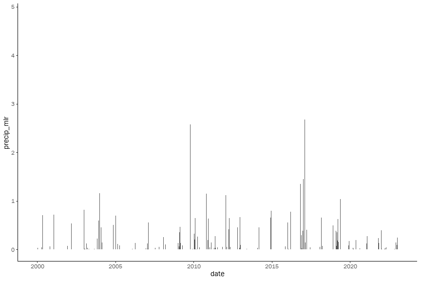
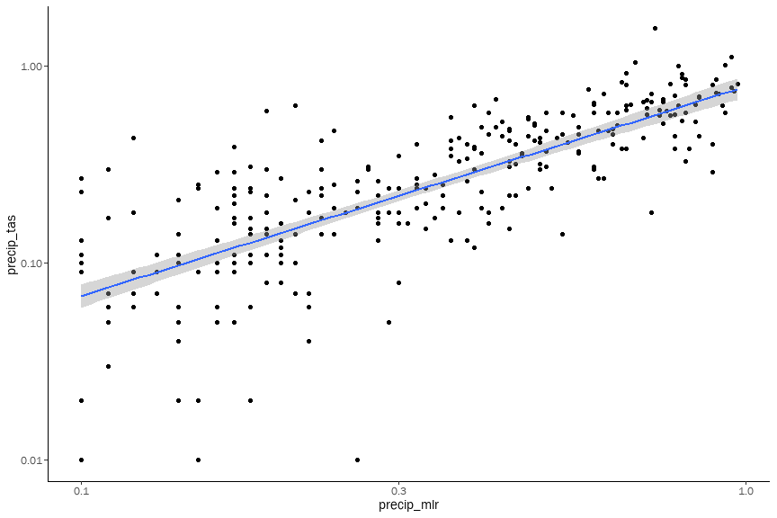

Extrapolation of Tassajara rain gauge
================

This is an [R Markdown](http://rmarkdown.rstudio.com) Notebook. When you
execute code within the notebook, the results appear beneath the code.

Try executing this chunk by clicking the *Run* button within the chunk
or by placing your cursor inside it and pressing *Ctrl+Shift+Enter*.

``` r
library(tidyverse)
```

    ## ── Attaching packages ─────────────────────────────────────── tidyverse 1.3.2 ──
    ## ✔ ggplot2 3.4.1     ✔ purrr   1.0.1
    ## ✔ tibble  3.1.8     ✔ dplyr   1.1.0
    ## ✔ tidyr   1.3.0     ✔ stringr 1.5.0
    ## ✔ readr   2.1.4     ✔ forcats 1.0.0
    ## ── Conflicts ────────────────────────────────────────── tidyverse_conflicts() ──
    ## ✖ dplyr::filter() masks stats::filter()
    ## ✖ dplyr::lag()    masks stats::lag()

``` r
rawdata_tas <- read_csv("https://cdec.water.ca.gov/dynamicapp/req/CSVDataServlet?Stations=TAS&SensorNums=16&dur_code=E&Start=1900-01-01&End=2023-02-16")
```

    ## Rows: 100444 Columns: 9
    ## ── Column specification ────────────────────────────────────────────────────────
    ## Delimiter: ","
    ## chr  (4): STATION_ID, DURATION, SENSOR_TYPE, UNITS
    ## dbl  (2): SENSOR_NUMBER, VALUE
    ## lgl  (1): DATA_FLAG
    ## dttm (2): DATE TIME, OBS DATE
    ## 
    ## ℹ Use `spec()` to retrieve the full column specification for this data.
    ## ℹ Specify the column types or set `show_col_types = FALSE` to quiet this message.

``` r
rawdata_tas %>% save(file = "data/rawdata_tas.Rda")

rawdata_mlr <- read_csv("https://cdec.water.ca.gov/dynamicapp/req/CSVDataServlet?Stations=MLR&SensorNums=2&dur_code=H&Start=1900-01-01&End=2023-02-16")
```

    ## Rows: 203420 Columns: 9
    ## ── Column specification ────────────────────────────────────────────────────────
    ## Delimiter: ","
    ## chr  (5): STATION_ID, DURATION, SENSOR_TYPE, VALUE, UNITS
    ## dbl  (1): SENSOR_NUMBER
    ## lgl  (1): DATA_FLAG
    ## dttm (2): DATE TIME, OBS DATE
    ## 
    ## ℹ Use `spec()` to retrieve the full column specification for this data.
    ## ℹ Specify the column types or set `show_col_types = FALSE` to quiet this message.

``` r
rawdata_mlr %>% save(file = "data/rawdata_mlr.Rda")
```

Add a new chunk by clicking the *Insert Chunk* button on the toolbar or
by pressing *Ctrl+Alt+I*.

When you save the notebook, an HTML file containing the code and output
will be saved alongside it (click the *Preview* button or press
*Ctrl+Shift+K* to preview the HTML file).

The preview shows you a rendered HTML copy of the contents of the
editor. Consequently, unlike *Knit*, *Preview* does not run any R code
chunks. Instead, the output of the chunk when it was last run in the
editor is displayed.

``` r
load(file = "data/rawdata_tas.Rda")
load(file = "data/rawdata_mlr.Rda")

daily_data_tas <- rawdata_tas %>%
  as_tibble() %>%
  janitor::clean_names() %>% 
  mutate(date = lubridate::round_date(date_time, unit="day"),
         increment = case_when(value >= lag(value, n=1) ~ value - lag(value, n=1))) %>%
  group_by(date) %>%
  summarize(precip_tas = sum(increment))

daily_data_tas %>% ggplot(aes(y = precip_tas, x = date)) + geom_col()
```

    ## Warning: Removed 15 rows containing missing values (`position_stack()`).

<!-- -->

``` r
daily_data_mlr <- rawdata_mlr %>% 
  as_tibble() %>%
  janitor::clean_names() %>% 
  mutate(date = lubridate::round_date(date_time, unit="day"),
         value = as.numeric(value),
         increment = case_when(value >= lag(value, n=1) ~ value - lag(value, n=1))) %>%
  group_by(date) %>%
  summarize(precip_mlr = sum(increment))
```

    ## Warning: There was 1 warning in `mutate()`.
    ## ℹ In argument: `value = as.numeric(value)`.
    ## Caused by warning:
    ## ! NAs introduced by coercion

``` r
daily_data_mlr %>% ggplot(aes(y = precip_mlr, x = date)) + geom_col()
```

    ## Warning: Removed 727 rows containing missing values (`position_stack()`).

<!-- -->

``` r
daily_data <- daily_data_mlr %>% 
  left_join(daily_data_tas) 
```

    ## Joining with `by = join_by(date)`

``` r
daily_data_filtered <- daily_data %>%
  filter(precip_tas > 0 & precip_mlr > 0)

daily_data_filtered %>% 
  ggplot(aes(y = precip_tas, x = precip_mlr)) +
    geom_point() +
    scale_y_log10() +
    scale_x_log10()
```

<!-- -->

``` r
model <- lm(log(daily_data_filtered$precip_tas) ~ log(daily_data_filtered$precip_mlr))
summary(model)
```

    ## 
    ## Call:
    ## lm(formula = log(daily_data_filtered$precip_tas) ~ log(daily_data_filtered$precip_mlr))
    ## 
    ## Residuals:
    ##      Min       1Q   Median       3Q      Max 
    ## -3.02726 -0.33773  0.01431  0.36989  2.66718 
    ## 
    ## Coefficients:
    ##                                     Estimate Std. Error t value Pr(>|t|)    
    ## (Intercept)                         -0.35729    0.04748  -7.525 2.46e-13 ***
    ## log(daily_data_filtered$precip_mlr)  0.90613    0.02260  40.089  < 2e-16 ***
    ## ---
    ## Signif. codes:  0 '***' 0.001 '**' 0.01 '*' 0.05 '.' 0.1 ' ' 1
    ## 
    ## Residual standard error: 0.7006 on 501 degrees of freedom
    ## Multiple R-squared:  0.7623, Adjusted R-squared:  0.7619 
    ## F-statistic:  1607 on 1 and 501 DF,  p-value: < 2.2e-16

``` r
alpha <- exp(model$coefficients["(Intercept)"])
beta <- model$coefficients["log(daily_data_filtered$precip_mlr)"]

daily_data_pred <- daily_data %>% 
  mutate(precip_tas_pred = case_when(
    !is.na(precip_mlr) ~ alpha * precip_mlr^beta, 
    TRUE ~ 0
    ))

daily_data_pred %>% ggplot(aes(y = precip_tas_pred, x = date)) + geom_col() + theme_classic()
```

<!-- -->

``` r
ggsave("barchart.svg")
```

    ## Saving 7 x 5 in image

``` r
daily_data_pred %>% write_csv("data/daily_data_pred.csv")
```
