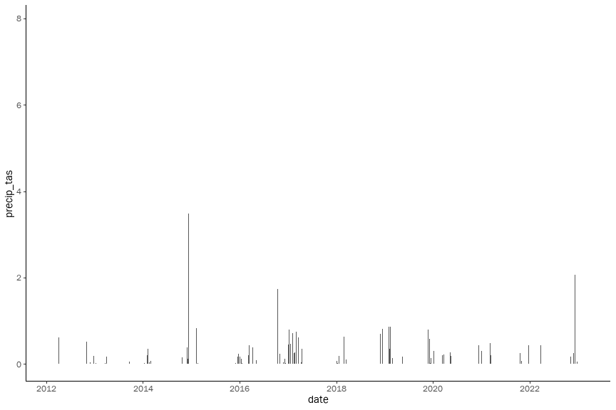
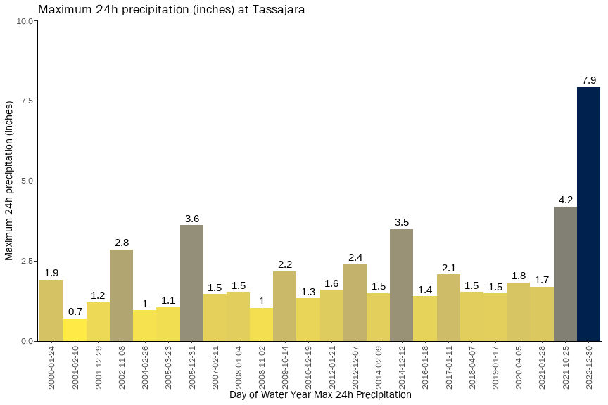
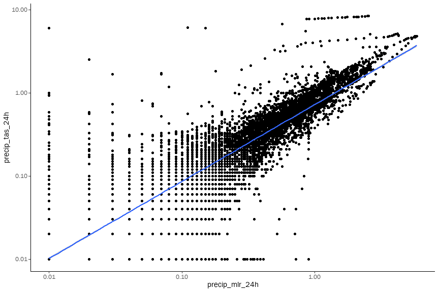
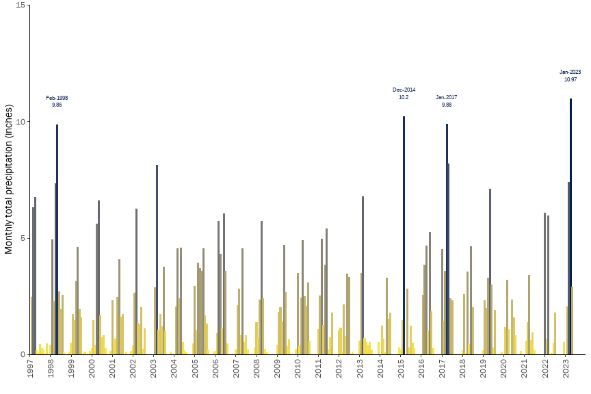
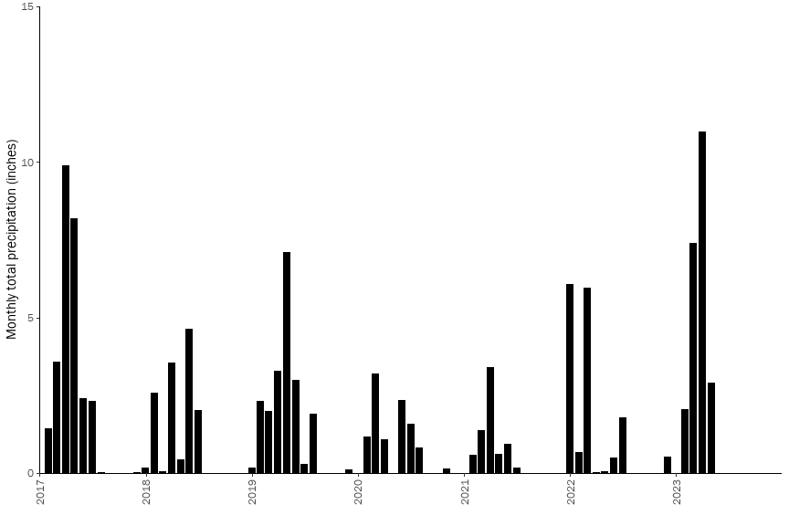
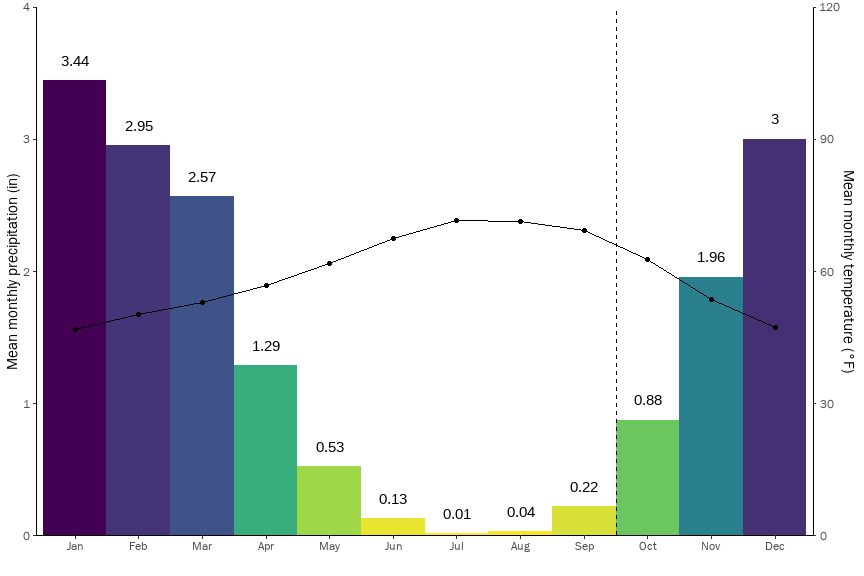
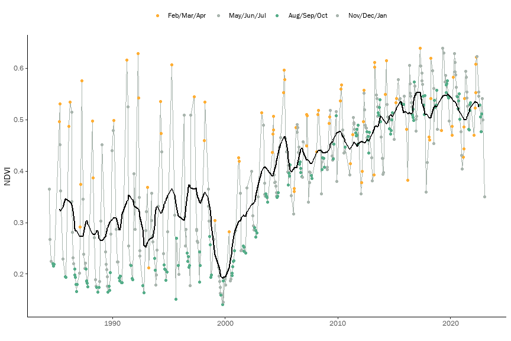
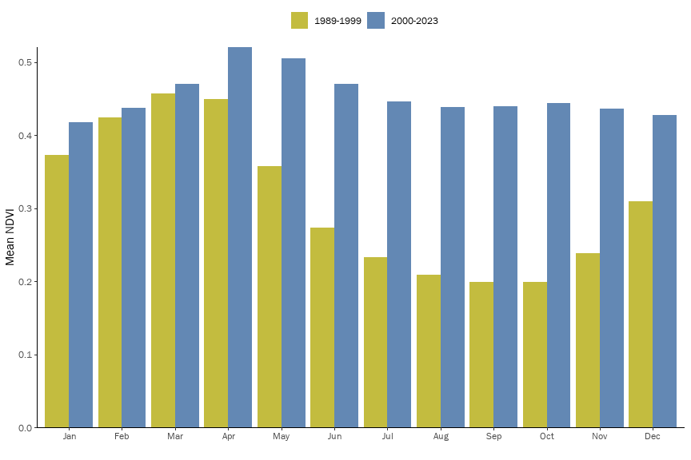

Time Series Analysis - Precip and NDVI
================

``` r
library(tidyverse)
```

    ## ── Attaching packages ─────────────────────────────────────── tidyverse 1.3.2 ──
    ## ✔ ggplot2 3.4.1     ✔ purrr   1.0.1
    ## ✔ tibble  3.1.8     ✔ dplyr   1.1.0
    ## ✔ tidyr   1.3.0     ✔ stringr 1.5.0
    ## ✔ readr   2.1.4     ✔ forcats 1.0.0
    ## ── Conflicts ────────────────────────────────────────── tidyverse_conflicts() ──
    ## ✖ dplyr::filter() masks stats::filter()
    ## ✖ dplyr::lag()    masks stats::lag()

``` r
library(lubridate)
```

    ## 
    ## Attaching package: 'lubridate'
    ## 
    ## The following objects are masked from 'package:base':
    ## 
    ##     date, intersect, setdiff, union

``` r
sysfonts::font_add(family = "franklin-gothic", 
                   regular = "./fonts/FRABK.TTF", 
                   italic = "./fonts/FRABKIT.TTF", 
                   bold = "./fonts/FRADM.TTF",
                   bolditalic = "./fonts/FRADMIT.TTF")
showtext::showtext_auto()
ggplot2::theme_set(theme_classic() + theme(text = element_text(family = 'franklin-gothic')))
knitr::opts_chunk$set(fig.width=9, fig.height=6) 
```

# CDEC Precipitation

``` r
if (!file.exists("data/rawdata_tas.rds")){
  rawdata_tas <- read_csv("https://cdec.water.ca.gov/dynamicapp/req/CSVDataServlet?Stations=TAS&SensorNums=16&dur_code=E&Start=1900-01-01&End=2023-02-16")
  rawdata_tas %>% saveRDS(file = "data/rawdata_tas.rds")
}
if (!file.exists("data/rawdata_mlr.rds")){
rawdata_mlr <- read_csv("https://cdec.water.ca.gov/dynamicapp/req/CSVDataServlet?Stations=MLR&SensorNums=2&dur_code=H&Start=1900-01-01&End=2023-02-16")
rawdata_mlr %>% saveRDS(file = "data/rawdata_mlr.rds")
}
```

``` r
rawdata_tas <- readRDS(file = "data/rawdata_tas.rds")
rawdata_mlr <- readRDS(file = "data/rawdata_mlr.rds")

# convert tipping bucket data to daily data

inst_data_tas <- rawdata_tas %>%
  as_tibble() %>%
  janitor::clean_names() %>% 
  mutate(date = lubridate::round_date(date_time, unit="day"),
         date_hour = lubridate::round_date(date_time, unit="hour"),
         value = as.numeric(value),
         increment = case_when(value >= lag(value, n=1) ~ value - lag(value, n=1))) 
daily_data_tas <- inst_data_tas %>%
  group_by(date) %>%
  summarize(precip_tas = sum(increment))

daily_data_tas %>% 
  ggplot(aes(y = precip_tas, x = date)) + geom_col()
```

    ## Warning: Removed 15 rows containing missing values (`position_stack()`).

<!-- -->

``` r
inst_data_mlr <- rawdata_mlr %>% 
  as_tibble() %>%
  janitor::clean_names() %>% 
  mutate(date = lubridate::round_date(date_time, unit="day"),
         date_hour = lubridate::round_date(date_time, unit="hour"),
         value = as.numeric(value),
         increment = case_when(value >= lag(value, n=1) ~ value - lag(value, n=1))) 
```

    ## Warning: There was 1 warning in `mutate()`.
    ## ℹ In argument: `value = as.numeric(value)`.
    ## Caused by warning:
    ## ! NAs introduced by coercion

``` r
daily_data_mlr <- inst_data_mlr %>%
  group_by(date) %>%
  summarize(precip_mlr = sum(increment))

daily_data_mlr %>% ggplot(aes(y = precip_mlr, x = date)) + geom_col()
```

    ## Warning: Removed 727 rows containing missing values (`position_stack()`).

<!-- -->

``` r
daily_data <- daily_data_mlr %>% 
  left_join(daily_data_tas) 
```

    ## Joining with `by = join_by(date)`

``` r
daily_data_filtered <- daily_data %>%
  filter(precip_tas > 0 & precip_mlr > 0) %>% filter(precip_mlr>0.1 & precip_mlr<1)

daily_data_filtered %>% 
  #select(c(precip_tas, precip_mlr)) %>%
  #filter((precip_tas > 0) & (precip_mlr > 0)) %>%
  #drop_na() %>%
  ggplot(aes(y = precip_tas, x = precip_mlr)) +
    geom_point() +
    scale_y_log10() +
    scale_x_log10() + 
    geom_smooth(method="lm")
```

    ## `geom_smooth()` using formula = 'y ~ x'

<!-- -->

``` r
model <- lm(log(daily_data_filtered$precip_tas) ~ log(daily_data_filtered$precip_mlr))
summary(model)
```

    ## 
    ## Call:
    ## lm(formula = log(daily_data_filtered$precip_tas) ~ log(daily_data_filtered$precip_mlr))
    ## 
    ## Residuals:
    ##      Min       1Q   Median       3Q      Max 
    ## -2.93557 -0.23933  0.03744  0.32268  1.64875 
    ## 
    ## Coefficients:
    ##                                     Estimate Std. Error t value Pr(>|t|)    
    ## (Intercept)                         -0.23553    0.06524   -3.61 0.000358 ***
    ## log(daily_data_filtered$precip_mlr)  1.06458    0.05094   20.90  < 2e-16 ***
    ## ---
    ## Signif. codes:  0 '***' 0.001 '**' 0.01 '*' 0.05 '.' 0.1 ' ' 1
    ## 
    ## Residual standard error: 0.5661 on 300 degrees of freedom
    ## Multiple R-squared:  0.5928, Adjusted R-squared:  0.5914 
    ## F-statistic: 436.7 on 1 and 300 DF,  p-value: < 2.2e-16

``` r
alpha <- exp(model$coefficients["(Intercept)"])
beta <- model$coefficients["log(daily_data_filtered$precip_mlr)"]

# daily_data_pred <- daily_data %>% 
#   mutate(precip_tas_pred = case_when(
#     !is.na(precip_mlr) ~ alpha * precip_mlr^beta, 
#     TRUE ~ 0
#     ))

# daily_data_pred <- daily_data %>% 
#   mutate(precip_tas_pred = case_when(
#     is.na(precip_tas) ~ alpha * precip_mlr^beta, 
#     TRUE ~ precip_tas
#     ))

daily_data_pred <- daily_data %>% 
  mutate(precip_tas_pred = replace_na(case_when(date < min(daily_data_tas$date) ~ alpha * precip_mlr^beta, TRUE ~ precip_tas),0))

daily_data_pred %>% 
  ggplot(aes(y = precip_tas_pred, x = date)) + #, fill = precip_tas_pred)) +
   geom_area() + 
  scale_y_continuous(expand = c(0, 0),limits = c(0, 2)) +
    ggtitle("Maximum 24h precipitation (inches) at Tassajara") + 
    #scale_fill_viridis_c(direction = -1) + 
    theme(axis.text.x = element_text(angle = 90, vjust = 0.5, hjust=1))
```

    ## Warning: Removed 12 rows containing non-finite values (`stat_align()`).

<!-- -->

``` r
ggsave("barchart.svg")
```

    ## Saving 9 x 6 in image

    ## Warning: Removed 12 rows containing non-finite values (`stat_align()`).

``` r
daily_data_pred %>% write_csv("data/daily_data_pred.csv")
```

``` r
daily_data_pred %>% 
  mutate(#cal_year = year(date),
         water_year = case_when(month(date) >= 10 ~ year(date) + 1, TRUE ~ year(date))) %>% 
  group_by(water_year) %>% 
  slice(which.max(precip_tas_pred)) %>%
  rename(precip_max_24h = precip_tas_pred, date_max_24h = date) %>%
  ggplot(aes(y = precip_max_24h, x = as.factor(date_max_24h), fill = precip_max_24h)) + 
    geom_col(width = 1) +
    geom_text(aes(label = round(precip_max_24h, 1)), vjust=-0.5) +
    scale_x_discrete(name = "Day of Water Year Max 24h Precipitation") +
    scale_y_continuous(name = "Maximum 24h precipitation (inches)", expand = c(0, 0), limits = c(0, 10)) +
    ggtitle("Maximum 24h precipitation (inches) at Tassajara") + 
    scale_fill_viridis_c(direction = -1, option = "cividis") + 
    theme(axis.text.x = element_text(angle = 90, vjust = 0.5, hjust=1)) + 
  theme(legend.position = "none")
```

<!-- -->

``` r
daily_data_pred %>% 
  mutate(#cal_year = year(date),
         water_year = case_when(month(date) >= 10 ~ year(date) + 1, TRUE ~ year(date))) %>% 
  group_by(water_year) %>% 
  summarize(precip_wy_total = sum(precip_tas_pred)) %>%
  ggplot(aes(y = precip_wy_total, x = as.factor(water_year), fill = precip_wy_total)) + 
    geom_col(width = 1) +
    geom_text(aes(label = round(precip_wy_total, 1)), vjust=-0.5) +
    scale_x_discrete(name = "Water Year") +
    scale_y_continuous(name = "Total annual precipitation (inches)", expand = c(0, 0), limits = c(0, 40)) +
    ggtitle("Total annual precipitation (inches) at Tassajara") + 
    scale_fill_viridis_c(direction = -1, option = "cividis") + 
    theme(axis.text.x = element_text(angle = 90, vjust = 0.5, hjust=1)) + 
  theme(legend.position = "none")
```

<!-- -->

``` r
# IMPROVED VERSION USING ROLLING 24H WINDOW RATHER THAN CALENDAR 24H DAY -- IN PROGRESS
hourly_tas <- inst_data_tas %>%
  group_by(date_hour) %>%
  summarize(precip_tas = sum(increment)) %>%
  complete(date_hour) %>%
  mutate(precip_tas_24h = zoo::rollapplyr(precip_tas, 24, sum, partial=T)) 

hourly_mlr <- inst_data_mlr %>%
  group_by(date_hour) %>%
  summarize(precip_mlr = sum(increment)) %>%
  complete(date_hour) %>%
  mutate(precip_mlr_24h = zoo::rollapplyr(precip_mlr, 24, sum, partial=T)) 

hourly <- hourly_mlr %>% left_join(hourly_tas) 
```

    ## Joining with `by = join_by(date_hour)`

``` r
hourly_filtered <- hourly %>% 
  select(precip_tas_24h, precip_mlr_24h) %>%
  filter(precip_tas_24h > 0, precip_mlr_24h > 0)
model <- lm(log(hourly_filtered$precip_tas_24h) ~ log(hourly_filtered$precip_mlr_24h))
summary(model)
```

    ## 
    ## Call:
    ## lm(formula = log(hourly_filtered$precip_tas_24h) ~ log(hourly_filtered$precip_mlr_24h))
    ## 
    ## Residuals:
    ##     Min      1Q  Median      3Q     Max 
    ## -4.1814 -0.3290  0.0321  0.3300  6.3786 
    ## 
    ## Coefficients:
    ##                                      Estimate Std. Error t value Pr(>|t|)    
    ## (Intercept)                         -0.326381   0.010340  -31.57   <2e-16 ***
    ## log(hourly_filtered$precip_mlr_24h)  0.924775   0.004837  191.19   <2e-16 ***
    ## ---
    ## Signif. codes:  0 '***' 0.001 '**' 0.01 '*' 0.05 '.' 0.1 ' ' 1
    ## 
    ## Residual standard error: 0.7166 on 11559 degrees of freedom
    ## Multiple R-squared:  0.7598, Adjusted R-squared:  0.7597 
    ## F-statistic: 3.655e+04 on 1 and 11559 DF,  p-value: < 2.2e-16

``` r
alpha <- exp(model$coefficients["(Intercept)"])
beta <- model$coefficients["log(hourly_filtered$precip_mlr_24h)"]

hourly_filtered %>% ggplot(aes(y = precip_tas_24h, x = precip_mlr_24h)) + geom_point() + 
  scale_x_log10() + scale_y_log10() + geom_smooth(method=lm)
```

    ## `geom_smooth()` using formula = 'y ~ x'

<!-- -->

``` r
rolling24h_pred <- hourly %>% 
#  mutate(precip_tas_24h_pred = alpha * precip_mlr_24h^beta)
   mutate(precip_tas_24h_pred = replace_na(case_when(date_hour < min(hourly_tas$date_hour) ~ alpha * precip_mlr_24h^beta, TRUE ~ precip_tas_24h),0))

rolling24h_pred %>%
  mutate(water_year = case_when(month(date_hour) >= 10 ~ year(date_hour) + 1, TRUE ~ year(date_hour))) %>% 
  group_by(water_year) %>%
  slice(which.max(precip_tas_24h_pred)) %>%
  rename(precip_tas_24h_max = precip_tas_24h_pred, date_24h_max = date_hour) %>%
  ggplot(aes(y = precip_tas_24h_max, x = as.factor(date_24h_max), fill = precip_tas_24h_max)) + 
    geom_col(width = 1) +
    geom_text(aes(label = round(precip_tas_24h_max, 1)), vjust=-0.5) +
    scale_x_discrete(name = "Day of Water Year Max 24h Precipitation") +
    scale_y_continuous(name = "Maximum 24h precipitation (inches)", expand = c(0, 0), limits = c(0, 20)) +
    ggtitle("Maximum 24h precipitation (inches) at Tassajara") + 
    scale_fill_viridis_c(direction = -1, option = "cividis") + 
    theme(axis.text.x = element_text(angle = 90, vjust = 0.5, hjust=1)) + 
  theme(legend.position = "none")
```

<!-- -->

``` r
# IMPROVED VERSION USING ROLLING 24H WINDOW RATHER THAN CALENDAR 24H DAY -- IN PROGRESS
hourly_tas <- inst_data_tas %>%
  group_by(date_hour) %>%
  summarize(precip_tas = sum(increment)) %>%
  complete(date_hour) %>%
  mutate(precip_tas_24h = zoo::rollapplyr(precip_tas, 24, sum, partial=T)) 

hourly_mlr <- inst_data_mlr %>%
  group_by(date_hour) %>%
  summarize(precip_mlr = sum(increment)) %>%
  complete(date_hour) %>%
  mutate(precip_mlr_24h = zoo::rollapplyr(precip_mlr, 24, sum, partial=T)) 

hourly <- hourly_mlr %>% left_join(hourly_tas) 
```

    ## Joining with `by = join_by(date_hour)`

``` r
hourly_filtered <- hourly %>% 
  select(precip_tas_24h, precip_mlr_24h) %>%
  filter(precip_tas_24h > 0, precip_mlr_24h > 0)
model <- lm(log(hourly_filtered$precip_tas_24h) ~ log(hourly_filtered$precip_mlr_24h))
summary(model)
```

    ## 
    ## Call:
    ## lm(formula = log(hourly_filtered$precip_tas_24h) ~ log(hourly_filtered$precip_mlr_24h))
    ## 
    ## Residuals:
    ##     Min      1Q  Median      3Q     Max 
    ## -4.1814 -0.3290  0.0321  0.3300  6.3786 
    ## 
    ## Coefficients:
    ##                                      Estimate Std. Error t value Pr(>|t|)    
    ## (Intercept)                         -0.326381   0.010340  -31.57   <2e-16 ***
    ## log(hourly_filtered$precip_mlr_24h)  0.924775   0.004837  191.19   <2e-16 ***
    ## ---
    ## Signif. codes:  0 '***' 0.001 '**' 0.01 '*' 0.05 '.' 0.1 ' ' 1
    ## 
    ## Residual standard error: 0.7166 on 11559 degrees of freedom
    ## Multiple R-squared:  0.7598, Adjusted R-squared:  0.7597 
    ## F-statistic: 3.655e+04 on 1 and 11559 DF,  p-value: < 2.2e-16

``` r
alpha <- exp(model$coefficients["(Intercept)"])
beta <- model$coefficients["log(hourly_filtered$precip_mlr_24h)"]

hourly_filtered %>% ggplot(aes(y = precip_tas_24h, x = precip_mlr_24h)) + geom_point() + 
  scale_x_log10() + scale_y_log10() + geom_smooth(method=lm)
```

    ## `geom_smooth()` using formula = 'y ~ x'

<!-- -->

``` r
rolling24h_pred <- hourly %>% 
#  mutate(precip_tas_24h_pred = alpha * precip_mlr_24h^beta)
   mutate(precip_tas_24h_pred = replace_na(case_when(date_hour < min(hourly_tas$date_hour) ~ alpha * precip_mlr_24h^beta, TRUE ~ precip_tas_24h),0))

rolling24h_pred %>%
  mutate(water_year = case_when(month(date_hour) >= 10 ~ year(date_hour) + 1, TRUE ~ year(date_hour))) %>% 
  group_by(water_year) %>%
  slice(which.max(precip_tas_24h_pred)) %>%
  rename(precip_tas_24h_max = precip_tas_24h_pred, date_24h_max = date_hour) %>%
  ggplot(aes(y = precip_tas_24h_max, x = as.factor(date_24h_max), fill = precip_tas_24h_max)) + 
    geom_col(width = 1) +
    geom_text(aes(label = round(precip_tas_24h_max, 1)), vjust=-0.5) +
    scale_x_discrete(name = "Day of Water Year Max 24h Precipitation") +
    scale_y_continuous(name = "Maximum 24h precipitation (inches)", expand = c(0, 0), limits = c(0, 20)) +
    ggtitle("Maximum 24h precipitation (inches) at Tassajara") + 
    scale_fill_viridis_c(direction = -1, option = "cividis") + 
    theme(axis.text.x = element_text(angle = 90, vjust = 0.5, hjust=1)) + 
  theme(legend.position = "none")
```

<!-- -->

# PRISM Precipitation

``` r
# PRISM long term time series for a single location
# retrieved from https://prism.oregonstate.edu/explorer/ for 37.7083, -121.8750

prism_monthly <- read_csv("data/PRISM_ppt_tmin_tmean_tmax_tdmean_vpdmin_vpdmax_provisional_4km_189501_202302_37.7083_-121.8750.csv", skip = 10) %>%
  janitor::clean_names() %>%
  mutate(date = ym(date),
         water_year = case_when(month(date) >= 10 ~ year(date) + 1, TRUE ~ year(date)))
```

    ## Rows: 1538 Columns: 8
    ## ── Column specification ────────────────────────────────────────────────────────
    ## Delimiter: ","
    ## chr (1): Date
    ## dbl (7): ppt (inches), tmin (degrees F), tmean (degrees F), tmax (degrees F)...
    ## 
    ## ℹ Use `spec()` to retrieve the full column specification for this data.
    ## ℹ Specify the column types or set `show_col_types = FALSE` to quiet this message.

``` r
prism_monthly %>% 
  filter(water_year>=1997) %>%
  ggplot(aes(y = ppt_inches, x = as.POSIXct(date %m+% months(3)), fill = ppt_inches, color = ppt_inches)) + 
    geom_col() + #fill = "black") +
    scale_y_continuous(name = "Monthly total precipitation (inches)", expand = c(0, 0), limits = c(0, 15)) +
  scale_x_datetime(date_breaks = "1 year", date_labels = "%Y", name="", expand = c(0,0), 
                   limits=c(as.POSIXct(ymd("1997-01-01")), as.POSIXct(ymd("2023-12-31")))) +
    #ggtitle("PRISM historical precipitation for Lower Tassajara Creek") + 
  scale_fill_viridis_c(direction = -1 , option = "cividis") + 
  scale_color_viridis_c(direction = -1, option = "cividis") + 
  theme(axis.text.x = element_text(angle = 90, vjust = 0.5, hjust=1), legend.position = "none") + 
  geom_text(aes(y = ppt_inches + 1, label = case_when(ppt_inches > 9 ~ paste0(format(date, "%b-%Y"), "\n", ppt_inches), TRUE ~ NA)), size = 2)
```

    ## Warning: Removed 1 rows containing missing values (`geom_col()`).

    ## Warning: Removed 313 rows containing missing values (`geom_text()`).

<!-- -->

``` r
prism_monthly %>% 
  filter(water_year>=2017) %>%
  ggplot(aes(y = ppt_inches, x = as.POSIXct(date %m+% months(3)))) + #fill = ppt_inches, color = ppt_inches)) + 
    geom_col(fill = "black") +
    scale_y_continuous(name = "Monthly total precipitation (inches)", expand = c(0, 0), limits = c(0, 15)) +
  scale_x_datetime(date_breaks = "1 year", date_labels = "%Y", name="", expand = c(0,0), 
                   limits=c(as.POSIXct(ymd("2017-01-01")), as.POSIXct(ymd("2023-12-31")))) +
    #ggtitle("PRISM historical precipitation for Lower Tassajara Creek") + 
  #scale_fill_viridis_c(direction = -1, option = "cividis") + 
  #scale_color_viridis_c(direction = -1, option = "cividis") + 
  theme(axis.text.x = element_text(angle = 90, vjust = 0.5, hjust=1), legend.position = "none")
```

    ## Warning: Removed 1 rows containing missing values (`geom_col()`).

<!-- -->

``` r
prism_yearly <- prism_monthly %>% 
  group_by(water_year) %>% 
  summarize(ppt_inches = sum(ppt_inches))#,
            #vpd_min = min(vpdmax_h_pa), 
            #vpd_max = max(vpdmax_h_pa))

ppt_quantiles <- quantile(prism_yearly$ppt_inches, c(0.00, 0.25, 0.50, 0.75, 1.00))
print(ppt_quantiles)
```

    ##    0%   25%   50%   75%  100% 
    ##  6.61 12.86 15.76 20.80 38.21

``` r
prism_yearly_top <- prism_yearly %>% arrange(-ppt_inches) %>% top_n(4)
```

    ## Selecting by ppt_inches

``` r
prism_yearly %>% 
  mutate(ppt_quantile = cut_number(ppt_inches, n = 4)) %>%
  ggplot(aes(y = ppt_inches, x = water_year, fill = ppt_quantile)) + 
    geom_col(width = 1) +
    geom_text(aes(label = case_when(water_year %in% prism_yearly_top$water_year ~ paste(water_year, ppt_inches, sep = "\n"), TRUE ~ NA)), vjust=-0.25) +
    #scale_fill_brewer()
    scale_fill_viridis_d(direction = -1, option = "viridis", name = "Quartile of anual precip.") +
    scale_x_continuous(name ="Water Year", breaks = seq(1890, 2020, by = 10), expand = c(0,0)) +
    scale_y_continuous(name = "Annual total precipitation (inches)", expand = c(0, 0), limits = c(0, 50)) +
    #ggtitle("PRISM historical precipitation for Lower Tassajara Creek")  + 
  theme(legend.position = "top")
```

    ## Warning: Removed 125 rows containing missing values (`geom_text()`).

<!-- -->

``` r
coeff <- 30
prism_monthly  %>% 
  mutate(time_month = fct_recode(as.factor(month(date)), 
                                 "Jan" = "1", "Feb" = "2" , "Mar" = "3", 
                                 "Apr" = "4", "May" = "5" , "Jun" = "6", 
                                 "Jul" = "7", "Aug" = "8" , "Sep" = "9", 
                                 "Oct" = "10", "Nov" = "11","Dec" = "12"),
         time_year = year(date)) %>%
  group_by(time_month) %>% 
  summarize(mean_precip = mean(ppt_inches),
            mean_temp = mean(tmean_degrees_f),
            mean_temp_min = mean(tmin_degrees_f),
            mean_temp_max = mean(tmax_degrees_f)) %>%
  ggplot(aes(x = time_month)) + 
  geom_col(aes(y = mean_precip, group = 1, fill = mean_precip), width=1) + 
  geom_text(aes(y = mean_precip+0.15, label = round(mean_precip,2), group = 1)) + 
  geom_point(aes(y = mean_temp/coeff, group = 1)) + 
  geom_line(aes(y = mean_temp/coeff, group = 1)) + 
  #geom_ribbon(aes(ymin = mean_temp_min/coeff, ymax = mean_temp_max/coeff, group = 1)) +
  scale_y_continuous(name = "Mean monthly precipitation (in)", limits = c(0, 4), sec.axis = sec_axis(trans = ~.*coeff, name = "Mean monthly temperature (°F)"), expand = c(0,0)) + 
  scale_x_discrete(name = "") +
  #ggtitle("PRISM monthly average precipitation and temperature") +
  scale_fill_viridis_c(direction = -1, option = "viridis") + geom_vline(xintercept=9.5, linetype="dashed") + 
  theme(legend.position = "none")
```

<!-- -->

# Landsat NDVI

``` r
ndvi_time_series <- read_csv("data/ndvi_time_series.csv")
```

    ## New names:
    ## Rows: 453 Columns: 3
    ## ── Column specification
    ## ──────────────────────────────────────────────────────── Delimiter: "," dbl
    ## (2): ...1, ndvi dttm (1): time
    ## ℹ Use `spec()` to retrieve the full column specification for this data. ℹ
    ## Specify the column types or set `show_col_types = FALSE` to quiet this message.
    ## • `` -> `...1`

``` r
ndvi_time_series_interp <- ndvi_time_series %>%
  mutate(date_round = as.Date(lubridate::round_date(time, unit = "day"))) %>%
  complete(date_round = seq.Date(from = min(date_round), to = max(date_round), by = "day")) %>%
  mutate(ndvi = zoo::na.approx(ndvi)) %>%
  mutate(rolling_ndvi = zoo::rollapply(ndvi, 365, mean, align='center', fill=NA))
```

``` r
ggplot() + 
geom_line(data = ndvi_time_series_interp, aes(y = ndvi, x = time), color="darkolivegreen2") +
geom_line(data = ndvi_time_series_interp, aes(y = rolling_ndvi, x = time), color="seagreen") +
scale_y_continuous(name = "NDVI",)
```

    ## Warning: Removed 13676 rows containing missing values (`geom_line()`).

    ## Warning: Removed 13689 rows containing missing values (`geom_line()`).

<!-- -->

``` r
ggplot() + 
geom_line(data = ndvi_time_series_interp, aes(y = ndvi, x = time), color="gray", size=.25) +
geom_point(data = ndvi_time_series_interp %>% filter(month(time) %in% c(2, 3, 4)),   aes(y = ndvi, x = time), color="blue", size = 1) +
geom_point(data = ndvi_time_series_interp %>% filter(month(time) %in% c(5, 6, 7)),   aes(y = ndvi, x = time), color="gray", size = 1) +
geom_point(data = ndvi_time_series_interp %>% filter(month(time) %in% c(8, 9, 10)),  aes(y = ndvi, x = time), color="red",  size = 1) +
geom_point(data = ndvi_time_series_interp %>% filter(month(time) %in% c(11, 12, 1)), aes(y = ndvi, x = time), color="gray", size = 1) +
geom_point(data = ndvi_time_series_interp %>% filter(month(time) %in% c()),   aes(y = ndvi, x = time), color="gray", size = 1) +
geom_line(data = ndvi_time_series_interp, aes(y = rolling_ndvi, x = time), color="black", size = 1) +
scale_y_continuous(name = "NDVI",) + ggtitle("Landsat NDVI Time Series 1989-2023")
```

    ## Warning: Using `size` aesthetic for lines was deprecated in ggplot2 3.4.0.
    ## ℹ Please use `linewidth` instead.

    ## Warning: Removed 13676 rows containing missing values (`geom_line()`).

    ## Warning: Removed 13689 rows containing missing values (`geom_line()`).

<!-- -->

``` r
ndvi_time_series_interp %>% 
  mutate(time_month = fct_recode(as.factor(month(date_round)), 
                                 "Jan" = "1", "Feb" = "2" , "Mar" = "3", 
                                 "Apr" = "4", "May" = "5" , "Jun" = "6", 
                                 "Jul" = "7", "Aug" = "8" , "Sep" = "9", 
                                 "Oct" = "10", "Nov" = "11","Dec" = "12"),
         after_restoration = date_round > ymd("2000-01-01")) %>%
  group_by(time_month, after_restoration) %>% 
  summarize(mean_ndvi = mean(ndvi), sd_ndvi = sd(ndvi), n_ndvi = n()) %>%
  mutate(se_ndvi = sd_ndvi / sqrt(n_ndvi)) %>%
  ggplot(aes(x = time_month, fill = after_restoration)) + 
  geom_col(aes(y = mean_ndvi), position = "dodge") +
  scale_y_continuous(expand = c(0, 0))  + ggtitle("Landsat average NDVI by month, 1989-1999 vs 2000-2023")
```

    ## `summarise()` has grouped output by 'time_month'. You can override using the
    ## `.groups` argument.

<!-- -->

``` r
ndvi_time_series_interp %>% 
  mutate(time_month = fct_recode(as.factor(month(date_round)), 
                                 "Jan" = "1", "Feb" = "2" , "Mar" = "3", 
                                 "Apr" = "4", "May" = "5" , "Jun" = "6", 
                                 "Jul" = "7", "Aug" = "8" , "Sep" = "9", 
                                 "Oct" = "10", "Nov" = "11","Dec" = "12"),
         time_year = year(date_round),
         after_restoration = date_round > ymd("2000-01-01")) %>%
  group_by(time_month, after_restoration) %>% 
  do(model = lm(ndvi ~ time_year, data = .)) %>%
  mutate(model_coeff = list(model$coefficients), 
         model_se = summary(model)$coefficients["time_year", "Std. Error"], #"Std. Error" "t value" "Pr(>|t|)"
         model_n = summary(model)$n) %>% 
  unnest_wider(col = model_coeff) %>%
  janitor::clean_names() %>%
  rename(model_slope = time_year) %>%
  ggplot(aes(y = time_month, color = after_restoration)) + 
  geom_point(aes(x = model_slope)) +
  geom_errorbarh(aes(xmin = model_slope - 1.96*model_se, xmax = model_slope + 1.96*model_se)) + 
  geom_vline(xintercept = 0) + scale_y_discrete(limits = rev) + ggtitle("Landsat change in NDVI per year by month, 1989-1999 vs 2000-2023")
```

<!-- -->

``` r
#https://www.statology.org/extract-coefficients-from-lm-in-r/
```

``` r
print(mean(filter(ndvi_time_series_interp, time < ymd("2000-01-01"))$ndvi))
```

    ## [1] 0.2780999

``` r
print(mean(filter(ndvi_time_series_interp, year(time) == "2000")$ndvi))
```

    ## [1] 0.2210828

``` r
print(mean(filter(ndvi_time_series_interp, year(time) == "2022")$ndvi))
```

    ## [1] 0.5396288

``` r
print(mean(filter(ndvi_time_series_interp, time > ymd("2018-01-01"))$ndvi))
```

    ## [1] 0.5335974

``` r
# create bar plot of mean ndvi by year

ndvi_time_series_interp %>% 
  mutate(water_year = case_when(month(time) >= 10 ~ year(time) + 1, TRUE ~ year(time))) %>%
  group_by(water_year) %>% summarize(mean_ndvi = mean(ndvi)) %>% 
  ggplot(aes(y = mean_ndvi, x= water_year)) + geom_col()
```

    ## Warning: Removed 1 rows containing missing values (`position_stack()`).

<!-- -->

``` r
maxRange <- 10
coeff <- 1 / maxRange

ggplot() + 
geom_area(data = daily_data_pred, aes(y = precip_tas_pred, x = date), color="cadetblue") +
geom_line(data = ndvi_time_series_interp, aes(y = ndvi/coeff, x = time), color="darkolivegreen2") +
geom_line(data = ndvi_time_series_interp, aes(y = rolling_ndvi/coeff, x = time), color="seagreen") +
scale_y_continuous(name = "precipitation",
                 limit = c(0, maxRange),
                 expand = c(0, 0),
                 sec.axis = sec_axis(trans = ~.*coeff, 
                                     name = "NDVI"))
```

    ## Warning: Removed 13676 rows containing missing values (`geom_line()`).

    ## Warning: Removed 13689 rows containing missing values (`geom_line()`).

<!-- -->

``` r
#ndvi_time_series %>% 
#  mutate(time_month = month(time)) %>%
#  ggplot(aes(x = time, y = ndvi, color = as.factor(time_month), fill = as.factor(time_month))) + geom_smooth(se=F)
#
#ndvi_time_series %>% 
#  mutate(time_month = month(time),
#         season = factor(case_when(
#           #time_month %in% c(4, 5, 6) ~ "Spring",
#           #time_month %in% c(8, 9, 10) ~ "Summer",
#           #time_month %in% c(12, 1, 2) ~ "Rainy"
#           time_month %in% c(3, 4) ~ "Mar - Apr",
#           time_month %in% c(5, 6, 7) ~ "May - Jul",
#           time_month %in% c(8, 9, 10) ~ "Aug - Oct",
#           time_month %in% c(11, 12, 1, 2) ~ "Nov - Feb",
#         ), levels = c("Mar - Apr", "May - Jul", "Aug - Oct", "Nov - Feb"))) %>%
#  ggplot(aes(x = time, y = ndvi, color = season, fill = season)) + 
#    geom_point(size = 1) + 
#    geom_smooth(method = "loess", span = .5, se = T) + # geom_smooth(method = "gam") #geom_text(aes(label = time_month)) 
#    theme(legend.position = "top") #+ 
#    #scale_color_manual(values=colors) + scale_fill_manual(values=colors)
```

``` r
colors <- c("cadetblue", "lightgreen", "orange")
ndvi_time_series %>% 
  mutate(time_month = month(time),
         season = factor(case_when(
           #time_month %in% c(4, 5, 6) ~ "Spring",
           #time_month %in% c(8, 9, 10) ~ "Summer",
           #time_month %in% c(12, 1, 2) ~ "Rainy"
           time_month %in% c(3, 4, 5, 6) ~ "Mar - Jun",
           time_month %in% c(7, 8, 9, 10) ~ "Jul - Oct",
           time_month %in% c(11, 12, 1, 2) ~ "Nov - Feb"
         ), levels = c("Nov - Feb", "Mar - Jun", "Jul - Oct"))) %>%
  ggplot(aes(x = time, y = ndvi, color = season, fill = season)) + 
    geom_point(size = 1) + 
    geom_smooth(method = "loess", span = .25, se = T) + # geom_smooth(method = "gam") #geom_text(aes(label = time_month)) 
    theme(legend.position = "top") + 
    scale_color_manual(values=colors) + scale_fill_manual(values=colors)
```

    ## `geom_smooth()` using formula = 'y ~ x'

<!-- -->

# crosstab of NDVI and relative elevation

``` r
aoi <- sf::st_read("data/tassajara_perim_50ft.kml") %>% 
  terra::vect() # convert from sf into terra vector
```

    ## Reading layer `alamedaco_parcels_perimeter_buffer50ft' from data source 
    ##   `C:\Users\skylerlewis\Documents\GitHub\tassajara\data\tassajara_perim_50ft.kml' 
    ##   using driver `KML'
    ## Simple feature collection with 1 feature and 2 fields
    ## Geometry type: MULTIPOLYGON
    ## Dimension:     XYZ
    ## Bounding box:  xmin: -121.8803 ymin: 37.7012 xmax: -121.8777 ymax: 37.71252
    ## z_range:       zmin: 0 zmax: 0
    ## Geodetic CRS:  WGS 84

``` r
naip_scale <- terra::rast("data/raster/naip_scale.tif") %>% 
  terra::classify(cbind(0, NA))  # mask zeros
naip_offset <- terra::rast("data/raster/naip_offset.tif") %>% 
  terra::classify(cbind(0, NA))  # mask zeros
rem <- terra::rast("data/raster/lidar2021_REM.tif") %>% 
  terra::project(naip_scale) %>% # reproject to same crs
  terra::mask(aoi)

terra::plot(rem)
```

<!-- -->

``` r
# categorical crosstab
terra::crosstab(c(
  naip_scale %>% terra::classify(seq(from=0, to=1, by=0.01)),
  rem %>% terra::classify(seq(from=0, to=30, by=1))
))
```

    ##              Band_1
    ## naip_scale    (0–1] (1–2] (10–11] (11–12] (12–13] (13–14] (14–15] (15–16]
    ##   (0–0.01]    18083 10561   15874   28283   39757   41866   35467   34948
    ##   (0.01–0.02]  9691  5634   10161   13317   16138   18160   14189   13774
    ##   (0.02–0.03]  3906  2555    7851   10478   10459   12069    9323    9083
    ##   (0.03–0.04]  1677  1320    5712    8014    8199    8192    7222    7649
    ##   (0.04–0.05]   769   518    3722    5489    6261    5550    5437    5739
    ##   (0.05–0.06]   398   300    1637    2738    4163    3431    3731    4144
    ##   (0.06–0.07]   103    12     580    1325    1979    2031    2146    2308
    ##   (0.07–0.08]    10     0     162     364     778     721     835     883
    ##   (0.08–0.09]     0     0      71      59     131     130      93     221
    ##   (0.09–0.1]      0     0      57       0       3       5       0      15
    ##   (0.1–0.11]      0     0      16       0       0       0       0       0
    ##              Band_1
    ## naip_scale    (16–17] (17–18] (18–19] (19–20] (2–3] (20–21] (21–22] (22–23]
    ##   (0–0.01]      33485   23506   11832    9239 10778    9261    2015     803
    ##   (0.01–0.02]   12330   11838    7153    3767  5375    2556     678     112
    ##   (0.02–0.03]    8510    7560    4844    2301  2002    1670     511      21
    ##   (0.03–0.04]    5562    4326    3342    1571   940    1075     524      11
    ##   (0.04–0.05]    3399    2873    2404    1196   309     747     329       1
    ##   (0.05–0.06]    1930    2308    1351     725   101     372     244       0
    ##   (0.06–0.07]     745    1758     575     391    47     185     152       0
    ##   (0.07–0.08]     209     216     242     366     0      37     267       0
    ##   (0.08–0.09]      46      42      50     232     0       9      73       0
    ##   (0.09–0.1]        0       2       0       0     0       0       0       0
    ##   (0.1–0.11]        0       0       0       0     0       0       0       0
    ##              Band_1
    ## naip_scale    (23–24] (24–25] (25–26] (26–27] (27–28] (3–4] (4–5] (5–6] (6–7]
    ##   (0–0.01]        578     290     247     178      78 16959 25898 24895 30801
    ##   (0.01–0.02]     217      39      26      50      30  7708 13453 13993 19799
    ##   (0.02–0.03]      94       0       7      13       5  3179  7053  7679 12560
    ##   (0.03–0.04]      34       0       5      18       5  1439  3598  4648  6447
    ##   (0.04–0.05]       2       0       0       7       2   698  1426  2548  2253
    ##   (0.05–0.06]       1       0       0       0       0   192   374   848   753
    ##   (0.06–0.07]       0       0       0       0       0    44    81    97   188
    ##   (0.07–0.08]       0       0       0       0       0     0    19     5    27
    ##   (0.08–0.09]       0       0       0       0       0     0     0     0     0
    ##   (0.09–0.1]        0       0       0       0       0     0     0     0     0
    ##   (0.1–0.11]        0       0       0       0       0     0     0     0     0
    ##              Band_1
    ## naip_scale    (7–8] (8–9] (9–10]
    ##   (0–0.01]    38098 21724  15229
    ##   (0.01–0.02] 26298 15293  11581
    ##   (0.02–0.03] 17446 10799   7928
    ##   (0.03–0.04] 10396  7180   4777
    ##   (0.04–0.05]  4344  3243   2613
    ##   (0.05–0.06]  1297   997    914
    ##   (0.06–0.07]   245   146    151
    ##   (0.07–0.08]    25     1     39
    ##   (0.08–0.09]     0     0     25
    ##   (0.09–0.1]      0     0     13
    ##   (0.1–0.11]      0     0      9

``` r
# # scatterplot
# terra::plot(rem[[1]], naip_scale[[1]])
 
rem_zones <- rem %>% terra::classify(c(0, 4, 8, 12))
naip_scale %>% terra::boxplot(rem_zones)
```

    ## Warning: [boxplot] taking a regular sample of 1e+05 cells

<!-- -->

``` r
naip_offset %>% terra::boxplot(rem_zones)
```

    ## Warning: [boxplot] taking a regular sample of 1e+05 cells

<!-- -->
